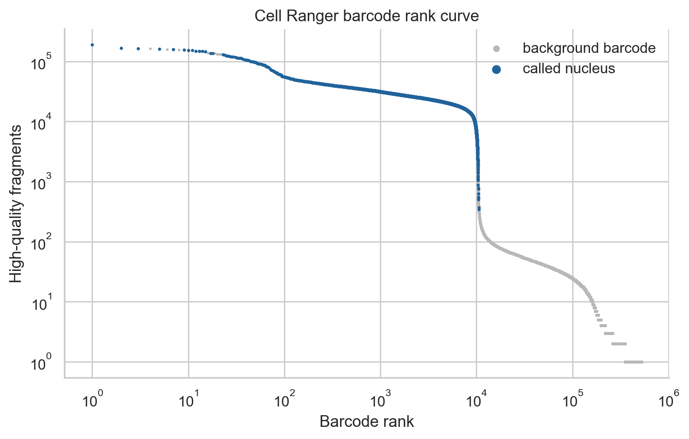
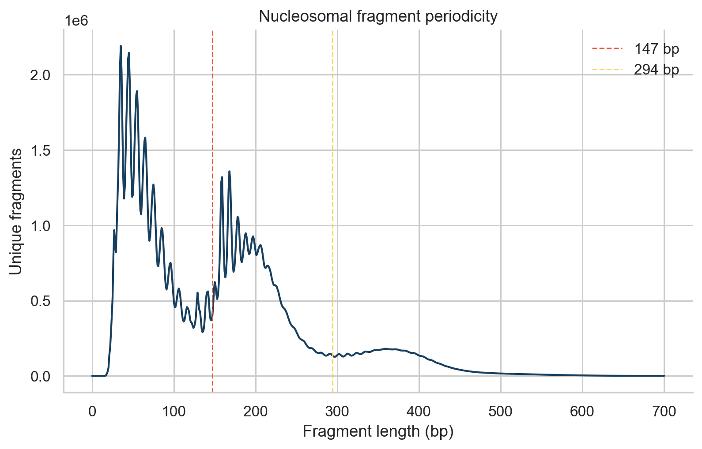
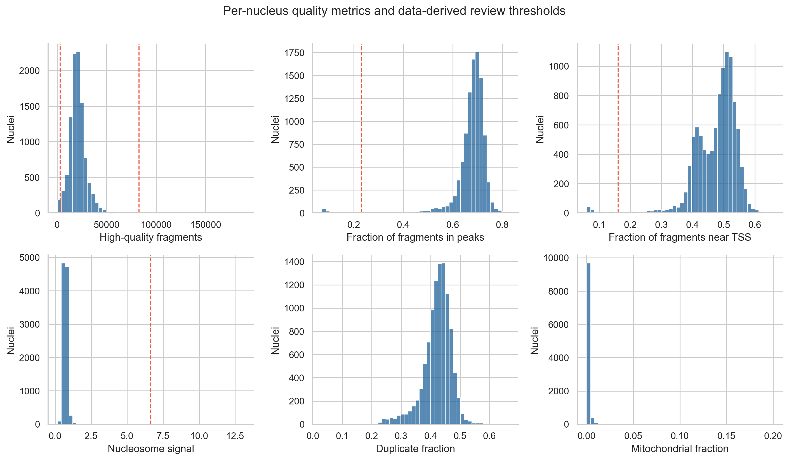
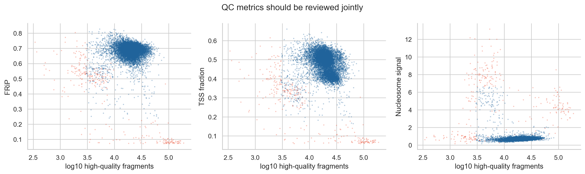
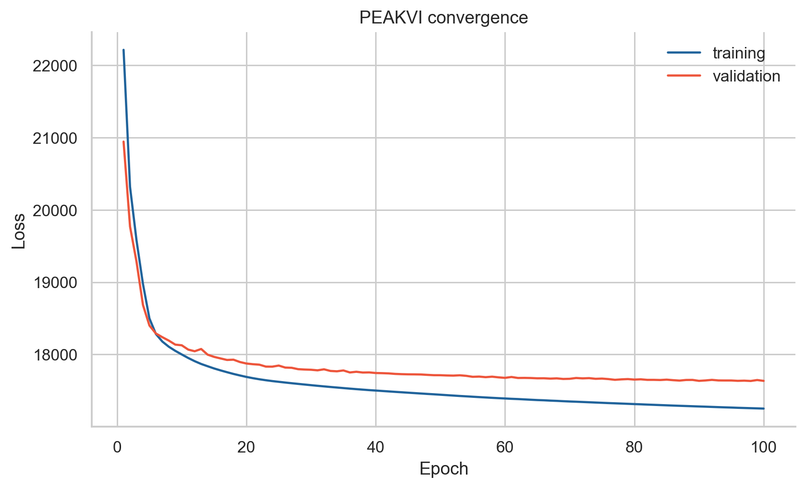
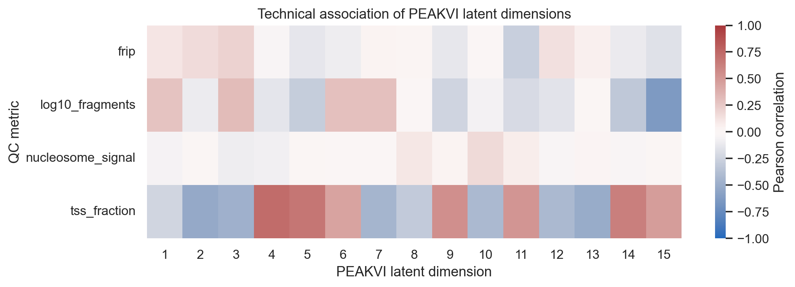
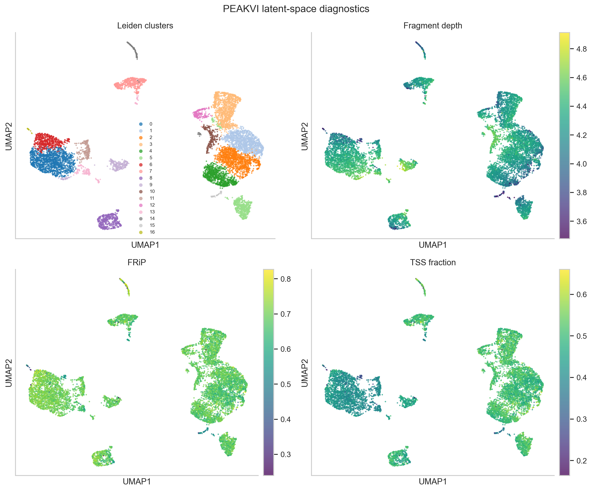
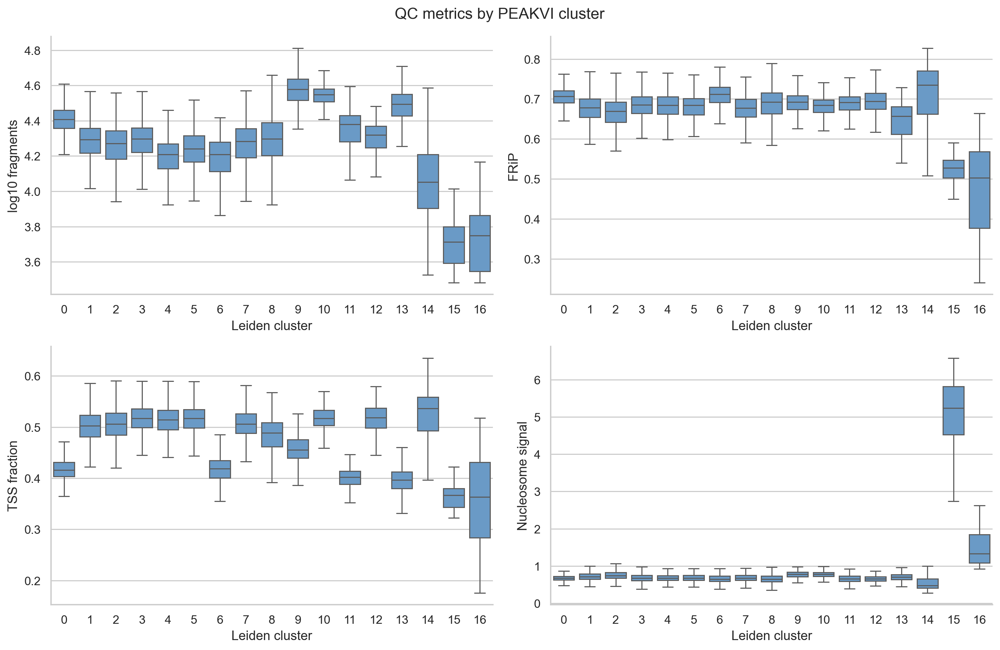
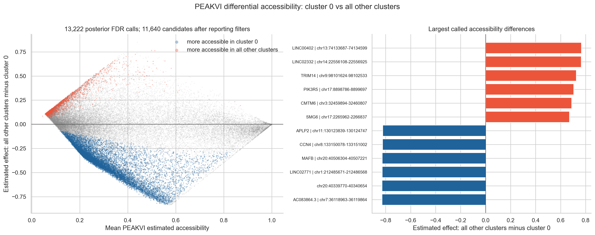

Single-cell ATAC-seq analysis with PEAKVI
=========================================

This tutorial analyzes the public `10x Genomics 10k Human PBMCs, ATAC v2,
Chromium X <https://www.10xgenomics.com/datasets/10k-human-pbmcs-atac-v2-chromium-x-2-standard>`_
dataset. It starts from Cell Ranger ATAC output, performs fragment-level and
per-nucleus quality control, trains PEAKVI, and evaluates the resulting latent
space with UMAP, Leiden clustering, technical covariates, and a
cluster-associated accessibility example.

The tutorial focuses on scATAC quality control, PEAKVI training, latent-space
diagnostics, UMAP, and unsupervised clustering.
It then uses the fitted PEAKVI model to call candidate marker peaks for one
quality-reviewed cluster.

The fully rendered notebook and reproducibility files are available here:

* :download:`Rendered Jupyter notebook <scatac_tutorial/notebooks/scatac_peakvi_tutorial.ipynb>`
* :download:`Conda environment <scatac_tutorial/environment.yml>`
* :download:`Data download script <scatac_tutorial/scripts/download_data.sh>`
* :download:`Fragment QC script <scatac_tutorial/scripts/prepare_fragment_metrics.sh>`
* :download:`PEAKVI workflow <scatac_tutorial/scripts/peakvi_workflow.py>`
* :download:`Complete analysis runner <scatac_tutorial/scripts/run_peakvi.py>`
* :download:`Notebook builder <scatac_tutorial/scripts/build_notebook.py>`

Learning objectives
-------------------

By the end of this tutorial, you should be able to:

* identify the Cell Ranger ATAC files used for secondary analysis;
* interpret barcode rank, fragment periodicity, FRiP, TSS-associated fragments,
  nucleosome signal, duplicate fraction, and mitochondrial fraction;
* create and report QC flags from the observed dataset;
* preserve raw peak counts in an AnnData layer;
* select a peak feature set for a teaching-scale PEAKVI model;
* train, save, and reload PEAKVI;
* construct a neighbor graph, UMAP, and Leiden clusters from ``X_peakvi``;
* audit the latent space and clusters for residual technical structure;
* call and interpret candidate cluster-associated accessible peaks.

Dataset and inputs
------------------

The example contains 10,273 nuclei from one healthy PBMC donor. Libraries were
generated with 10x Single Cell ATAC v2 chemistry and analyzed with Cell Ranger
ATAC 2.1.0 against GRCh38. The dataset is distributed under `CC BY 4.0
<https://creativecommons.org/licenses/by/4.0/>`_.

The workflow uses:

``filtered_peak_bc_matrix.h5``
   Peak-by-barcode counts for called nuclei.

``singlecell.csv``
   Per-barcode Cell Ranger counts and cell-calling status. It includes
   background barcodes, so it can reconstruct a barcode-rank curve.

``peak_annotation.tsv``
   Positional peak annotations supplied by 10x. These are descriptive and do
   not establish regulatory peak-to-gene relationships.

``fragments.tsv.gz`` and ``fragments.tsv.gz.tbi``
   Barcoded fragments and their Tabix index. The fragment file is approximately
   2.3 GB and is used to calculate fragment periodicity and nucleosome signal.

The 10x fragment specification is documented in the `Cell Ranger ATAC fragment
guide <https://www.10xgenomics.com/support/software/cell-ranger-atac/latest/analysis/outputs/fragments-file>`_.

Environment and data download
-----------------------------

Create the environment and download the public inputs:

.. code-block:: bash

   cd source/epigenomics/scatac_tutorial
   conda env create -f environment.yml
   conda activate gencore-scatac-peakvi

   scripts/download_data.sh
   scripts/prepare_fragment_metrics.sh

The raw downloads and trained model are ignored by Git. The notebook, scripts,
environment, and rendered figures remain versioned.

1. Review cell calling and fragment structure
----------------------------------------------

Cell Ranger calls nuclei from the number of high-quality fragments associated
with each barcode. A barcode-rank plot helps reveal whether called nuclei form
a clear signal-rich population above the background.

   Barcode rank based on high-quality fragments. The matrix contains only the
   called nuclei, while ``singlecell.csv`` also contains background barcodes.

ATAC fragment sizes should show a nucleosome-free component and periodic
mono- and di-nucleosomal structure. The included preprocessing script streams
the fragment file and records the distribution without expanding it on disk.

   Fragment lengths for called nuclei. Dashed lines mark 147 and 294 base
   pairs, which are used to summarize nucleosome-free and mononucleosomal
   fragments.

2. Calculate and interpret per-nucleus QC
-----------------------------------------

The tutorial reviews these metrics jointly:

* **High-quality fragments:** usable fragments passing Cell Ranger filters.
* **FRiP:** peak-region fragments divided by high-quality fragments.
* **TSS fraction:** fragments assigned near annotated transcription start
  sites divided by high-quality fragments.
* **Nucleosome signal:** mononucleosomal fragments divided by nucleosome-free
  fragments.
* **Duplicate fraction:** duplicate reads divided by total reads.
* **Mitochondrial fraction:** mitochondrial reads divided by total reads.

.. warning::

   ``tss_fraction`` is not the standard aggregate TSS enrichment score. The
   latter is calculated from a TSS-centered insertion profile. The names and
   formulas of QC metrics must be reported precisely.

The example uses the observed lower 1 percent tails of fragment count, FRiP,
and TSS fraction; the upper 0.5 percent tail of fragment count; and the upper 1
percent tail of nucleosome signal as review thresholds. These are
dataset-specific starting points, not universal biological cutoffs.

   QC distributions. Dashed lines show the thresholds calculated from this
   dataset.

   Joint review of QC metrics. Flagged nuclei are shown in red. A nucleus can
   fail more than one criterion.

QC flags are retained in ``adata.obs`` before filtering:

.. code-block:: python

   thresholds = choose_qc_thresholds(adata)
   add_qc_flags(adata, thresholds)

   adata.obs[
       ["passed_filters", "frip", "tss_fraction", "nucleosome_signal",
        "qc_pass", "qc_reason"]
   ].head()

This preserves the decision trail and makes before-and-after comparisons
possible. Avoid deleting cells as soon as one metric is calculated.

3. Prepare a peak matrix for PEAKVI
-----------------------------------

The example keeps nuclei passing all tutorial flags and peaks detected in at
least 20 retained nuclei. For the rendered CPU example, it then keeps the
50,000 peaks with the largest binary accessibility variance.

.. code-block:: python

   peakvi_adata = filter_for_peakvi(
       adata,
       min_cells_per_peak=20,
       max_peaks=50_000,
   )

Raw counts remain available in ``peakvi_adata.layers["counts"]``. Feature
selection is a reported compute choice because it changes the model input. A
larger GPU analysis may retain more peaks after checking memory, convergence,
and sensitivity to the feature rule.

4. Train and save PEAKVI
------------------------

PEAKVI models the probability that a genomic region is accessible in each
nucleus while learning cell-level and region-level detection effects. It
accepts binary or count input. This tutorial supplies unmodified Cell Ranger
peak counts.

.. code-block:: python

   scvi.model.PEAKVI.setup_anndata(
       peakvi_adata,
       layer="counts",
   )

   model = scvi.model.PEAKVI(
       peakvi_adata,
       n_latent=15,
   )

   model.train(
       max_epochs=100,
       early_stopping=True,
       accelerator="cpu",
       devices=1,
       batch_size=128,
   )

   model.save("results/models/peakvi_pbmc", overwrite=True)
   peakvi_adata.obsm["X_peakvi"] = model.get_latent_representation()

PEAKVI is substantially faster on a GPU. The official `scvi-tools PEAKVI guide
<https://docs.scvi-tools.org/en/latest/tutorials/notebooks/atac/PeakVI.html>`_
should be checked for current API and hardware guidance.

   PEAKVI convergence on the filtered PBMC peak matrix. Training loss alone
   does not establish that the representation is biologically meaningful.

5. Audit the latent representation
----------------------------------

After training, correlate every latent dimension with technical metrics. This
step asks whether a dimension still mainly follows fragment depth or another
QC feature.

.. code-block:: python

   correlations = latent_qc_correlations(peakvi_adata)
   correlations.sort_values(
       "correlation",
       key=lambda values: values.abs(),
       ascending=False,
   ).head()

   Pearson correlations between each PEAKVI dimension and four technical
   summaries. Large correlations should be investigated before downstream
   interpretation.

6. Build UMAP and Leiden clusters
---------------------------------

The neighbor graph, UMAP, and Leiden clusters are calculated from
``X_peakvi``:

.. code-block:: python

   sc.pp.neighbors(
       peakvi_adata,
       use_rep="X_peakvi",
       n_neighbors=30,
       metric="cosine",
   )
   sc.tl.umap(peakvi_adata, min_dist=0.25, random_state=17)
   sc.tl.leiden(
       peakvi_adata,
       resolution=0.6,
       key_added="leiden_peakvi",
       random_state=17,
   )

   The same PEAKVI UMAP colored by Leiden cluster, fragment depth, FRiP, and
   TSS fraction. This diagnostic makes technical gradients visible.

   QC metrics by cluster. A cluster dominated by a technical tail should be
   investigated before it is treated as biological.

7. Call candidate cluster-associated accessible peaks
------------------------------------------------------

PEAKVI can compare its estimated accessibility probabilities between groups
at individual peaks. The rendered example compares cluster 0, the largest
cluster after per-nucleus QC and review of the diagnostics above, with all
other retained nuclei.

.. code-block:: python

   da_results = model.differential_accessibility(
       adata=peakvi_adata,
       groupby="leiden_peakvi",
       group1=["0"],
       group2=None,
       mode="change",
       delta=0.05,
       fdr_target=0.05,
       batch_correction=False,
       use_permutation=False,
       n_samples_overall=5_000,
       silent=True,
   )

``is_da_fdr`` is PEAKVI's posterior expected-FDR classification. It is not a
donor-replicated frequentist test. In the scvi-tools implementation used here,
``delta`` is applied to a posterior log2 accessibility change calculated with
an estimated pseudocount. It is not an absolute five-percentage-point cutoff.
The returned ``effect_size`` is a separate absolute probability difference:
estimated accessibility in the comparison group minus accessibility in the
target group. A negative effect therefore indicates greater accessibility in
cluster 0.

The rendered comparison uses 5,000 posterior samples. At 50,000 peaks this can
require several gigabytes of memory. A smaller setting such as 500 is useful
for a quick preview, but thresholded calls can change and final results should
use the documented full setting.

For the compact teaching table, the workflow additionally requires an
estimated effect of at least 0.10 toward cluster 0, an empirical effect of at
least 0.05 in the same direction, and empirical detection in at least 5 percent
of cluster 0 nuclei. These are transparent reporting filters rather than part
of PEAKVI's expected-FDR calculation.

   PEAKVI estimated accessibility differences for the 50,000 tested peaks.
   Among the posterior expected-FDR calls, blue points are more accessible in
   cluster 0 and orange points are more accessible in the other clusters.
   Noncalled peaks are gray. The second panel shows peaks with the largest
   estimated differences.

The nearest-gene field supplied by 10x is included to help inspect results. It
is a positional annotation and does not demonstrate that a peak regulates that
gene.

The reference group is a heterogeneous mixture and includes clusters 15 and
16, whose QC profiles warrant further review. The marker list is therefore
specific to this contrast and should be checked in a sensitivity analysis that
excludes technically concerning clusters before biological interpretation.

Stopping point and limitations
------------------------------

The output is a QC-audited PEAKVI representation and unsupervised
clusters, plus candidate cluster-associated accessible peaks. Cluster numbers
are not cell types, and biological annotation requires additional evidence.

In the rendered run, clusters 15 and 16 are the two smallest groups and have
lower fragment depth, FRiP, and TSS fraction than the main groups. Cluster 15
also has an unusually high nucleosome signal. These groups remain visible to
show why QC must be repeated after representation learning. They are candidates
for a documented filtering sensitivity analysis before cell-type annotation,
not evidence of rare biological populations by themselves.

This dataset contains one donor. It can demonstrate QC, representation
learning, and descriptive marker accessibility within this sample. It cannot
estimate biological batch effects or support donor-level or condition-level
differential accessibility. Cells are not independent biological replicates.
Condition comparisons require independent donors and a sample-aware method,
such as cell-type-specific pseudobulk analysis.

Common pitfalls
---------------

* Copying fixed QC thresholds from another tissue or chemistry.
* Treating a Cell Ranger cell call as a complete QC decision.
* Calling ``tss_fraction`` a TSS enrichment score.
* Removing rare nuclei because their distributions differ from abundant cells.
* Forgetting to record peak filtering and feature selection.
* Treating UMAP distances as quantitative effect sizes.
* Naming clusters as cell types without marker or reference evidence.
* Treating cluster-associated peaks as condition-level inference.
* Forgetting that clustering and marker discovery use the same selected peak
  matrix and are therefore partly circular.
* Treating a nearest-gene annotation as a validated regulatory relationship.
* Assuming model convergence removes all technical structure.
* Running a large PEAKVI model on a CPU without planning runtime and memory.

References
----------

* Ashuach T, Reidenbach DA, Gayoso A, Yosef N. PeakVI: a deep generative model
  for single-cell chromatin accessibility analysis. *Cell Reports Methods*
  2022. `doi:10.1016/j.crmeth.2022.100182
  <https://doi.org/10.1016/j.crmeth.2022.100182>`_.
* Gayoso A and colleagues. A Python library for probabilistic analysis of
  single-cell omics data. *Nature Biotechnology* 2022.
  `doi:10.1038/s41587-021-01206-w
  <https://doi.org/10.1038/s41587-021-01206-w>`_.
* 10x Genomics. 10k Human PBMCs, ATAC v2, Chromium X, Cell Ranger ATAC 2.1.0,
  published March 29, 2022.
* Best practices for differential accessibility analysis in single-cell
  epigenomics. *Nature Communications* 2024.
  `doi:10.1038/s41467-024-53089-5
  <https://doi.org/10.1038/s41467-024-53089-5>`_.
