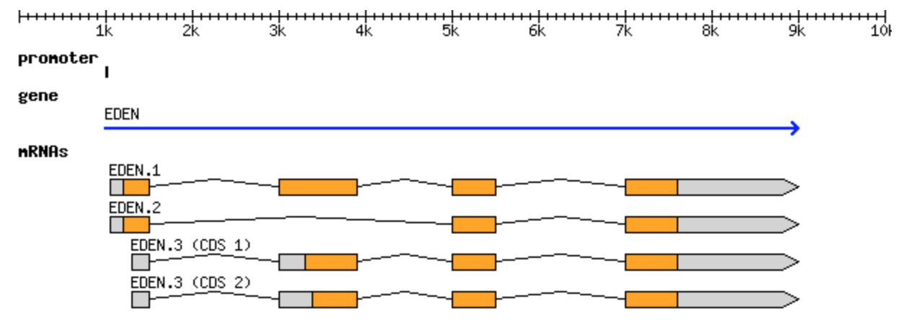

GFF3 and GTF formats
====================

For the full specification, see the `GFF3 specification
<https://github.com/The-Sequence-Ontology/Specifications/blob/master/gff3.md>`_.

GFF3 (Generic Feature Format version 3) is a tab-delimited format for
describing genomic features such as genes, transcripts, and exons, along
with the relationships between them. It is one of the most common ways to
distribute gene annotations.

Format
------

Each feature is described by nine tab-separated fields:

* **seqid** — the name of the sequence (for example a chromosome) the
  feature is on.
* **source** — the program or database that produced the feature.
* **type** — the kind of feature (for example ``gene``, ``mRNA``,
  ``exon``).
* **start** — the 1-based start coordinate of the feature.
* **end** — the end coordinate of the feature.
* **score** — a numeric score for the feature, or ``.`` if none.
* **strand** — ``+``, ``-``, or ``.`` for unstranded.
* **phase** — for CDS features, where the next codon begins (0, 1, or
  2); otherwise ``.``.
* **attributes** — a semicolon-separated list of ``tag=value`` pairs.
  This is where identifiers and parent/child relationships are recorded
  using the ``ID`` and ``Parent`` tags.

Example
-------

The canonical example from the specification describes a gene named
EDEN with three alternative transcripts:

.. code-block:: text

   ##gff-version 3
   ctg123	.	gene	1000	9000	.	+	.	ID=gene00001;Name=EDEN
   ctg123	.	mRNA	1050	9000	.	+	.	ID=mRNA00001;Parent=gene00001;Name=EDEN.1
   ctg123	.	mRNA	1050	9000	.	+	.	ID=mRNA00002;Parent=gene00001;Name=EDEN.2
   ctg123	.	mRNA	1300	9000	.	+	.	ID=mRNA00003;Parent=gene00001;Name=EDEN.3
   ctg123	.	exon	1300	1500	.	+	.	ID=exon00001;Parent=mRNA00003
   ctg123	.	exon	1050	1500	.	+	.	ID=exon00002;Parent=mRNA00001,mRNA00002
   ctg123	.	exon	3000	3902	.	+	.	ID=exon00003;Parent=mRNA00001,mRNA00003
   ctg123	.	exon	5000	5500	.	+	.	ID=exon00004;Parent=mRNA00001,mRNA00002,mRNA00003
   ctg123	.	exon	7000	9000	.	+	.	ID=exon00005;Parent=mRNA00001,mRNA00002,mRNA00003
   ctg123	.	CDS	1201	1500	.	+	0	ID=cds00001;Parent=mRNA00001
   ctg123	.	CDS	3000	3902	.	+	0	ID=cds00001;Parent=mRNA00001
   ctg123	.	CDS	5000	5500	.	+	0	ID=cds00001;Parent=mRNA00001
   ctg123	.	CDS	7000	7600	.	+	0	ID=cds00001;Parent=mRNA00001

The ``Parent`` attribute is what ties the features together: each exon
and CDS names the mRNA it belongs to, and each mRNA names its gene. This
lets a program reconstruct the full structure of the gene.

   The EDEN gene from the example above, drawn out as a gene model with
   three alternative transcripts. Source: `GFF3 specification
   <https://github.com/The-Sequence-Ontology/Specifications/blob/master/gff3.md>`_.

What about GTF?
---------------

You will often see the closely related **GTF** (Gene Transfer Format,
also called GTF2). GTF and GFF3 are not the same format, but they are
close relatives, and both are in wide use today. GTF shares the same
nine tab-separated columns as GFF3, but differs in how the ninth
(attributes) column is written and in how features are grouped:

* GTF attributes use the form ``key "value";`` (the value is quoted and
  each pair ends with a semicolon), whereas GFF3 uses ``key=value`` pairs
  separated by semicolons.
* GTF groups features using ``gene_id`` and ``transcript_id`` attributes
  rather than the GFF3 ``ID`` and ``Parent`` scheme.

A GTF line looks like this:

.. code-block:: text

   ctg123	.	exon	1300	1500	.	+	.	gene_id "gene00001"; transcript_id "mRNA00003";

Which format you use is usually dictated by the tool: many RNA-seq tools
expect GTF, while GFF3 is common for genome annotation. Reference
annotations are frequently distributed in both.

Software that use GFF3 and GTF
------------------------------

Annotation files are used throughout transcriptomics and visualization:

* `TopHat <https://ccb.jhu.edu/software/tophat/index.shtml>`_ — spliced
  alignment guided by a GTF/GFF annotation.
* `HTSeq <https://htseq.readthedocs.io/>`_ — counting reads per feature.
* `IGV <https://software.broadinstitute.org/software/igv/>`_ —
  visualizing features alongside alignments.
* `GBrowse <http://gmod.org/wiki/GBrowse>`_ and the `UCSC Genome Browser
  <https://genome.ucsc.edu/>`_ — displaying annotations in a genome
  browser.
