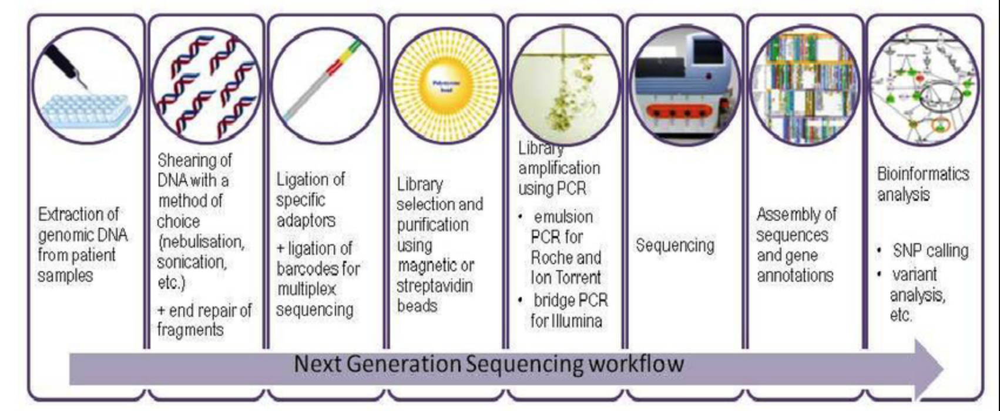
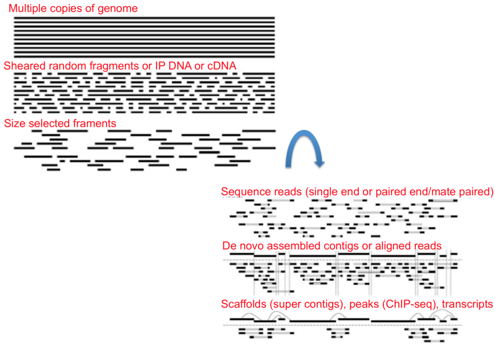
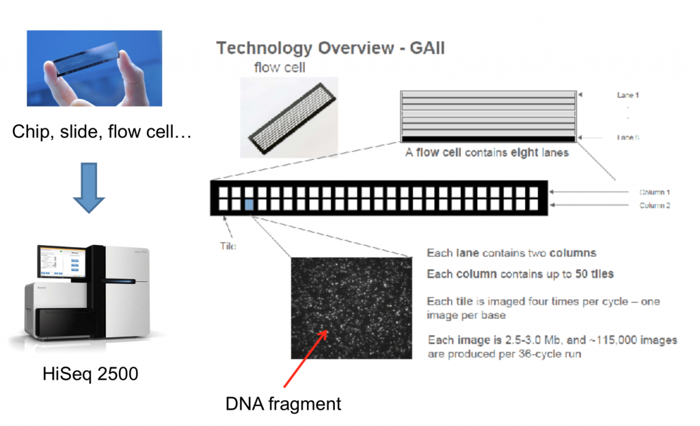

How sequencing works
====================

Many different companies have their own sequencing technologies, some
better suited for certain applications than others, but they boil down
to the same concept: identify each nucleotide in a particular molecule.

The Genomics Core at NYU New York and in Abu Dhabi has a range of
sequencers to choose from (see the `GenCore sequencing page
<https://gencore.bio.nyu.edu/sequencing/>`_):

* **New York**

  * Illumina NextSeq
  * Illumina MiSeq
  * Illumina NovaSeq 6000
  * Element Biosciences AVITI
  * Oxford Nanopore GridION

* **Abu Dhabi**

  * Illumina NovaSeq 6000
  * Illumina NextSeq 550
  * Illumina MiSeq
  * Oxford Nanopore MinION
  * Oxford Nanopore PromethION P2i
  * PacBio Vega

There are three main steps in NGS:

1. Sample collection / preparation
2. Amplification
3. Basecalling

Sample collection and preparation
---------------------------------

This step involves gathering the nucleic acids from your organism of
interest. The collection method differs based on what the sample is, but
the preparation usually involves isolating and purifying the nucleic
acids, shearing them to a certain size, amplification of your product,
and ligation of sequencing adaptors (small fragments of DNA used to
anchor the molecule of interest onto the flowcell).

   The main steps in a next-generation sequencing workflow, from
   extraction of genomic DNA through to bioinformatics analysis. Source:
   `ResearchGate
   <https://www.researchgate.net/figure/282061980_Overview-of-the-main-steps-in-Next-Generation-Sequencing-workflow>`_.

Single-end vs paired-end sequencing
-----------------------------------

Once you have your nucleic acids ready to go you can then choose whether
you want single-end or paired-end data.

Single-read sequencing
~~~~~~~~~~~~~~~~~~~~~~~~

Single-read sequencing involves sequencing DNA from only one end, and is
the simplest way to use Illumina sequencing. By leveraging proprietary
reversible terminator chemistry and a novel polymerase, this approach
delivers large volumes of high-quality data, rapidly and economically.

Highlights:

* **Simple library preparation:** follows standard molecular biology
  methods; compatible with robotics.
* **Low input DNA requirements:** as little as 100 ng genomic DNA or
  cDNA.
* **Economical:** 1/100th the cost of traditional Sanger sequencing.
* **Simplified data analysis:** high-quality sequence assemblies with
  short-insert libraries.

Paired-end sequencing
~~~~~~~~~~~~~~~~~~~~~~~

Highlights:

* **Simple paired-end libraries:** a simple workflow allows generation
  of unique ranges of insert sizes.
* **Efficient sample use:** requires the same amount of DNA as
  single-read gDNA or cDNA sequencing.
* **Broad range of applications:** does not require methylation of DNA
  or restriction digestion; can be used for bisulfite sequencing.
* **Simplified data analysis:** higher-quality sequence assemblies with
  short-insert libraries. A simple modification to the standard
  single-read library preparation process facilitates reading both the
  forward and reverse template strands of each cluster during one
  paired-end read. Both reads contain long-range positional information,
  allowing for highly precise alignment of reads.

To summarize, the illustration below shows each step of the library prep
once nucleic acids are isolated and amplified.

   Each step of library preparation, from isolated and amplified nucleic
   acids through to a sequencing-ready library.

Sequencing
----------

To better understand how sequencing is done on the machine, look over
the diagram below. It shows the physical layout of the flowcell onto
which the DNA is loaded.

   The physical layout of a flowcell onto which the library is loaded.

Amplification
~~~~~~~~~~~~~

On many platforms each library fragment is first clonally amplified, so
that many identical copies sit together and produce a signal strong
enough to detect. Illumina does this with bridge amplification to form
dense clusters on the flowcell, and Element Biosciences' AVITI uses
rolling-circle amplification to build "polonies". Single-molecule
platforms such as Oxford Nanopore and PacBio skip this step entirely:
they read one native molecule at a time, so no clonal amplification is
required (though library preparation may still include an optional PCR
step).

Basecalling
~~~~~~~~~~~

Basecalling is the step that turns the sequencer's raw measurements into
an actual sequence of bases. What is measured differs by platform:
Illumina, AVITI and PacBio detect light (fluorescence), while Oxford
Nanopore measures changes in ionic current as a strand passes through a
nanopore. In every case, basecalling software
translates that signal into a sequence of bases and assigns each base a
quality score (see :doc:`quality_scores`).

Amplification (where it applies) and basecalling are essential steps
across sequencing platforms. The following Illumina video shows both in
action for sequencing by synthesis: `Overview of Illumina Sequencing by
Synthesis <https://www.youtube.com/watch?v=EDVKxSNdSic>`_ (the visuals
help).
