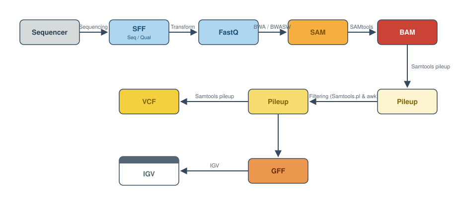

Intro to Bioinformatics
=======================

This section is here to help you understand how sequencing data are
generated, what happens to them next, and how the file formats you will
meet along the way fit together. Getting comfortable with these
foundations first makes every analysis pipeline in the rest of this
resource much easier to follow.

Below we describe how next-generation sequencing works, and then walk
through the file formats you will encounter most often: those that come
straight off the sequencer, and those produced by the analysis programs
downstream.

   How the file formats in this section relate to one another in a
   typical analysis. Reads come off the sequencer, are written as
   FastQ, aligned into SAM/BAM, and then reduced to variants (VCF) and
   features (GFF) that can be inspected in a genome viewer such as IGV.

.. rubric:: Key terms

Before we begin, it is good to be familiar with some terminology that
will be used from here on out.

read
    A single sequence produced from a sequencer. Think: a sequencing
    machine *read* a molecule and this is what it thinks it is.

library
    A collection of DNA fragments that have been prepared for
    sequencing. This generally refers to an individual sample.

flowcell
    A chip on which DNA is loaded and provided to the sequencer.

lane
    One portion of a flowcell. Usually used for technical replicates or
    different samples.

run
    An entire sequencing reaction from start to finish.

The pages below walk through how sequencing works and each of the file
formats in turn:

.. toctree::
   :maxdepth: 1

   how_sequencing_works
   fasta_format
   fastq_format
   quality_scores
   sam_bam_cram_format
   bed_format
   vcf_format
   gff3_format
