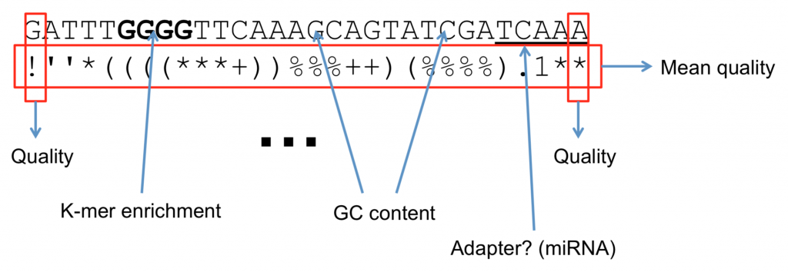

Quality scores
==============

For more information on quality scores, see the Illumina technical note
`Quality Scores for Next-Generation Sequencing
<https://www.illumina.com/documents/products/technotes/technote_Q-Scores.pdf>`_.

Every base in a FastQ read comes with a quality score. This is the
sequencer's estimate of how likely it is that the base was called
incorrectly. Understanding quality scores is essential for judging how
much you can trust your data.

The Phred scale
---------------

Quality scores are reported on the **Phred scale**. A Phred quality
score *Q* is related to the probability *P* that the corresponding base
is wrong by:

.. math::

   Q = -10 \log_{10} P
   \qquad\Longleftrightarrow\qquad
   P = 10^{-Q/10}

A higher score means a lower probability of error. Because the scores
can range beyond the digits 0 to 9, each score is encoded as a single
ASCII character so that it takes up exactly one space per base in the
FastQ file.

There are two encodings you may encounter. The **Sanger / Illumina
1.8+** encoding adds 33 to the score to get the ASCII character
(``ASCII_BASE = 33``). Older **Illumina 1.3 to 1.7** data adds 64
instead (``ASCII_BASE = 64``). The table below lists both.

.. list-table:: Phred quality scores and their ASCII encodings
   :header-rows: 1
   :widths: 12 22 33 33

   * - Q
     - P (error prob.)
     - ASCII (base 33)
     - ASCII (base 64)
   * - 0
     - 1
     - ``!``
     - ``@``
   * - 1
     - 0.79433
     - ``"``
     - ``A``
   * - 2
     - 0.63096
     - ``#``
     - ``B``
   * - 3
     - 0.50119
     - ``$``
     - ``C``
   * - 4
     - 0.39811
     - ``%``
     - ``D``
   * - 5
     - 0.31623
     - ``&``
     - ``E``
   * - 6
     - 0.25119
     - ``'``
     - ``F``
   * - 7
     - 0.19953
     - ``(``
     - ``G``
   * - 8
     - 0.15849
     - ``)``
     - ``H``
   * - 9
     - 0.12589
     - ``*``
     - ``I``
   * - 10
     - 0.1
     - ``+``
     - ``J``
   * - 11
     - 0.07943
     - ``,``
     - ``K``
   * - 12
     - 0.0631
     - ``-``
     - ``L``
   * - 13
     - 0.05012
     - ``.``
     - ``M``
   * - 14
     - 0.03981
     - ``/``
     - ``N``
   * - 15
     - 0.03162
     - ``0``
     - ``O``
   * - 16
     - 0.02512
     - ``1``
     - ``P``
   * - 17
     - 0.01995
     - ``2``
     - ``Q``
   * - 18
     - 0.01585
     - ``3``
     - ``R``
   * - 19
     - 0.01259
     - ``4``
     - ``S``
   * - 20
     - 0.01
     - ``5``
     - ``T``
   * - 21
     - 0.00794
     - ``6``
     - ``U``
   * - 22
     - 0.00631
     - ``7``
     - ``V``
   * - 23
     - 0.00501
     - ``8``
     - ``W``
   * - 24
     - 0.00398
     - ``9``
     - ``X``
   * - 25
     - 0.00316
     - ``:``
     - ``Y``
   * - 26
     - 0.00251
     - ``;``
     - ``Z``
   * - 27
     - 0.002
     - ``<``
     - ``[``
   * - 28
     - 0.00158
     - ``=``
     - ``\``
   * - 29
     - 0.00126
     - ``>``
     - ``]``
   * - 30
     - 0.001
     - ``?``
     - ``^``
   * - 31
     - 7.94e-04
     - ``@``
     - ``_``
   * - 32
     - 6.31e-04
     - ``A``
     - \` (backtick)
   * - 33
     - 5.01e-04
     - ``B``
     - ``a``
   * - 34
     - 3.98e-04
     - ``C``
     - ``b``
   * - 35
     - 3.16e-04
     - ``D``
     - ``c``
   * - 36
     - 2.51e-04
     - ``E``
     - ``d``
   * - 37
     - 2.00e-04
     - ``F``
     - ``e``
   * - 38
     - 1.58e-04
     - ``G``
     - ``f``
   * - 39
     - 1.26e-04
     - ``H``
     - ``g``
   * - 40
     - 1.00e-04
     - ``I``
     - ``h``
   * - 41
     - 7.94e-05
     - ``J``
     - ``i``

Reading accuracy
----------------

It is often easier to think about a quality score in terms of basecall
accuracy rather than error probability:

.. list-table::
   :header-rows: 1
   :widths: 20 40 40

   * - Phred score
     - Probability of incorrect call
     - Basecall accuracy
   * - 10
     - 1 in 10
     - 90%
   * - 20
     - 1 in 100
     - 99%
   * - 30
     - 1 in 1,000
     - 99.9%
   * - 40
     - 1 in 10,000
     - 99.99%
   * - 50
     - 1 in 100,000
     - 99.999%

Putting it together
-------------------

The figure below shows a FastQ read with its quality line annotated, so
you can see how each ASCII character maps back to a score and therefore
to a confidence in the basecall.

   An annotated FastQ read: each character on the quality line encodes
   the Phred score for the base directly above it.

What are quality scores good for?
---------------------------------

Quality scores let you make informed decisions about your data. You can
use them to trim low-quality bases from the ends of reads, to discard
reads that are poor overall, and to weight basecalls during variant
calling so that confident bases count for more than uncertain ones.

What software use quality scores?
---------------------------------

Quality-aware tools are used at nearly every stage of analysis. `FastQC
<https://www.bioinformatics.babraham.ac.uk/projects/fastqc/>`_
summarizes the score distribution across a run, `Trimmomatic
<http://www.usadellab.org/cms/?page=trimmomatic>`_ trims on the basis of
quality, and variant callers use the scores when deciding how much to
trust each observed base.
