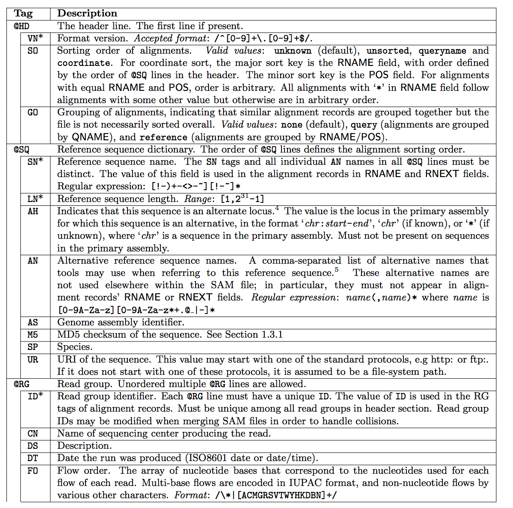
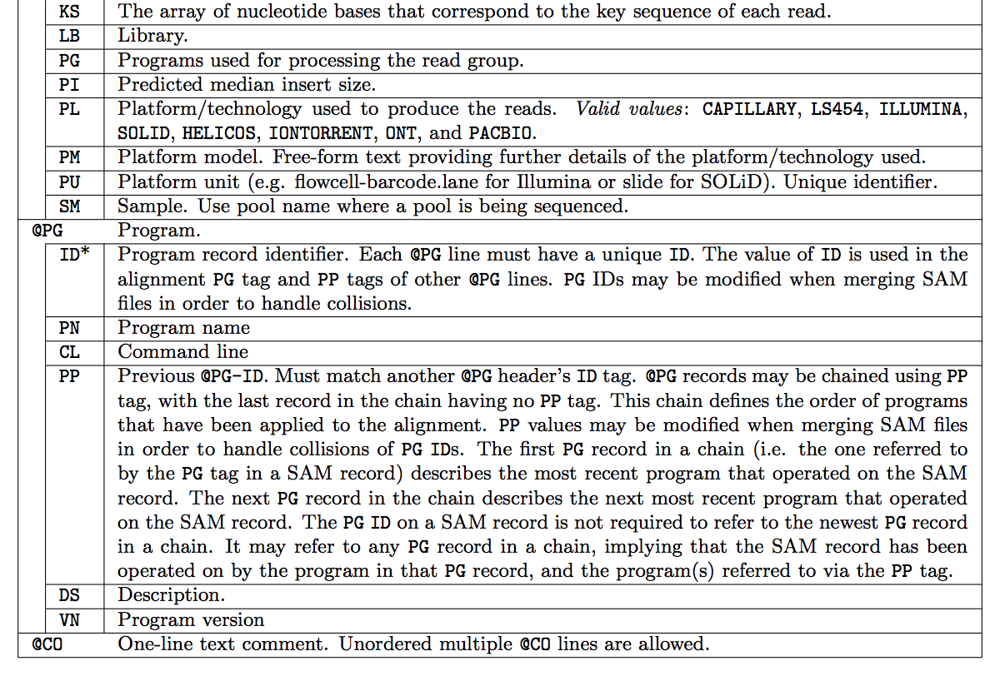
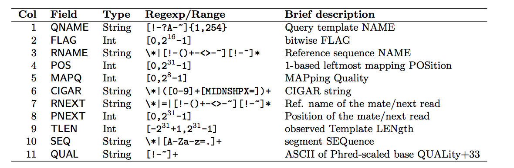
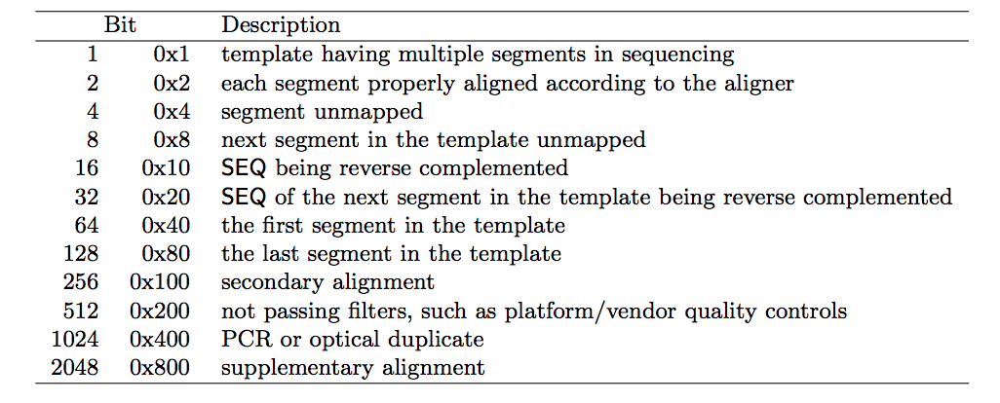
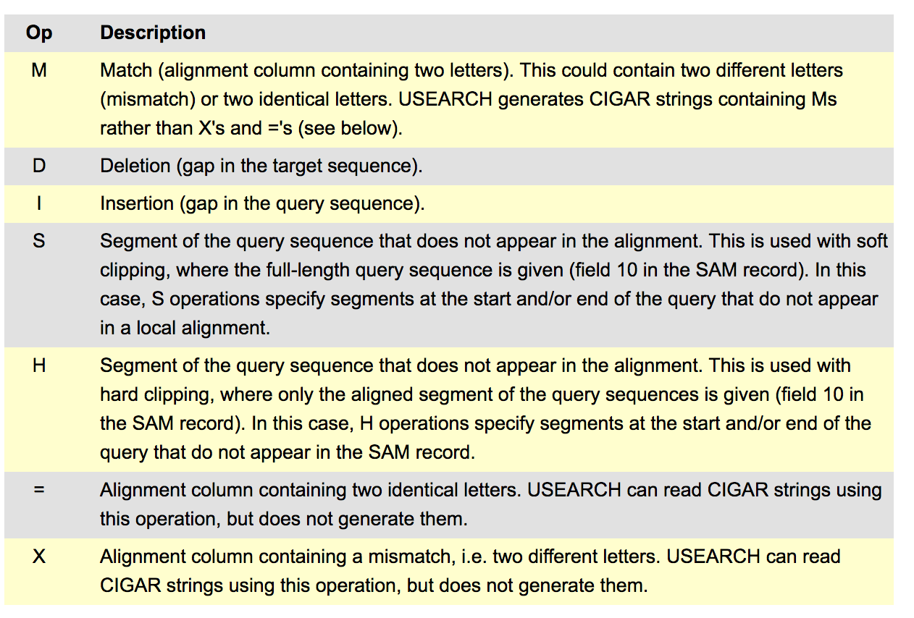
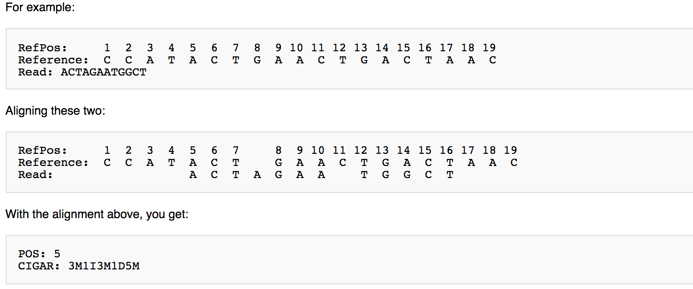

SAM, BAM and CRAM formats
=========================

For the full specification, see the `SAM/BAM format specification
<https://samtools.github.io/hts-specs/SAMv1.pdf>`_.

Once reads have been aligned to a reference, the alignments are stored in
one of three closely related formats. **SAM** (Sequence Alignment/Map)
is the human-readable, tab-delimited text form. **BAM** is its
compressed binary equivalent, and **CRAM** is a more heavily compressed
format that stores alignments relative to a reference to save even more
space.

SAM
---

A SAM file has two parts: an optional header, and the alignment records
themselves.

Header
~~~~~~

Header lines begin with ``@`` and describe the file: the reference
sequences, the programs that were run, read groups, and so on. Each
header line uses two-letter record type codes and two-letter tags.

   SAM header record types and their tags (part 1). Source: `SAM/BAM
   specification <https://samtools.github.io/hts-specs/SAMv1.pdf>`_.

   SAM header record types and their tags (part 2). Source: `SAM/BAM
   specification <https://samtools.github.io/hts-specs/SAMv1.pdf>`_.

Alignment records
~~~~~~~~~~~~~~~~~~

Each alignment record has 11 mandatory, tab-separated fields, optionally
followed by any number of extra tagged fields.

   The 11 mandatory fields of a SAM alignment record. Source: `SAM/BAM
   specification <https://samtools.github.io/hts-specs/SAMv1.pdf>`_.

The FLAG field
~~~~~~~~~~~~~~~

The second field, FLAG, is a bitwise flag that packs several yes/no
properties of the alignment (paired, mapped, reverse strand, and so on)
into a single integer.

   The meaning of each bit in the SAM FLAG field. Source: `SAM/BAM
   specification <https://samtools.github.io/hts-specs/SAMv1.pdf>`_.

Decoding a FLAG value by hand is tedious, so use the Broad Institute's
`Explain SAM Flags <https://broadinstitute.github.io/picard/explain-flags.html>`_
tool, which converts a flag integer to and from its individual bits.

MapQ
~~~~

The fifth field, MAPQ, is the mapping quality. Like a Phred base quality,
it is ``-10 log10`` of the probability that the read is mapped to the
wrong position, rounded to the nearest integer. A value of 255 means the
mapping quality is not available.

CIGAR
~~~~~

The sixth field, CIGAR, is a compact string that describes how the read
aligns to the reference: which bases match or mismatch, which are
inserted or deleted, and which are clipped.

   The CIGAR operations and their meanings. Source: `usearch CIGAR
   documentation <https://www.drive5.com/usearch/manual/cigar.html>`_.

   A worked example of a CIGAR string. Source: `University of Michigan
   SAM wiki
   <https://genome.sph.umich.edu/wiki/SAM#What_is_a_CIGAR.3F>`_.

Example
~~~~~~~

A small SAM file with a two-line header and a few alignment records
looks like this:

.. code-block:: text

   @HD	VN:1.5	SO:coordinate
   @SQ	SN:ref	LN:45
   HWI-ST865:416	0	ref	7	30	8M2I4M1D3M	*	0	0	TTAGATAAAGGATACTG	*
   HWI-ST865:417	0	ref	9	30	3S6M1P1I4M	*	0	0	AAAAGATAAGGATA	*
   HWI-ST865:418	0	ref	16	30	6M14N5M	*	0	0	ATAGCTTCAGC	*

BAM
---

BAM is the compressed binary version of SAM. It contains exactly the
same information, but because it is binary it is much smaller and can be
indexed for fast random access to any region of the genome. Almost all
tools that work with alignments read and write BAM. Common examples are
`Samtools <http://samtools.github.io/>`_, `Picard
<https://broadinstitute.github.io/picard/>`_, and the `Integrative
Genomics Viewer (IGV)
<https://software.broadinstitute.org/software/igv/>`_.

CRAM
----

CRAM compresses alignments even further by storing them relative to the
reference sequence, keeping only the differences from the reference
rather than the full read sequence. This can dramatically reduce file
size, at the cost of needing the reference available to decode the file.
For details, see the `CRAM format specification
<https://samtools.github.io/hts-specs/CRAMv3.pdf>`_.
