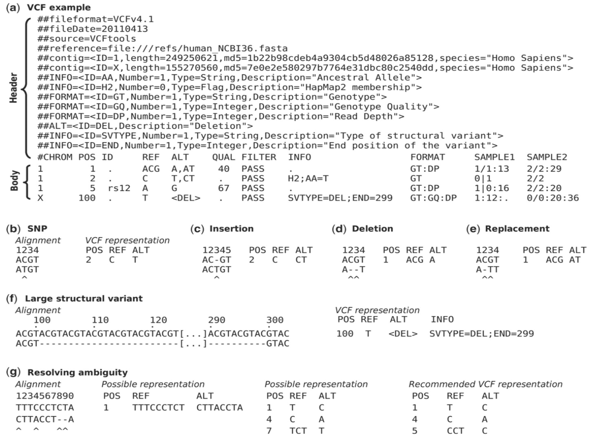

VCF format
==========

For the full specification, see the `VCF format specification
<https://samtools.github.io/hts-specs/VCFv4.2.pdf>`_.

VCF (Variant Call Format) is the standard text format for storing genetic
variants: the places where a sample's sequence differs from a reference.
This includes single-nucleotide polymorphisms (SNPs), insertions and
deletions (indels), and larger structural variants.

Format
------

A VCF file has a header section followed by one data line per variant.
Header lines begin with ``##`` and describe the file and the meaning of
the fields used below; the single line beginning with ``#CHROM`` names
the columns. Each variant record has eight required, tab-separated
fields:

* **CHROM** — the chromosome the variant is on.
* **POS** — the 1-based position of the variant on the chromosome.
* **ID** — an identifier for the variant (for example a dbSNP ``rs``
  number), or ``.`` if none.
* **REF** — the reference allele (the base(s) in the reference).
* **ALT** — the alternate allele(s) observed in the sample.
* **QUAL** — a Phred-scaled quality score for the assertion that a
  variant is present.
* **FILTER** — ``PASS`` if the variant passed all filters, or a list of
  the filters it failed.
* **INFO** — a semicolon-separated list of additional annotations.

The figure below shows an example from the specification:

   An example VCF file with its header lines and several variant
   records. Source: `VCF format specification
   <https://samtools.github.io/hts-specs/VCFv4.2.pdf>`_.

Software that use VCF format
----------------------------

VCF is produced and consumed by most variant-focused tools:

* `GATK <https://gatk.broadinstitute.org/>`_ — variant calling
  and filtering.
* `Samtools / BCFtools <http://samtools.github.io/>`_ — variant calling
  and VCF manipulation.
* `SnpEff <http://snpeff.sourceforge.net/>`_ — annotating variants with
  their predicted effects.
* `VCFtools <https://vcftools.github.io/index.html>`_ — filtering and
  summarizing VCF files.
* `dbSNP <https://www.ncbi.nlm.nih.gov/snp/>`_ — a public
  database of known variants.

How are these files generated?
------------------------------

VCF files are the output of a variant-calling pipeline: reads are
aligned to a reference, the alignments are processed, and a variant
caller compares the sample to the reference to produce the list of
differences. For a full worked example of such a pipeline, see the
:doc:`whole genome sequencing walkthrough <../variant_detection/wgs>`.
