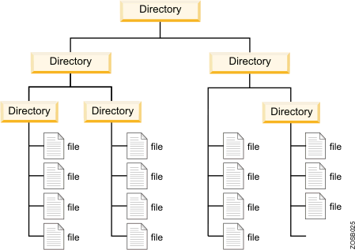

Customizing Your Unix Environment
==================================

This walkthrough is designed to show users some interesting ways to use the
command line and set it up in a way that makes it most comfortable.

Getting Started
---------------

In order to follow the steps exactly as described in this tutorial you will
need the following:

* A personal computer with an ssh client
* An ssh connection to a server (HPC, standalone, etc)
* Optional: a VPN connection to the network where the remote server is hosted.

What is a Unix Environment?
---------------------------

A Unix environment is composed of three components:

1. **The kernel**: this is the master control program of the operating system.
   This handles everything that make a computer a computer, such as I/O
   streams, booting, peripherals, etc.

2. **File system**: this is a hierarchical file system. This is the system in
   which the operating system keeps track of all the files and folders it needs
   in order to function. An example filesystem is seen in the figure below:

3. **The shell (aka. terminal, command prompt)**: This is the interface between
   the user and the kernel. The main purpose of the shell is to take a command
   or series of commands and sends them to the kernel to be processed into a
   set of instructions. This is place where you will spend most of your time
   analyzing data, so may as well make it comfortable for you to work in, which
   is the main objective in this tutorial.

.bashrc, .bash_profile, and .profile files
-------------------------------------------

Each of these files could be considered a config file: they all help in making
your terminal environment the way you want, though each has a particular
purpose within the shell. Each of these are found in your home directory
(``/home/$USER/``) which we will access via the shortcut ``~`` or ``~/``,
which just saves you from having to type the full path to your home directory.

A note about hidden files: as you may have noticed, there is a preceding ``.``
in front of the filenames. This is Unix/Linux notation to hide a file by
default when looking into a directory. This is because you most likely won't
want to see these files every time you ``ls`` your home directory (they can
start to clutter things) but also because these are generally very important
files that are critical to the way your account functions, so tampering with
these by mistake could be very serious. In order to view them, you can run
``ls -a`` which will list everything in the directory. To access them, use the
complete filename, including the ``.``.

.bashrc
~~~~~~~

This is the main file where you add most of your configurations, such as
aliases, PATH variable, color schemes, etc. Unlike the other configuration
files, this affects every terminal instance as opposed to only the login
shell, which is handled by ``.bash_profile``.

A few things that are defined in this file are:

* set the ``$PS1`` variable, which displays hostname and current directory
* set the ``$PATH`` variable (discussed below)
* aliases
* history settings

**IMPORTANT**: this file should never output anything! You will run into some
very frustrating situations if it does.

.bash_profile
~~~~~~~~~~~~~

This handles the login nodes, i.e. as soon as you ``ssh`` or log into a
computer, this is the file that gets loaded. The reason being is that sometimes
you want to view diagnostics of the machine that you're logging into (how long
has it been running, are there any updates that need to be installed, etc.)
which you wouldn't want to see in every other terminal instance. Unfortunately
this does not have the same settings as the ``.bashrc`` file, so your path will
not work **unless** you load your ``.bashrc`` file from within. To do so, you
can add the following lines to your ``.bash_profile`` file (it may already be
there, so check before you add this):

.. code-block:: bash

   if [ -f $HOME/.bashrc ]; then
           source $HOME/.bashrc
   fi

   # likewise for .profile
   if [ -f $HOME/.profile ]; then
           source $HOME/.profile
   fi

.profile
~~~~~~~~

This file isn't used very often, however one thing to note: anything that
should be available to graphical applications or sh MUST go here.

TMUX Session
------------

Tmux is a terminal multiplexer that enables a number of terminals (or windows)
to be created inside a single terminal window or remote terminal session. It is
useful for dealing with multiple programs from a command-line interface, and for
separating programs from the Unix shell that started the program. For the full
set of features please check the man page or this `handy cheatsheet
<https://gist.github.com/MohamedAlaa/2961058>`_.

To get started, ssh into your server:

.. code-block:: bash

   ssh user@server

**IMPORTANT:** If you are using Dalma, please note that tmux is not installed
on this system. Please skip to the next section of this tutorial or find
another server to test this on.

To start a tmux session:

.. code-block:: bash

   tmux

Or, you can name the tmux session to help keep things organized. In this
example, the tmux session we will use is named 'test':

.. code-block:: bash

   tmux new -s test

To detach from a tmux session (log out of the session but keep it running)
press ``ctrl+b`` then ``d``.

To see existing sessions on your account:

.. code-block:: bash

   tmux ls # or tmux list-sessions

**NOTE:** your tmux sessions will not appear if you are not on the same login
node they were created on. For example, prince has ``log-0`` and ``log-1``. A
tmux session created on ``log-0`` will not be accessible to that on ``log-1``
and vice versa. Please see the session on setting up your ssh alias below.

To log back into your tmux session:

.. code-block:: bash

   tmux attach

Or, if you have multiple sessions:

.. code-block:: bash

   tmux attach -t test

Script Command
--------------

The ``script`` command is a way to log and replay the commands that were
entered during a script session. This is useful for sharing workflows and
keeping track of what has been done.

While in a ``tmux`` session, start a ``script`` session to begin logging your
commands and name it ``test_commands``:

.. code-block:: bash

   script test_commands

To end a ``script`` session and dump the commands into a file type ``exit`` or
``ctrl+d``. The results will be saved into a file named ``test_commands``
within your working directory. If no filename was provided they will be saved
to a file named ``typescript``.

To append to an existing script file:

.. code-block:: bash

   # in this example, filename is test_commands
   script -a

Downloading, Compiling, and Adding Software to the $PATH
---------------------------------------------------------

Download and Compile
~~~~~~~~~~~~~~~~~~~~

There are often times when users do not have sufficient permissions to install
software on a server so then we have to wait for someone with permissions to do
it. As a workaround, you can download and compile (NOT install), and run
packages yourself.

The first step is to grab the package you're interested in. We can use this
using ``wget``, ``curl``, or ``git clone``. In this example, we will grab BWA
using ``git clone``. This will download the BWA source code into the current
directory (it is good practice to compile all of your software into one
directory, say ``/scratch/$USER/software``). Once it is done, we can compile
the software using ``make``. There are other ways to compile software, but this
is one of the more common ways so we will stick with this.

.. code-block:: bash

   # Download the repository using git
   git clone https://github.com/lh3/bwa.git

   # change into the bwa directory
   cd bwa

   # compile using make
   make

   # once it is done, you can try to run bwa
   ./bwa

   # You should see the help output from bwa.
   # If you do then it works! If not, you may need to make the bwa binary
   # file executable using chmod +x ./bwa

PATH Variable
~~~~~~~~~~~~~

Now that we have it running, we can continue in our analysis. However, it's
pretty annoying that you have to write ``/scratch/$USER/software/bwa/bwa``
every time you want to run BWA; why can't we just type ``bwa`` like all the
other commands (``ls``, ``pwd``, ``cp``)? After all, it is a command, isn't it?
Well, in fact you can! This is where the PATH variable comes into play. For
normal, distributed commands (such as those above) the path variable points to
a directory that holds the binary executable files in it, telling your user
account where to find them. So, if we print the $PATH variable:

.. code-block:: bash

   echo $PATH
   /opt/local/bin:/usr/local/sbin:/usr/local/bin:/usr/sbin:/usr/bin:/sbin:/bin:/usr/games:/usr/local/games

You might see something like this, a list of directory paths, separated by
``:``. If we ``ls`` one of those directories, say ``/bin``:

.. code-block:: bash

   ls /bin
   bash          bzmore  dir        fuser   kill        lsblk   nc.openbsd    ntfsfix   pwd        sh            systemd-inhibit         uname       zfgrep
   bunzip2       cat     dmesg      fusermount  kmod        lsmod   netcat        ntfsinfo  rbash      sh.distrib        systemd-machine-id-setup    uncompress      zforce
   busybox       chacl   dnsdomainname  getfacl     less        mkdir   netstat       ntfsls    readlink   sleep         systemd-notify          unicode_start   zgrep
   bzcat         chgrp   domainname     grep    lessecho    mknod   networkctl    ntfsmove  red        ss            systemd-tmpfiles        vdir        zless
   bzcmp         chmod   dumpkeys       gunzip  lessfile    mktemp  nisdomainname     ntfstruncate  rm     static-sh         systemd-tty-ask-password-agent  vmmouse_detect  zmore
   bzdiff        chown   echo       gzexe   lesskey     more    ntfs-3g       ntfswipe  rmdir      stty          tailf               wdctl       znew
   bzegrep       chvt    ed         gzip    lesspipe    mount   ntfs-3g.probe     open      rnano      su            tar                 which       zsh
   bzexe         cp      efibootmgr     hciconfig   ln      mountpoint  ntfs-3g.secaudit  openvt    run-parts  sync          tempfile            whiptail    zsh5
   bzfgrep       cpio    egrep      hostname    loadkeys    mt      ntfs-3g.usermap   pidof     rzsh       systemctl         touch               ypdomainname
   bzgrep        dash    false      ip      login       mt-gnu  ntfscat       ping      sed        systemd       true                zcat
   bzip2         date    fgconsole      journalctl  loginctl    mv      ntfscluster       ping6     setfacl    systemd-ask-password  udevadm             zcmp
   bzip2recover  dd      fgrep      kbd_mode    lowntfs-3g  nano    ntfscmp       plymouth  setfont    systemd-escape    ulockmgr_server         zdiff
   bzless        df      findmnt        keyctl  ls      nc      ntfsfallocate     ps        setupcon   systemd-hwdb      umount

These are a lot of the commands you use on a daily basis in the terminal
(``ls``, ``pwd``, ``cp``). The ``$PATH`` variable is how your account can
keep track of what
commands to provide your user as different users have different setups,
privileges, software, etc.

So now that we have a folder called ``software`` where we're going to house all
of our compiled software, we can tell the ``$PATH`` variable to look into our
software directory for binaries that we would like in our path so that we may
access them from anywhere within the filesystem. If a file is executable and it
resides in one of the paths in our ``$PATH`` variable, it can be executed from
anywhere.

To do this, we need to append the path (either the full or relative are fine)
to the ``$PATH`` variable.
**IMPORTANT:** Make sure that you follow the commands exactly and not overwrite
the ``$PATH`` variable but append to it. If you overwrite it, the operating
system will not be able to find any of the necessary commands since their paths
will not be found in the ``$PATH`` variable.

There are two ways to add the new path to the ``$PATH`` variable:

.. code-block:: bash

   # To append to the path variable for the current session only (until you log out)
   export PATH=$PATH:/scratch/$USER/software/bwa

   # To verify, you can print your $PATH variable to see if it now contains the new path
   echo $PATH

   # To permanently add a path you will need to make this edit in your .bashrc file
   vim ~/.bashrc

   # Then at the top add the same command we used above and then save and quit
   export PATH=$PATH:/scratch/$USER/software/bwa

   # To reload your terminal environment with these new changes we will need
   # to source the .bashrc file
   source ~/.bashrc

   # Now if you try to run bwa it should work. If not, then try logging out
   # of your session and log back in
   bwa

   # If you get the same output as ./bwa from the previous step, then congratulations!

Command History
---------------

Now that you know how to edit and reload the ``.bashrc`` file, we should go
ahead and make some more changes that may be convenient for you.

It is common practice to search your command history to see all the commands
that were executed previously on your account (you can do so with the
``history`` command or search with ``ctrl+r``). However, what if you enter
100,000 commands? Most accounts won't remember that many by default, they will
only remember the last 1000, even if some commands are redundant. To change
this to store all commands (or nearly all), you can add these lines to the
``.bashrc`` file:

.. code-block:: bash

   vim ~/.bashrc

   # Removes duplicated commands and doesn't store commands that start with a space
   HISTCONTROL=ignoreboth
   # Sets the filesize (chances are you won't fill this up for several years)
   HISTFILESIZE=10000000
   # Number of lines that are stored in memory while your session is ongoing
   HISTSIZE=100000

   # save and quit and then source the file
   source ~/.bashrc

Aliases
-------

Aliases are a way to rename commands or strings of commands. A common example
is ssh; many analysts log into a server on a daily basis:

.. code-block:: bash

   ssh -X at120@prince.hpc.nyu.edu

This is something you might use on a daily basis. It may seem like not too much
to type, but it does get annoying doing it every day. To make this more
succinct, we can create an alias named something shorter which, when executed,
will execute the ssh command. This is done in the ``.bashrc`` file as well. So
open it up and add these lines:

.. code-block:: bash

   # NOTE: you can change the server to any other server you'd like, you do not have to use prince.hpc.nyu.edu
   # Also NOTE: you can change $USER to whatever username you use for that server.
   # For example, my laptop user is alan, but my hpc user is at120. So for this example I would use at120 instead of $USER
   alias prince='ssh -X $USER@prince.hpc.nyu.edu'

   source ~/.bashrc

Now you should be able to ssh into the server with just the command ``prince``.

BUT I STILL NEED TO ENTER A PASSWORD! Is there a way to skip that part, too?
Yes.

Password-less SSH
-----------------

Believe it or not, this is a significantly more secure way to access other
computers. However, that's not the point of this section. In this section
we'll simply show briefly how it works and how to set it up.

The first step is to create a signature for your account, so that when you ssh
into a computer it knows who you are and will let you in without prompting for
a password. This is called the RSA key. You may already have one; they are
stored in the ``~/.ssh`` folder. If that folder doesn't exist then create it:

.. code-block:: bash

   # To make the .ssh directory
   mkdir ~/.ssh  # only do this if you do not have an .ssh directory already!

   # Then ls the .ssh directory to check to see if you have an RSA key already.
   # It will be in the id_rsa.pub file.
   # Your directory, if it exists, may look something like this
   ls ~/.ssh
   config  id_rsa  id_rsa.orig  id_rsa.pem  id_rsa.pub  id_rsa.pub.orig  keras-workshop.pem  known_hosts

   # If id_rsa.pub exists, then skip the command immediately below.
   # If it does not exist, we can create an RSA key with the following command
   ssh-keygen -t rsa
   # Press enter all the way through, even when it prompts for a password!

   # To verify, ls the directory and see if id_rsa.pub is now there
   ls ~/.ssh

Now what we want to do is give our public RSA key to the server you're going
to access (presumably the one you used to create your alias for!). We can do
that with a slightly sophisticated command (but don't worry, you'll learn what
it means in one of our later posts):

.. code-block:: bash

   # This command appends your signature to the authorized keys file on the
   # server, which is a list of signatures that it recognizes.
   # NOTE: You will have to enter your password at this step.
   cat ~/.ssh/id_rsa.pub | ssh at120@prince.hpc.nyu.edu 'cat >> .ssh/authorized_keys'

   # Once the transfer is complete, try running your alias
   prince

Hopefully now you can login without being prompted for a password!
