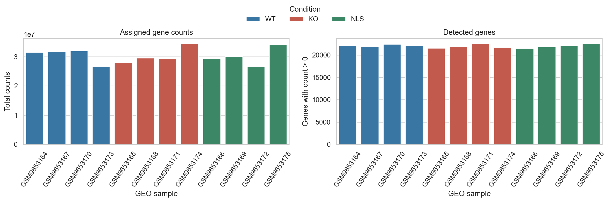
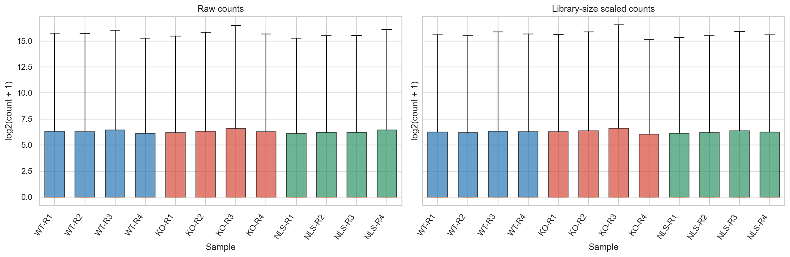
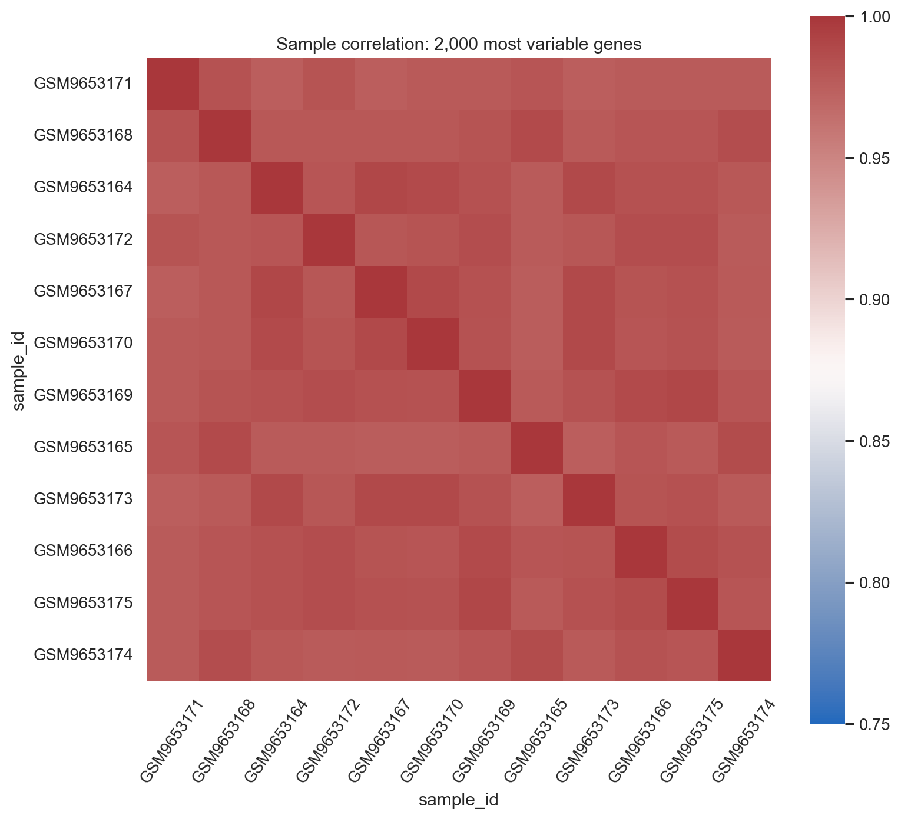
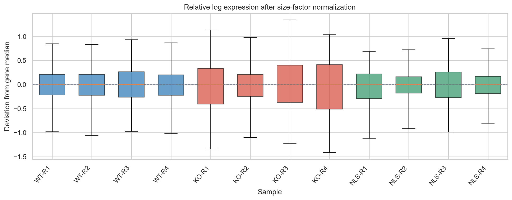
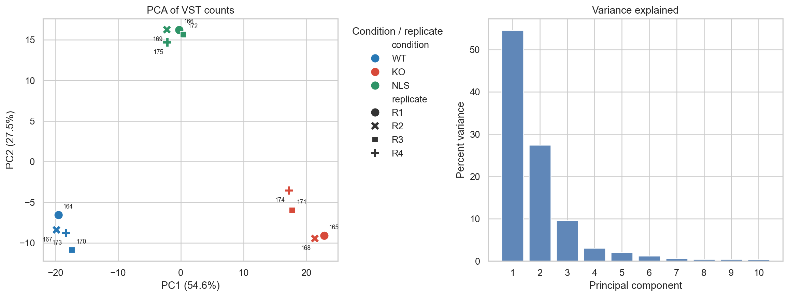
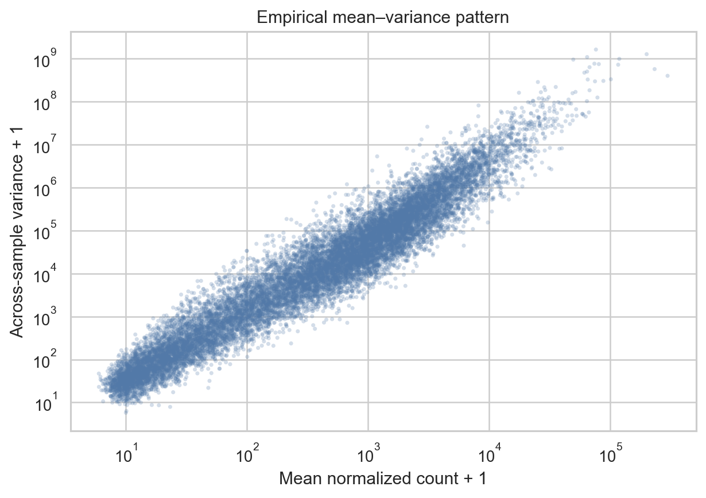
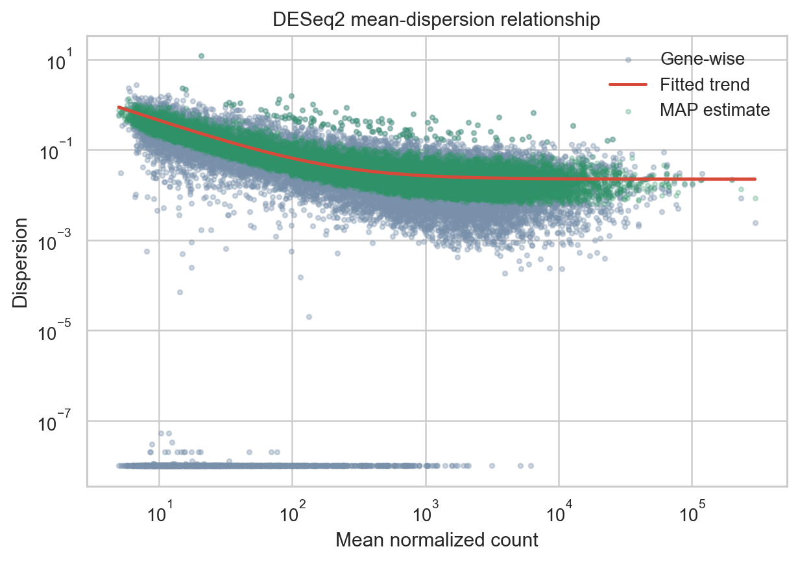
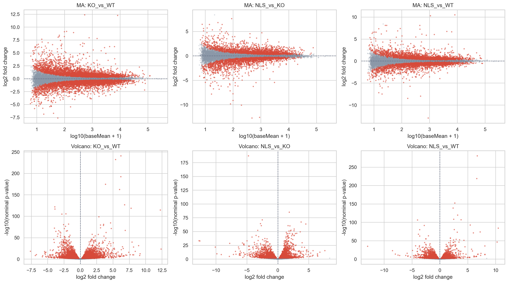
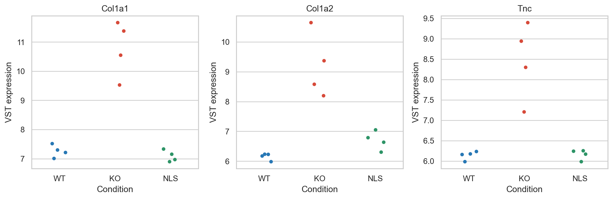
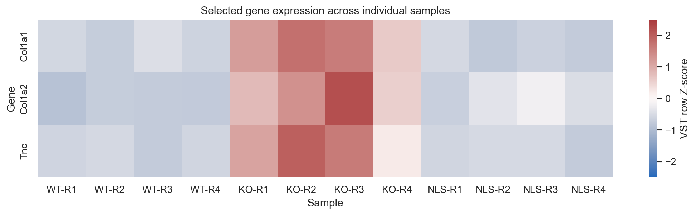

Bulk RNA-seq
============

This tutorial walks through a sample-level bulk RNA-seq analysis using a public
mouse embryonic stem cell dataset. It introduces the decisions behind quality
control, normalization, variance and batch diagnostics, and differential gene
expression. The worked analysis uses Bioconductor DESeq2; Python is used for the
figures in the companion notebook.

The goal is to understand what each step can tell you, what it cannot tell
you, and which parts of the analysis depend on the experimental design.

Learning objectives
-------------------

By the end of this tutorial, you should be able to:

* Inspect a count matrix and verify that its sample columns match the metadata.
* Distinguish read-level quality control from count-level sample checks.
* Identify libraries with unusual depth or expression distributions.
* Filter low-information genes using a stated, design-aware rule.
* Use DESeq2 size factors for count-model normalization and transformed values
  for visualization.
* Read RLE, sample-correlation, PCA, mean-variance, and dispersion plots.
* Decide when batch or block terms belong in the model and recognize
  confounding.
* Interpret effect sizes and adjusted p-values for planned contrasts.
* Report analysis choices, caveats, and replicate-level results.

Dataset and publication
-----------------------

The example uses mouse embryonic stem cells at Day 0, comparing wild type
(WT), beta-actin knockout (KO), and nuclear-localization-signal rescue (NLS).

* NCBI GEO series GSE327304:
  https://www.ncbi.nlm.nih.gov/geo/query/acc.cgi?acc=GSE327304
* GEO supplementary count archive:
  https://www.ncbi.nlm.nih.gov/geo/download/?acc=GSE327304&format=file
* Linked manuscript/preprint:
  https://doi.org/10.64898/2026.04.15.718829
* bioRxiv full text:
  https://www.biorxiv.org/content/10.64898/2026.04.15.718829v1.full

The companion project contains a gene-by-sample integer count matrix assembled
from the 12 Day 0 count files currently listed in GEO, with four libraries for
each condition. These are processed gene counts, not FASTQ files.

.. warning::

   GEO currently lists four Day 0 libraries per condition, while the linked
   manuscript methods appear to describe three biological RNA-seq replicates.
   This tutorial uses the 12 GEO count files and is a reproducible reanalysis
   of that public matrix. Reconcile the sample subset and replicate structure
   with the study records before treating these results as a reproduction of
   a manuscript analysis. The notebook includes all 12 samples so the issue is
   visible and reviewable.

The GEO count files support sample-level count diagnostics and downstream
count-based analysis. They cannot provide per-base sequencing quality,
adapter content, strandedness, mapping rates, or gene-body coverage. If raw
reads are available, inspect them with FastQC and MultiQC and use a documented
quantification workflow such as nf-core/rnaseq.

Companion notebook and files
----------------------------

The branch includes an executed Jupyter notebook, the processed count matrix,
sample manifest, environment file, and scripts used by the notebook. Download
the notebook here:

:download:`Bulk RNA-seq tutorial notebook <bulk_rna_seq_tutorial/notebooks/bulk_rnaseq_tutorial.ipynb>`

The notebook uses these accompanying files, which can also be downloaded individually:

:download:`Environment specification <bulk_rna_seq_tutorial/environment.yml>`
:download:`Processed GEO count matrix <bulk_rna_seq_tutorial/data/processed/GSE327304_D0_raw_counts.tsv>`
:download:`Sample manifest <bulk_rna_seq_tutorial/data/metadata/GSE327304_D0_sample_manifest.csv>`

From a clone of this repository, run the notebook from its project directory:

.. code-block:: bash

   cd source/transcriptomics/bulk_rna_seq_tutorial
   conda env create -f environment.yml
   conda activate bulk-rnaseq-tutorial
   jupyter lab notebooks/bulk_rnaseq_tutorial.ipynb

The environment uses R with Bioconductor DESeq2 for model fitting and Python
for data checks and plots. The notebook displays generated plots and summary
tables, and saves detailed outputs under its results directory.

1. Check the study design and inputs
------------------------------------

The experimental unit is the biological sample, not the number of reads or
genes. Before fitting a model, verify the condition, replicate, and any known
batch annotations against the GEO records and the experimental plan.

The count matrix and manifest are bundled with the companion project. Match
columns and rows by sample accession rather than relying on their original
order.

.. code-block:: r

   count_tab <- read.delim(
     'data/processed/GSE327304_D0_raw_counts.tsv',
     check.names = FALSE
   )
   rownames(count_tab) <- count_tab$gene_id
   count_tab$gene_id <- NULL
   counts <- as.matrix(count_tab)
   storage.mode(counts) <- 'integer'

   samples <- read.csv(
     'data/metadata/GSE327304_D0_sample_manifest.csv',
     stringsAsFactors = FALSE
   )
   rownames(samples) <- samples$sample_id
   counts <- counts[, rownames(samples), drop = FALSE]

   stopifnot(identical(colnames(counts), rownames(samples)))
   stopifnot(all(counts >= 0L))

Inspect the design before choosing terms. In the worked analysis, replicate
labels R1-R4 are used as a block only if they represent genuinely matched
biological blocks across WT, KO, and NLS. A sequencing lane or technical split
is not a biological replicate.

.. code-block:: r

   samples$condition <- relevel(
     factor(samples$condition, levels = c('WT', 'KO', 'NLS')),
     ref = 'WT'
   )
   samples$replicate <- factor(samples$replicate)

   design_matrix <- model.matrix(
     ~ replicate + condition,
     data = samples
   )
   if (qr(design_matrix)$rank < ncol(design_matrix)) {
     stop('Design is not full rank. Check confounding and factor levels.')
   }

If replicate labels do not identify shared blocks, use a design that reflects
the actual experiment, for example condition alone for independent groups.
Never add a term only because it improves a plot.

2. Count-level quality control
------------------------------

Start by checking total assigned counts and the number of detected genes for
each library. Review these together with the sample manifest. An unusually
shallow library may need investigation, but depth alone is not a reason to
discard a sample.

   Per-library assigned counts and detected genes. These are first-pass
   diagnostics and should be interpreted with the sample records.

Compare count distributions before and after simple library-size scaling.
This display is exploratory only. The DESeq2 model later estimates its own
median-of-ratios size factors.

   Count distributions show both library-depth differences and the strong
   right-skew and zero inflation typical of gene-level counts.

A sample-correlation heatmap gives a broad view of similarity. High
correlation is common because many genes do not change. Pair it with PCA,
count distributions, and metadata to look for sample swaps, outliers, or
unexpected grouping.

   Correlation is a diagnostic view. It is not a test of differential
   expression and does not prove that a sample is correctly labelled.

The RLE plot compares each sample's normalized log expression with each
gene's across-sample median. Similar centers and spreads are generally
expected after normalization. A shift can flag composition differences,
technical structure, or sample problems; do not force all distributions to
look identical.

   RLE is useful alongside other diagnostics. Strong global shifts may also
   reflect biology or assumptions behind relative normalization.

3. Filter and normalize counts
------------------------------

Remove genes with too little information to support reliable dispersion
estimation. The worked rule retains genes with at least 10 counts in at least
four libraries. This is a transparent example, not a universal threshold.
For other designs, consider a design-aware filter such as
edgeR::filterByExpr and keep the original matrix unchanged.

.. code-block:: r

   keep <- rowSums(counts >= 10L) >= 4L
   counts_filtered <- counts[keep, , drop = FALSE]

DESeq2 estimates median-of-ratios size factors to account for relative library
composition. The negative-binomial model is fit to filtered raw integer
counts. Use a variance-stabilizing transformation (VST) for PCA, correlation,
and display, not as input to the count test.

.. code-block:: r

   dds <- DESeqDataSetFromMatrix(
     countData = counts_filtered,
     colData = samples,
     design = ~ replicate + condition
   )
   dds <- DESeq(dds)
   vsd <- vst(dds, blind = FALSE)

If the replicate block is unsupported by the experimental records, change the
design before running DESeq2. Normalization is not the same as transformation:
size factors adjust counts for modeling, while VST values make the mean-
variance relationship more suitable for exploratory plots.

4. PCA and variance diagnostics
-------------------------------

PCA summarizes sample-to-sample expression variation. Color samples by
condition and mark known design variables such as replicate, batch, lane, or
processing date. Check whether the leading PCs associate with condition,
technical factors, or count-level QC. A PC that separates groups is not
automatically a batch effect; it may reflect biology, technical variation,
or both.

   In this run, PC1 explains 54.6% and PC2 explains 27.5% of the displayed
   variance. Condition separates strongly along PC1, while KO libraries also
   spread along PC2. Investigate that pattern with sample annotations and
   replicate-level QC before assigning a cause.

A scree plot reports the fraction of variance captured by each component.
With 12 libraries, treat the plot as descriptive. PCA helps prioritize
follow-up checks; it is not a hypothesis test and cannot by itself identify
which covariate caused the separation.

The mean-variance plot illustrates why raw counts need a count model. Absolute
variance rises with expression level, while the model estimates gene-wise
dispersion and shrinks noisy estimates toward a fitted trend.

   Across-sample variance increases with mean expression, motivating
   mean-dependent dispersion modeling.

   DESeq2 estimates dispersion from biological replicate variation, then
   moderates gene-wise estimates using the fitted mean-dispersion trend.

For experiments with enough independent samples and measured covariates,
variance-partitioning methods can estimate how much expression variability is
associated with each source. A simple model might include condition, donor,
and sequencing batch. Do not use a complex variance-partitioning model with
too few samples or a rank-deficient design; the 12-library example is too
small to estimate many sources reliably.

5. Estimate and handle batch effects
------------------------------------

First make a sample sheet that records known technical variables, such as
library preparation batch, sequencing run, lane, operator, and processing
date. Compare those variables with condition and replicate in PCA, correlation
plots, and count-level QC.

If a known batch is estimable independently of condition, include it in the
count model:

.. code-block:: r

   design(dds) <- ~ sequencing_batch + condition
   dds <- DESeq(dds)

For matched or repeated-measures samples, include the supported subject or
block term as well:

.. code-block:: r

   design(dds) <- ~ donor + sequencing_batch + condition

A design matrix with perfect batch-condition confounding cannot estimate
separate batch and condition effects. More samples or a redesigned experiment
may be needed. Do not try to fix perfect confounding by applying a correction
to the expression matrix.

For exploratory displays, remove a known batch from transformed values only
when the target biology is preserved and the result is clearly labelled as
adjusted. Batch adjustment is not part of the DESeq2 count test. Hidden-factor
methods such as SVA or RUV also require that the biology of interest be
protected in the model and that the number of factors be justified.

6. Test planned differential-expression contrasts
-------------------------------------------------

The worked analysis compares KO with WT, NLS with KO, and NLS with WT. The
log2 fold change is the tested condition relative to its reference. Report
effect sizes with adjusted p-values and inspect the individual libraries.

.. code-block:: r

   res_KO_vs_WT <- results(
     dds,
     contrast = c('condition', 'KO', 'WT'),
     alpha = 0.05
   )
   res_NLS_vs_KO <- results(
     dds,
     contrast = c('condition', 'NLS', 'KO'),
     alpha = 0.05
   )
   res_NLS_vs_WT <- results(
     dds,
     contrast = c('condition', 'NLS', 'WT'),
     alpha = 0.05
   )

Use Benjamini-Hochberg adjusted p-values to control the false discovery rate.
Keep all tested genes in the output, including genes whose adjusted p-value is
missing because they were filtered or could not be tested. Pair statistical
evidence with the size and uncertainty of the estimated effect. A small
p-value is not a measure of biological importance.

The companion run retained 16,539 genes for testing. Its FDR < 0.05 summary is:

.. list-table::
   :header-rows: 1
   :widths: 25 25 25 25

   * - Contrast
     - Tested genes
     - FDR < 0.05
     - FDR < 0.10
   * - KO vs WT
     - 16,539
     - 6,966
     - 8,030
   * - NLS vs KO
     - 16,539
     - 3,970
     - 4,989
   * - NLS vs WT
     - 16,539
     - 4,282
     - 5,146

These values summarize the current public GEO sample set and the stated
blocking model. Reconcile the replicate annotations before treating them as
the study's definitive result.

MA plots show fold change against mean abundance and help reveal unstable
low-count estimates. Volcano plots show effect size against statistical
evidence. Color marks FDR < 0.05 in this worked example; it does not encode
biological importance.

   MA and volcano plots for KO vs WT, NLS vs KO, and NLS vs WT. Review
   log2 fold changes and adjusted p-values in the complete result tables.

Plot individual normalized expression values for selected genes rather than
showing only group means. Replicate-level plots reveal variability that an
average can hide.

   Selected-gene expression is shown for every library. Gene-level patterns
   motivate follow-up experiments; they do not establish direct regulation.

   Heatmap colors are scaled by gene for visual comparison. Read the sample
   labels and replicate variation; row scaling does not compare absolute
   expression between genes.

Reading the rescue contrasts
~~~~~~~~~~~~~~~~~~~~~~~~~~~~

* KO vs WT describes the expression difference associated with the
  perturbation.
* NLS vs KO describes how the rescue condition differs from KO.
* NLS vs WT describes residual differences between the rescue and WT.

A significant NLS-vs-KO result alone does not establish complete rescue. A
small NLS-vs-WT difference can be compatible with rescue, but interpretation
also depends on confidence intervals, power, replicate variation, the design,
and independent measurements. RNA-seq alone does not show direct regulation.

7. Common pitfalls
------------------

.. list-table::
   :header-rows: 1
   :widths: 34 66

   * - Pitfall
     - Better practice
   * - Using TPM or FPKM as input to DESeq2.
     - Fit the count model to raw integer counts or a supported estimated-
       count import such as tximport.
   * - Treating normalization and transformation as interchangeable.
     - Use size factors for the count model and VST values for exploratory
       plots.
   * - Mismatching count columns and metadata rows.
     - Match by sample accession and stop if sample names or order differ.
   * - Treating technical lanes as biological replicates.
     - Identify the experimental unit; merge or model technical structure
       according to the design.
   * - Adding every available variable to the design.
     - Check rank, residual degrees of freedom, and confounding first.
   * - Calling a PCA split a batch effect.
     - Compare PCs against condition, known batches, replicates, and QC
       metrics.
   * - Removing a batch from the expression matrix before testing.
     - Include known estimable batch terms in the count model. Label adjusted
       transformed values as visualization-only.
   * - Removing an outlier because it weakens significance.
     - Investigate sample records and independent QC evidence, then document
       a prespecified exclusion rationale.
   * - Filtering genes based on which contrast looks interesting.
     - Use a stated expression filter independent of the observed result.
   * - Interpreting non-significance as no effect.
     - Report the effect estimate and uncertainty; account for limited power.
   * - Treating RNA-seq as an isoform or splicing analysis.
     - Use transcript-level or splice-aware tools for those questions.
   * - Inferring absolute global RNA changes from relative counts.
     - Use spike-ins or another absolute reference when global RNA content is
       the question.

8. Recommended reporting checklist
----------------------------------

For a reproducible report, record:

* Dataset accession and publication link.
* Genome and gene-annotation version used to generate the counts.
* Sample IDs, experimental units, condition, replicate, and known technical
  covariates.
* Any sample exclusions and the independent evidence supporting them.
* The filtering threshold and number of genes retained.
* DESeq2 design formula, contrast direction, package version, and FDR
  procedure.
* Sample-level QC, RLE, PCA/scree, mean-variance, and dispersion plots.
* Effect sizes, confidence intervals where available, adjusted p-values, and
  the full tested-gene tables.
* Whether analyses use processed counts or raw reads, and which read-level
  QC steps were available.
* Any mismatch between GEO sample annotations and the publication methods.

Workflow summary
----------------

::

   GEO raw-count files and sample metadata
      |
      v
   match sample IDs and verify design
      |
      v
   count-level sample QC and low-count filtering
      |
      v
   DESeq2 size factors and negative-binomial model
      |
      +--> VST for RLE, PCA, correlation, and figures
      |
      +--> planned contrasts and FDR-adjusted gene tables
      |
      v
   interpret effect sizes with replicate variation and study context

Key references
--------------

* GEO GSE327304:
  https://www.ncbi.nlm.nih.gov/geo/query/acc.cgi?acc=GSE327304
* Linked bioRxiv manuscript/preprint:
  https://www.biorxiv.org/content/10.64898/2026.04.15.718829v1.full
* DESeq2 vignette:
  https://bioconductor.org/packages/release/bioc/vignettes/DESeq2/inst/doc/DESeq2.html
* tximport vignette:
  https://bioconductor.org/packages/release/bioc/vignettes/tximport/inst/doc/tximport.html
* edgeR User's Guide:
  https://bioconductor.org/packages/release/bioc/vignettes/edgeR/inst/doc/edgeRUsersGuide.pdf
* limma User's Guide:
  https://bioconductor.org/packages/release/bioc/vignettes/limma/inst/doc/usersguide.pdf
* variancePartition/DREAM vignette:
  https://bioconductor.org/packages/release/bioc/vignettes/variancePartition/inst/doc/dream.html
* nf-core/rnaseq documentation:
  https://nf-co.re/rnaseq/3.27.0
