Gene set enrichment analysis
============================

Gene Set Enrichment Analysis (GSEA) is a computational method that
determines whether a pre-defined set of genes (e.g. those belonging to
a specific GO term or KEGG pathway) shows statistically significant,
concordant differences between two biological states.

GSEA differs from over-representation analysis: rather than testing
whether a subset of *significant* genes is enriched for a category,
GSEA walks the *entire ranked gene list* (typically ranked by log2
fold-change) and asks whether members of each gene set tend to cluster
at the top or bottom. This means you do not have to pick a
significance cut-off in advance.

This page describes the implementation of GSEA using the
``clusterProfiler`` package, run downstream of a differential
expression analysis (e.g. with `DESeq2
<https://bioconductor.org/packages/release/bioc/vignettes/DESeq2/inst/doc/DESeq2.html>`_).
Full ``clusterProfiler`` documentation:
`clusterProfiler vignette
<https://bioconductor.org/packages/release/bioc/vignettes/clusterProfiler/inst/doc/clusterProfiler.html>`_.

.. note::

   An R Markdown notebook covering this workflow is available at
   `gencorefacility/r-notebooks/gsea.Rmd
   <https://github.com/gencorefacility/r-notebooks/blob/master/gsea.Rmd>`_.

Workflow overview
-----------------

1. Load ``clusterProfiler``, ``enrichplot``, ``ggplot2`` and the
   organism-specific annotation database.
2. Read the differential-expression results and build a sorted, named
   vector of log2 fold-changes (the ranked gene list).
3. Run ``gseGO`` to test for GO-term enrichment in the ranked list.
4. Visualize the GO results (dotplot, enrichment map, category
   netplot, ridgeplot, GSEA plot, PubMed trend).
5. Convert gene IDs and run ``gseKEGG`` for KEGG pathway enrichment.
6. Visualize the KEGG results and render an enriched pathway with
   ``pathview``.

Environment
-----------

This is an R workflow. Install ``clusterProfiler``, ``pathview`` and
``enrichplot`` once, then load them at the start of each session. We
also use ``ggplot2`` to add x-axis labels on some plots (e.g.
``ridgeplot``).

.. code:: r

    BiocManager::install("clusterProfiler", version = "3.8")
    BiocManager::install("pathview")
    BiocManager::install("enrichplot")
    library(clusterProfiler)
    library(enrichplot)
    # we use ggplot2 to add x axis labels (ex: ridgeplot)
    library(ggplot2)

Inputs
------

You need:

* A **differential expression results CSV** containing a list of gene
  names and log2 fold-change values. This data is typically produced
  by a differential expression analysis tool such as `DESeq2
  <https://bioconductor.org/packages/release/bioc/vignettes/DESeq2/inst/doc/DESeq2.html>`_.
  In the examples below the file is ``drosphila_example_de.csv``.
* An **organism annotation database** matched to the gene IDs in that
  CSV. The examples here use *D. melanogaster* and ``org.Dm.eg.db``.

Annotation database
~~~~~~~~~~~~~~~~~~~

Install and load the annotation package for your organism. See the
full list at `Bioconductor OrgDb packages
<http://bioconductor.org/packages/release/BiocViews.html#___OrgDb>`_
(there are 19 presently available).

.. code:: r

    # SET THE DESIRED ORGANISM HERE
    organism = "org.Dm.eg.db"
    BiocManager::install(organism, character.only = TRUE)
    library(organism, character.only = TRUE)

Prepare input
-------------

Read the DESeq2 output and build a named, sorted vector of log2
fold-changes. ``clusterProfiler`` requires the list to be sorted in
decreasing order.

.. code:: r

    # reading in data from deseq2
    df = read.csv("drosphila_example_de.csv", header=TRUE)

    # we want the log2 fold change
    original_gene_list <- df$log2FoldChange

    # name the vector
    names(original_gene_list) <- df$X

    # omit any NA values
    gene_list <- na.omit(original_gene_list)

    # sort the list in decreasing order (required for clusterProfiler)
    gene_list = sort(gene_list, decreasing = TRUE)

GO gene set enrichment
----------------------

Run ``gseGO`` against the ranked gene list and the chosen ontology.

Parameters
~~~~~~~~~~

**keyType** This is the source of the annotation (gene IDs). The
options vary for each annotation. In the example of *org.Dm.eg.db*,
the options are:

    ``"ACCNUM"`` ``"ALIAS"`` ``"ENSEMBL"`` ``"ENSEMBLPROT"``
    ``"ENSEMBLTRANS"`` ``"ENTREZID"`` ``"ENZYME"`` ``"EVIDENCE"``
    ``"EVIDENCEALL"`` ``"FLYBASE"`` ``"FLYBASECG"`` ``"FLYBASEPROT"``
    ``"GENENAME"`` ``"GO"`` ``"GOALL"`` ``"MAP"`` ``"ONTOLOGY"``
    ``"ONTOLOGYALL"`` ``"PATH"`` ``"PMID"`` ``"REFSEQ"`` ``"SYMBOL"``
    ``"UNIGENE"`` ``"UNIPROT"``

Check which options are available with the ``keytypes`` command, for
example ``keytypes(org.Dm.eg.db)``.

**ont** one of ``"BP"``, ``"MF"``, ``"CC"`` or ``"ALL"``.

**nPerm** the higher the number of permutations you set, the more
accurate your result will be, but the longer the analysis will take.

**minGSSize** minimum number of genes in set. Gene sets with fewer
than this many genes in your dataset will be ignored.

**maxGSSize** maximum number of genes in set. Gene sets with more than
this many genes in your dataset will be ignored.

**pvalueCutoff** p-value cutoff.

**pAdjustMethod** one of ``"holm"``, ``"hochberg"``, ``"hommel"``,
``"bonferroni"``, ``"BH"``, ``"BY"``, ``"fdr"``, ``"none"``.

Create the gseGO object
~~~~~~~~~~~~~~~~~~~~~~~

.. code:: r

    gse <- gseGO(geneList = gene_list,
                 ont = "ALL",
                 keyType = "ENSEMBL",
                 nPerm = 10000,
                 minGSSize = 3,
                 maxGSSize = 800,
                 pvalueCutoff = 0.05,
                 verbose = TRUE,
                 OrgDb = organism,
                 pAdjustMethod = "none")

Visualizations
~~~~~~~~~~~~~~

Dotplot
^^^^^^^

.. code:: r

    require(DOSE)
    dotplot(gse, showCategory = 10, split = ".sign") + facet_grid(. ~ .sign)

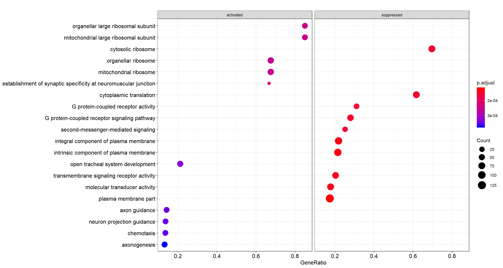

   Top 10 enriched GO terms, faceted by whether the gene set is
   activated or suppressed in the ranking.

Enrichment map
^^^^^^^^^^^^^^

Enrichment map organizes enriched terms into a network with edges
connecting overlapping gene sets. Mutually overlapping gene sets tend
to cluster together, making it easy to identify functional modules.

.. code:: r

    emapplot(gse, showCategory = 10)

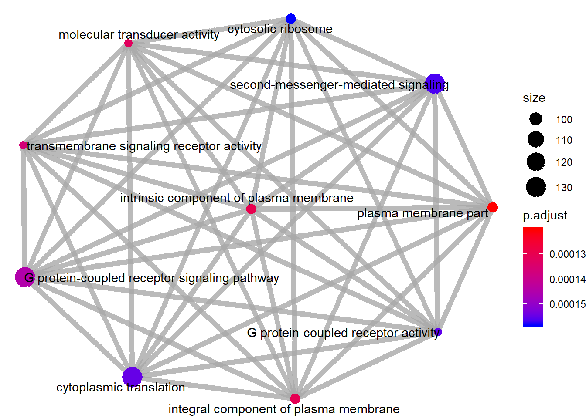

   Enrichment map of GO-term GSEA: nodes are terms, edges connect
   terms that share genes.

Category netplot
^^^^^^^^^^^^^^^^

The ``cnetplot`` depicts the linkages of genes and biological concepts
(e.g. GO terms or KEGG pathways) as a network. It is helpful for
seeing which genes are involved in enriched pathways and which genes
belong to multiple annotation categories.

.. code:: r

    # categorySize can be either 'pvalue' or 'geneNum'
    cnetplot(gse, categorySize = "pvalue", foldChange = gene_list, showCategory = 3)

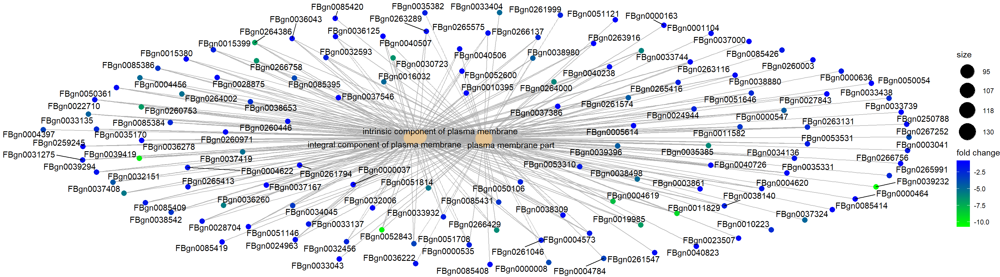

   Category netplot for the top 3 enriched GO terms, with gene
   fold-change overlaid as colour.

Ridgeplot
^^^^^^^^^

Grouped by gene set, density plots are generated by using the
frequency of fold-change values per gene within each set. Helpful to
interpret up- and down-regulated pathways.

.. code:: r

    ridgeplot(gse) + labs(x = "enrichment distribution")

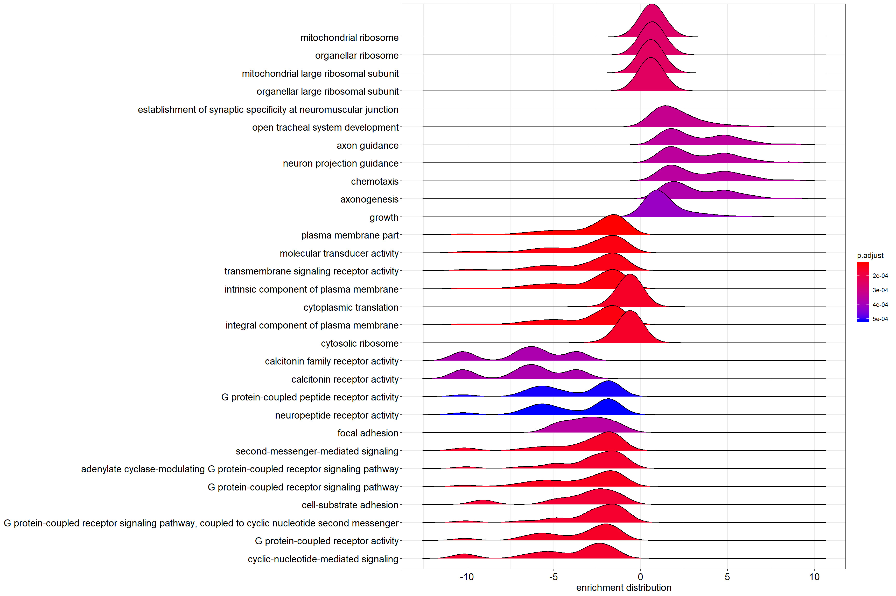

   Ridgeplot: per-gene-set density of log2 fold-change values across
   the genes in each set.

GSEA plot
^^^^^^^^^

Plot of the Running Enrichment Score (green line) for a gene set as
the analysis walks down the ranked gene list, including the location
of the maximum enrichment score (the red line). The black lines in the
Running Enrichment Score show where the members of the gene set appear
in the ranked list of genes, indicating the leading edge subset.

The Ranked list metric shows the value of the ranking metric (log2
fold-change) as you move down the list of ranked genes. The ranking
metric measures a gene's correlation with a phenotype.

**Gene Set** Integer. Corresponds to gene set in the ``gse`` object.
The first gene set is 1, second gene set is 2, etc.

.. code:: r

    # Use the `Gene Set` param for the index in the title, and as the
    # value for geneSetId
    gseaplot(gse, by = "all", title = gse$Description[1], geneSetID = 1)

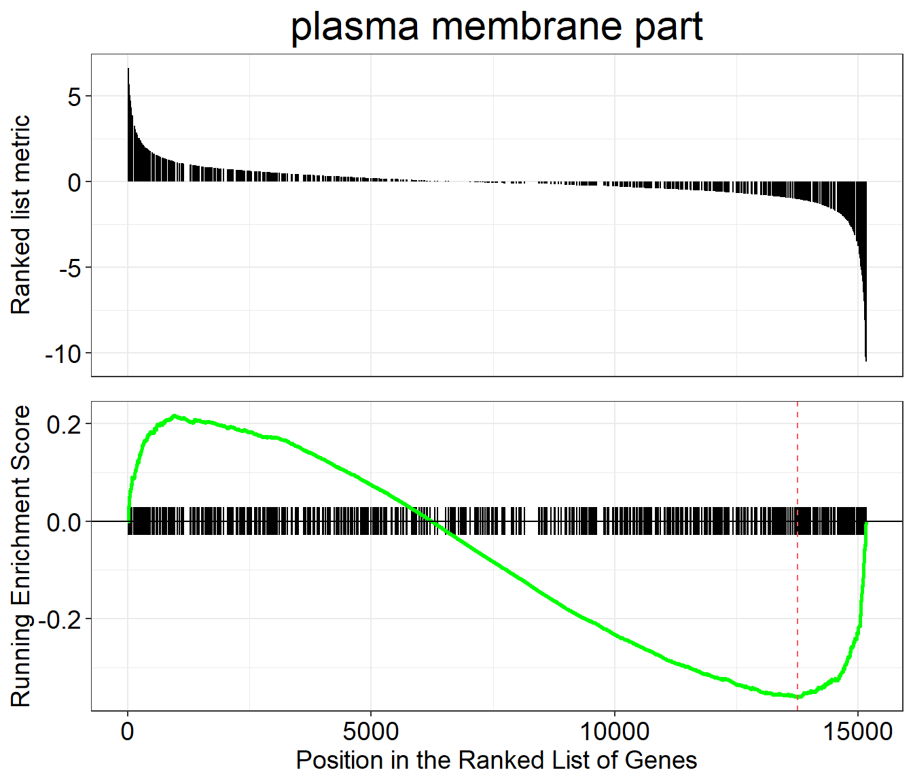

   Classic GSEA plot for the first enriched GO gene set: running
   enrichment score, leading-edge ticks, and ranking metric.

PubMed trend of enriched terms
^^^^^^^^^^^^^^^^^^^^^^^^^^^^^^

Plots the number or proportion of publications trend based on the
query result from PubMed Central.

.. code:: r

    terms <- gse$Description[1:3]
    pmcplot(terms, 2010:2018, proportion = FALSE)

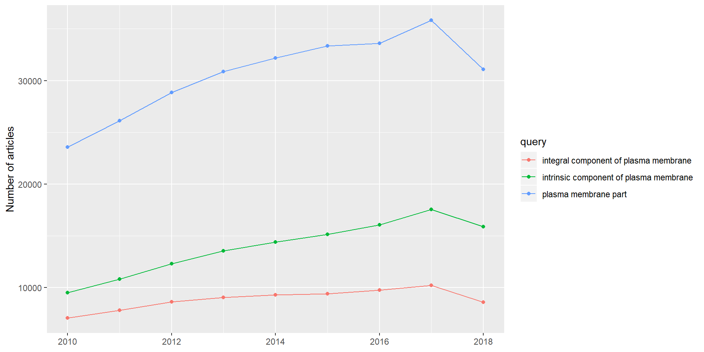

   PubMed Central publication counts (2010 to 2018) for the top three
   enriched GO terms.

KEGG gene set enrichment
------------------------

For KEGG pathway enrichment we use the ``gseKEGG`` function. KEGG
requires its own identifier types, so we first convert gene IDs with
``bitr`` (included in ``clusterProfiler``). It is normal for this call
to produce some messages or warnings.

In the ``bitr`` function, the param ``fromType`` should be the same as
the ``keyType`` we used for ``gseGO`` above (the annotation source).
This param is used again in the next two steps: creating ``dedup_ids``
and ``df2``.

``toType`` in the ``bitr`` function has to be one of the available
options from ``keyTypes(org.Dm.eg.db)`` and must map to one of
``'kegg'``, ``'ncbi-geneid'``, ``'ncib-proteinid'`` or ``'uniprot'``,
because ``gseKEGG`` only accepts one of those four options as its
``keytype`` parameter. In the case of *org.Dm.eg.db*, none of those
four types are available directly, but ``'ENTREZID'`` is the same as
``'ncbi-geneid'`` for *org.Dm.eg.db*, so we use ``'ENTREZID'`` for
``toType``.

As our initial input, we use ``original_gene_list`` created above.

Prepare input
~~~~~~~~~~~~~

.. code:: r

    # Convert gene IDs for gseKEGG function
    # We will lose some genes here because not all IDs will be converted
    ids <- bitr(names(original_gene_list), fromType = "ENSEMBL",
                toType = "ENTREZID", OrgDb = organism)

    # remove duplicate IDS (here I use "ENSEMBL", but it should be
    # whatever was selected as keyType)
    dedup_ids = ids[!duplicated(ids[c("ENSEMBL")]),]

    # Create a new dataframe df2 which has only the genes which were
    # successfully mapped using the bitr function above
    df2 = df[df$X %in% dedup_ids$ENSEMBL,]

    # Create a new column in df2 with the corresponding ENTREZ IDs
    df2$Y = dedup_ids$ENTREZID

    # Create a vector of the gene universe
    kegg_gene_list <- df2$log2FoldChange

    # Name vector with ENTREZ ids
    names(kegg_gene_list) <- df2$Y

    # omit any NA values
    kegg_gene_list <- na.omit(kegg_gene_list)

    # sort the list in decreasing order (required for clusterProfiler)
    kegg_gene_list = sort(kegg_gene_list, decreasing = TRUE)

Parameters
~~~~~~~~~~

**organism** KEGG organism code. The full list is here:
`KEGG organism list <https://www.genome.jp/kegg/catalog/org_list.html>`_
(need the 3-letter code). We define it as ``kegg_organism`` first,
because it is used again below when making the pathview plots.

**nPerm** the higher the number of permutations you set, the more
accurate your result will be, but the longer the analysis will take.

**minGSSize** minimum number of genes in set. Gene sets with fewer
than this many genes in your dataset will be ignored.

**maxGSSize** maximum number of genes in set. Gene sets with more than
this many genes in your dataset will be ignored.

**pvalueCutoff** p-value cutoff.

**pAdjustMethod** one of ``"holm"``, ``"hochberg"``, ``"hommel"``,
``"bonferroni"``, ``"BH"``, ``"BY"``, ``"fdr"``, ``"none"``.

**keyType** one of ``'kegg'``, ``'ncbi-geneid'``, ``'ncib-proteinid'``
or ``'uniprot'``.

Create the gseKEGG object
~~~~~~~~~~~~~~~~~~~~~~~~~

.. code:: r

    kegg_organism = "dme"
    kk2 <- gseKEGG(geneList     = kegg_gene_list,
                   organism     = kegg_organism,
                   nPerm        = 10000,
                   minGSSize    = 3,
                   maxGSSize    = 800,
                   pvalueCutoff = 0.05,
                   pAdjustMethod = "none",
                   keyType       = "ncbi-geneid")

Visualizations
~~~~~~~~~~~~~~

Dotplot
^^^^^^^

.. code:: r

    dotplot(kk2, showCategory = 10, title = "Enriched Pathways",
            split = ".sign") + facet_grid(. ~ .sign)

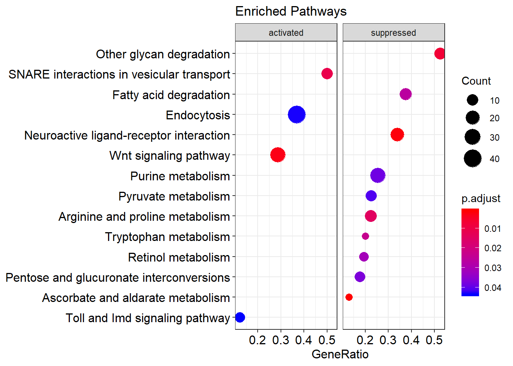

   Top 10 enriched KEGG pathways, faceted by whether the pathway is
   activated or suppressed in the ranking.

Enrichment map
^^^^^^^^^^^^^^

Enrichment map organizes enriched terms into a network with edges
connecting overlapping gene sets. Mutually overlapping gene sets tend
to cluster together, making it easy to identify functional modules.

.. code:: r

    emapplot(kk2)

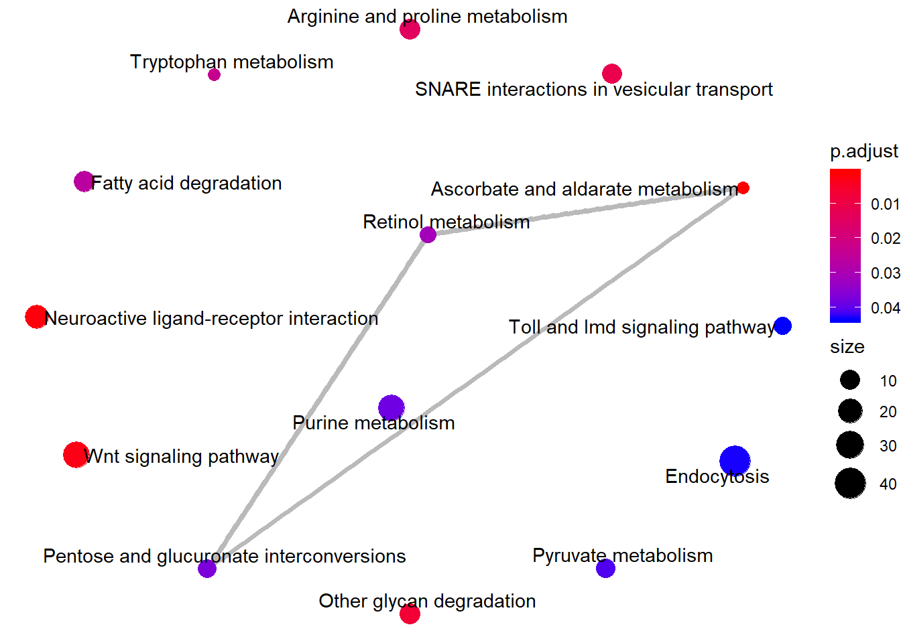

   Enrichment map of KEGG-pathway GSEA.

Category netplot
^^^^^^^^^^^^^^^^

The ``cnetplot`` depicts the linkages of genes and biological concepts
(here KEGG pathways) as a network.

.. code:: r

    # categorySize can be either 'pvalue' or 'geneNum'
    cnetplot(kk2, categorySize = "pvalue", foldChange = gene_list)

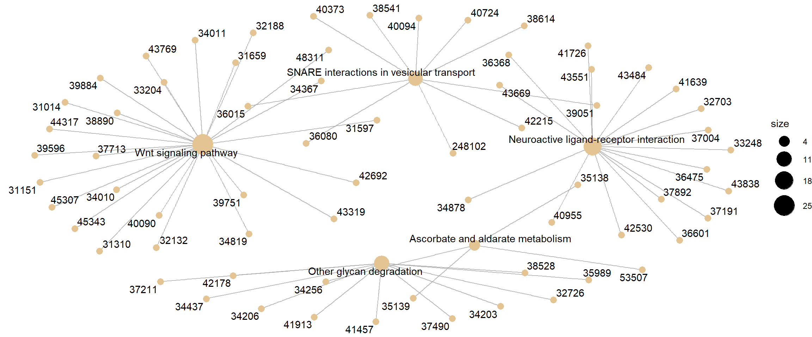

   Category netplot for KEGG pathway GSEA, with gene fold-change
   overlaid as colour.

Ridgeplot
^^^^^^^^^

Helpful to interpret up- and down-regulated pathways.

.. code:: r

    ridgeplot(kk2) + labs(x = "enrichment distribution")

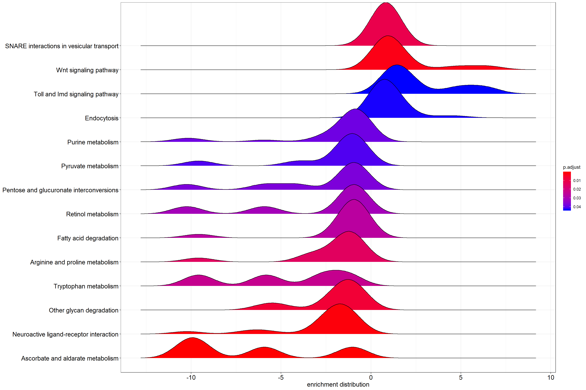

   Per-pathway density of log2 fold-change values across the genes in
   each KEGG set.

GSEA plot
^^^^^^^^^

Traditional method for visualizing a GSEA result.

**Gene Set** Integer. Corresponds to gene set in the ``gse`` object.
The first gene set is 1, second gene set is 2, etc. Default: 1.

.. code:: r

    # Use the `Gene Set` param for the index in the title, and as the
    # value for geneSetId
    gseaplot(kk2, by = "all", title = kk2$Description[1], geneSetID = 1)

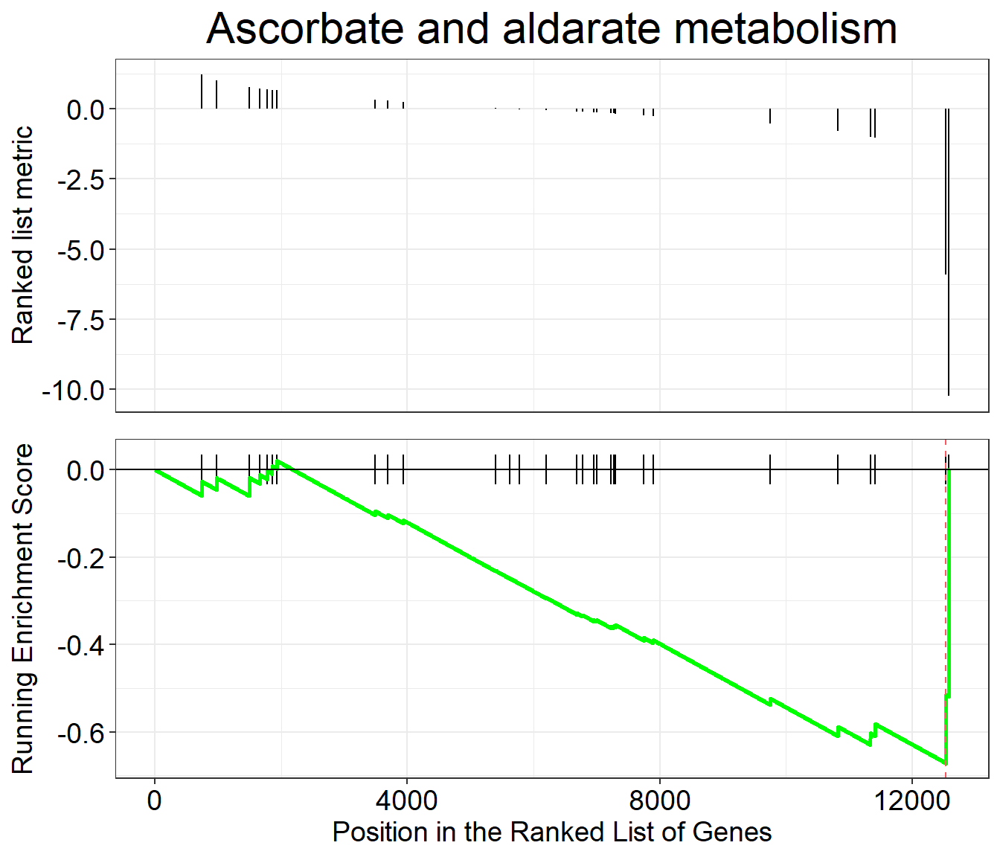

   Classic GSEA plot for the first enriched KEGG pathway.

Pathview
--------

``pathview`` renders an enriched KEGG pathway with your DE genes
overlaid, producing a PNG and a (different) PDF of the pathway map.

Parameters
~~~~~~~~~~

**gene.data** The named vector ``kegg_gene_list`` created above.

**pathway.id** The user needs to enter this. Enriched pathways plus
the pathway ID are provided in the ``gseKEGG`` output table above.

**species** Same as ``organism`` above in ``gseKEGG``, which we
defined as ``kegg_organism``.

.. code:: r

    library(pathview)

    # Produce the native KEGG plot (PNG)
    dme <- pathview(gene.data = kegg_gene_list, pathway.id = "dme04130",
                    species = kegg_organism)

    # Produce a different plot (PDF) (not displayed here)
    dme <- pathview(gene.data = kegg_gene_list, pathway.id = "dme04130",
                    species = kegg_organism, kegg.native = F)

.. code:: r

    knitr::include_graphics("dme04130.pathview.png")

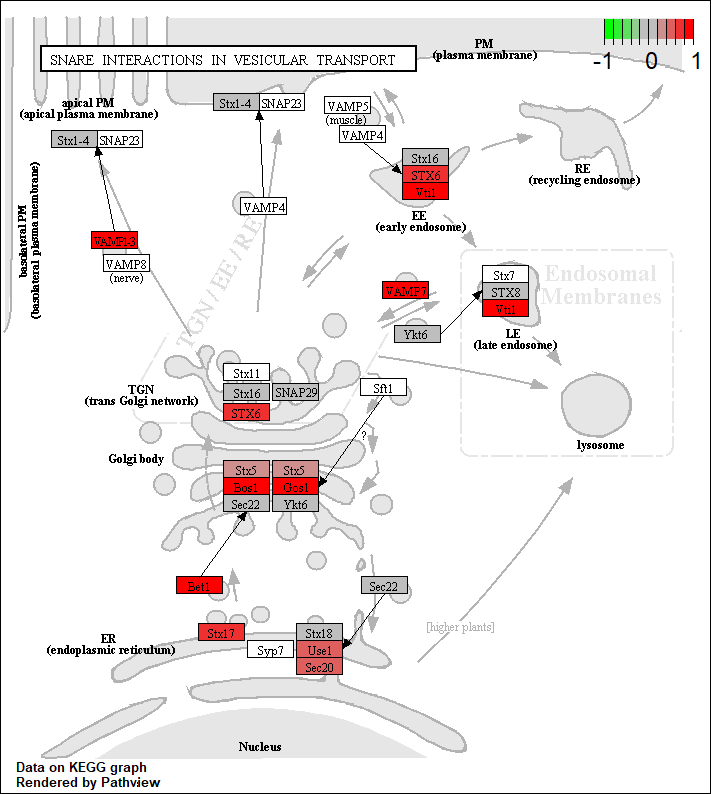

   KEGG native enriched pathway plot (``dme04130``) with gene
   fold-change overlaid on pathway nodes.
