Over-representation analysis
============================

Over-representation (or enrichment) analysis is a statistical method
that determines whether genes from pre-defined sets (e.g. those
belonging to a specific GO term or KEGG pathway) are present more than
would be expected (over-represented) in a subset of your data. In this
case, the subset is your set of under- or over-expressed genes.

For example, the fruit fly transcriptome has about 10,000 genes. If
260 genes are categorized as "axon guidance" (2.6% of all genes carry
that category), and in an experiment we find 1,000 genes are
differentially expressed and 200 of those genes are in the "axon
guidance" category (20% of DE genes), is that significant?

This page describes the implementation of over-representation analysis
using the ``clusterProfiler`` package. It is run downstream of a
differential expression analysis (e.g. with `DESeq2
<https://bioconductor.org/packages/release/bioc/vignettes/DESeq2/inst/doc/DESeq2.html>`_).
Full ``clusterProfiler`` documentation:
`clusterProfiler vignette
<https://bioconductor.org/packages/release/bioc/vignettes/clusterProfiler/inst/doc/clusterProfiler.html>`_.

.. note::

   An R Markdown notebook covering this workflow is available at
   `gencorefacility/r-notebooks/ora.Rmd
   <https://github.com/gencorefacility/r-notebooks/blob/master/ora.Rmd>`_.

Workflow overview
-----------------

1. Load ``clusterProfiler`` and the organism-specific annotation
   database.
2. Read the differential-expression results and build a sorted,
   named vector of log2 fold-changes (the *gene universe*) and a
   filtered vector of significant DE genes.
3. Run ``enrichGO`` to test for GO-term over-representation.
4. Visualize the GO results (upset, wordcloud, barplot, dotplot,
   enrichment map, induced graph, category netplot).
5. Convert gene IDs and run ``enrichKEGG`` for KEGG pathway
   over-representation.
6. Visualize the KEGG results and render an enriched pathway with
   ``pathview``.

Environment
-----------

This is an R workflow. Install ``clusterProfiler``, ``pathview``, and
``wordcloud`` once, then load them at the start of each session.

.. code:: r

    BiocManager::install("clusterProfiler", version = "3.8")
    BiocManager::install("pathview")
    install.packages("wordcloud")
    library(clusterProfiler)
    library(wordcloud)

Inputs
------

You need:

* A **differential expression results CSV** (``drosphila_example_de.csv``
  in the examples below), typically produced by a tool such as DESeq2.
  At minimum it must contain a gene-ID column, a ``log2FoldChange``
  column, and a ``padj`` column.
* An **organism annotation database** matched to the gene IDs in that
  CSV. The examples here use *D. melanogaster* and ``org.Dm.eg.db``.

Annotation database
~~~~~~~~~~~~~~~~~~~

Install and load the annotation package for your organism. See the
full list at `Bioconductor OrgDb packages
<http://bioconductor.org/packages/release/BiocViews.html#___OrgDb>`_
(there are 19 presently available).

.. code:: r

    organism = "org.Dm.eg.db"
    BiocManager::install(organism, character.only = TRUE)
    library(organism, character.only = TRUE)

Prepare input
-------------

Read the DESeq2 output and build two vectors: the full gene universe
(named, sorted log2 fold-changes) and the filtered set of significant
DE genes (gene names only).

.. code:: r

    # reading in input from deseq2
    df = read.csv("drosphila_example_de.csv", header=TRUE)

    # we want the log2 fold change
    original_gene_list <- df$log2FoldChange

    # name the vector
    names(original_gene_list) <- df$X

    # omit any NA values
    gene_list <- na.omit(original_gene_list)

    # sort the list in decreasing order (required for clusterProfiler)
    gene_list = sort(gene_list, decreasing = TRUE)

    # Extract significant results (padj < 0.05)
    sig_genes_df = subset(df, padj < 0.05)

    # From significant results, we want to filter on log2 fold change
    genes <- sig_genes_df$log2FoldChange

    # Name the vector
    names(genes) <- sig_genes_df$X

    # omit NA values
    genes <- na.omit(genes)

    # filter on min log2 fold change (log2FoldChange > 2)
    genes <- names(genes)[abs(genes) > 2]

GO enrichment
-------------

Run ``enrichGO`` to test whether GO terms are over-represented among
the significant DE genes, using the full gene universe as background.

Parameters
~~~~~~~~~~

**Ontology** Options: ``"BP"`` (Biological Process), ``"MF"``
(Molecular Function), ``"CC"`` (Cellular Component).

**keyType** This is the source of the annotation (gene IDs). The
options vary for each annotation. In the example of *org.Dm.eg.db*,
the options are:

    ``"ACCNUM"`` ``"ALIAS"`` ``"ENSEMBL"`` ``"ENSEMBLPROT"``
    ``"ENSEMBLTRANS"`` ``"ENTREZID"`` ``"ENZYME"`` ``"EVIDENCE"``
    ``"EVIDENCEALL"`` ``"FLYBASE"`` ``"FLYBASECG"`` ``"FLYBASEPROT"``
    ``"GENENAME"`` ``"GO"`` ``"GOALL"`` ``"MAP"`` ``"ONTOLOGY"``
    ``"ONTOLOGYALL"`` ``"PATH"`` ``"PMID"`` ``"REFSEQ"`` ``"SYMBOL"``
    ``"UNIGENE"`` ``"UNIPROT"``

Check which options are available with the ``keytypes`` command, for
example ``keytypes(org.Dm.eg.db)``.

Create the enrichGO object
~~~~~~~~~~~~~~~~~~~~~~~~~~

.. code:: r

    go_enrich <- enrichGO(gene = genes,
                          universe = names(gene_list),
                          OrgDb = organism,
                          keyType = 'ENSEMBL',
                          readable = T,
                          ont = "BP",
                          pvalueCutoff = 0.05,
                          qvalueCutoff = 0.10)

Visualizations
~~~~~~~~~~~~~~

Upset plot
^^^^^^^^^^

Emphasizes the genes overlapping among different gene sets.

.. code:: r

    BiocManager::install("enrichplot")
    library(enrichplot)
    upsetplot(go_enrich)

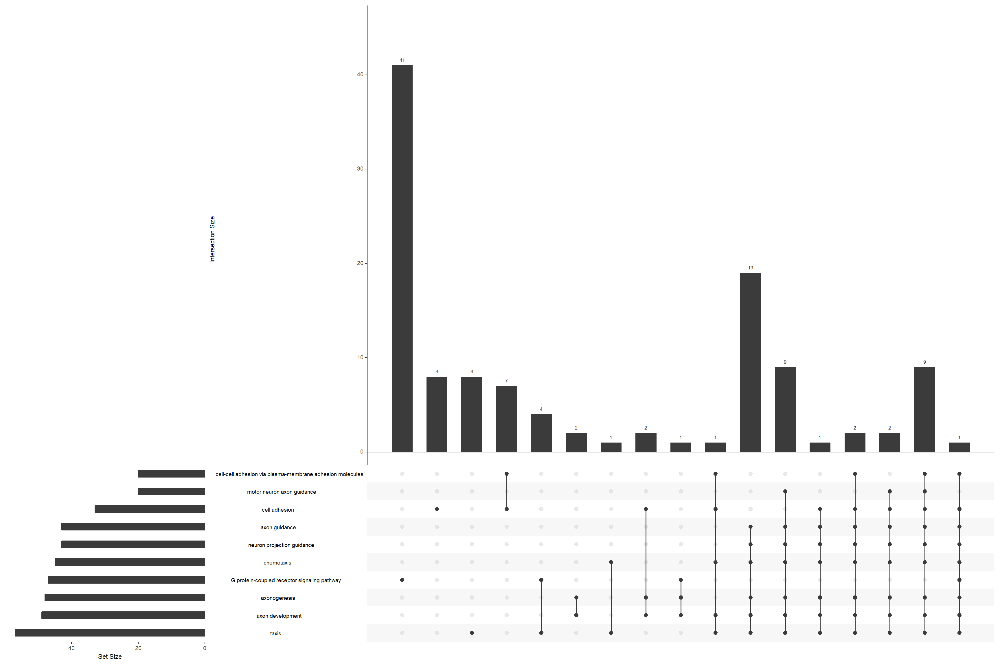

   Upset plot of GO-term over-representation, highlighting gene
   overlap between enriched sets.

Wordcloud
^^^^^^^^^

.. code:: r

    wcdf <- read.table(text = go_enrich$GeneRatio, sep = "/")[1]
    wcdf$term <- go_enrich[,2]
    wordcloud(words = wcdf$term, freq = wcdf$V1, scale=(c(4, .1)),
              colors = brewer.pal(8, "Dark2"), max.words = 25)

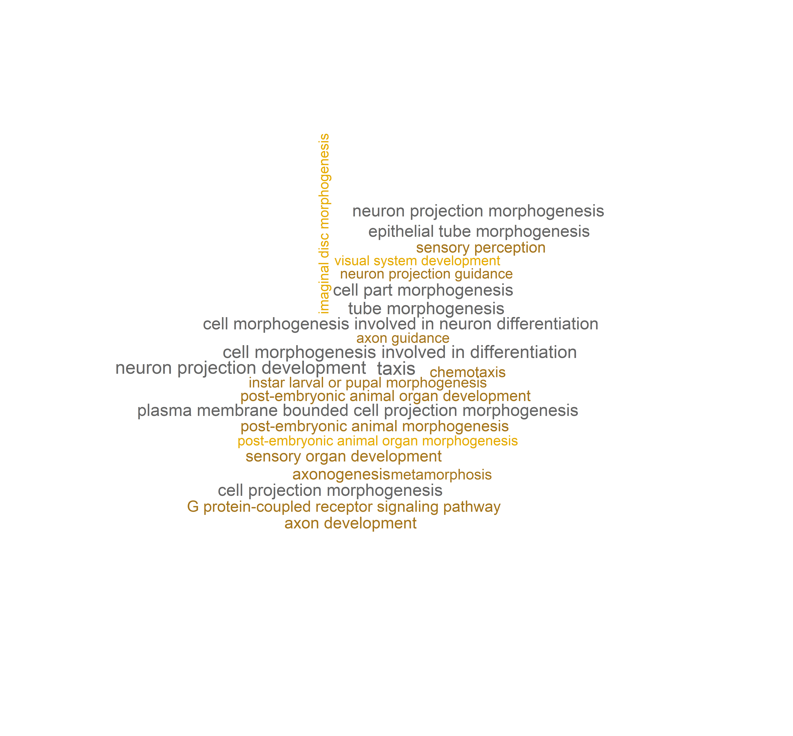

   Wordcloud of the top 25 enriched GO terms, sized by the numerator
   of each term's gene ratio.

Barplot
^^^^^^^

.. code:: r

    barplot(go_enrich,
            drop = TRUE,
            showCategory = 10,
            title = "GO Biological Pathways",
            font.size = 8)

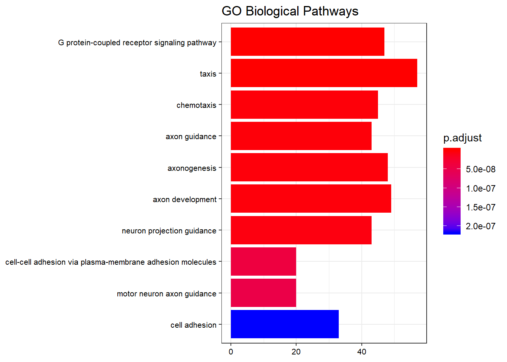

   Top 10 enriched GO biological-process terms by adjusted p-value.

Dotplot
^^^^^^^

.. code:: r

    dotplot(go_enrich)

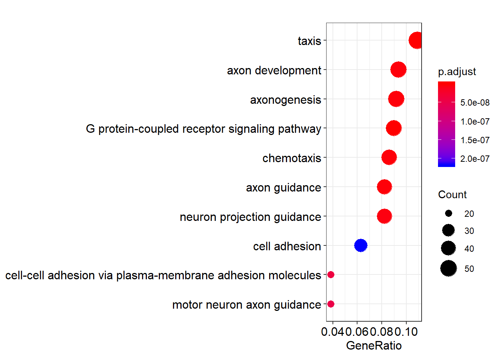

   Dotplot of enriched GO terms. Dot size is the number of DE genes in
   the set; colour is the adjusted p-value.

Enrichment map
^^^^^^^^^^^^^^

Enrichment map organizes enriched terms into a network with edges
connecting overlapping gene sets. Mutually overlapping gene sets tend
to cluster together, making it easy to identify functional modules.

.. code:: r

    emapplot(go_enrich)

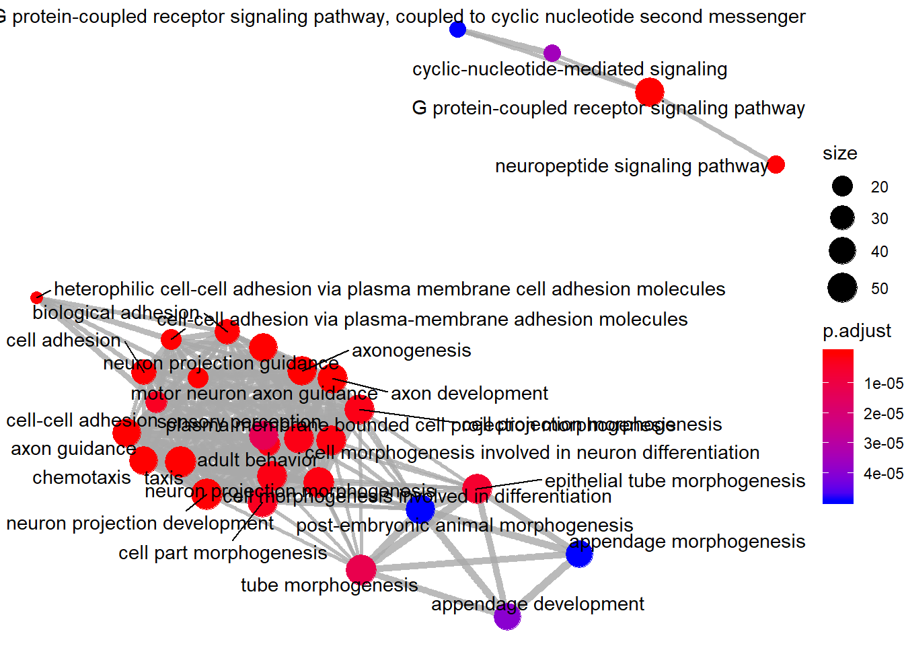

   Enrichment map: nodes are GO terms, edges connect terms that share
   genes. Functional modules cluster together.

Enriched GO induced graph
^^^^^^^^^^^^^^^^^^^^^^^^^

.. code:: r

    goplot(go_enrich, showCategory = 10)

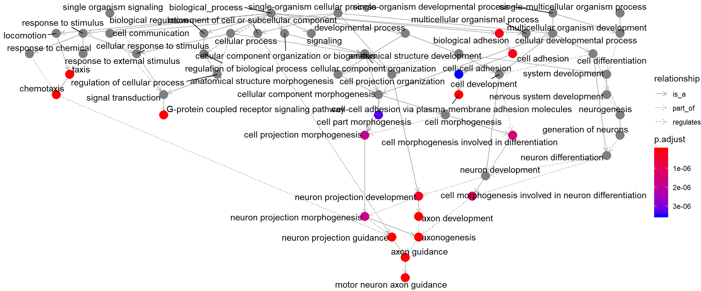

   Induced GO DAG for the top 10 enriched terms, showing each term's
   parents in the ontology hierarchy.

Category netplot
^^^^^^^^^^^^^^^^

The ``cnetplot`` depicts the linkages of genes and biological concepts
(e.g. GO terms or KEGG pathways) as a network. It is helpful for
seeing which genes are involved in enriched pathways and which genes
belong to multiple annotation categories.

.. code:: r

    # categorySize can be either 'pvalue' or 'geneNum'
    cnetplot(go_enrich, categorySize = "pvalue", foldChange = gene_list)

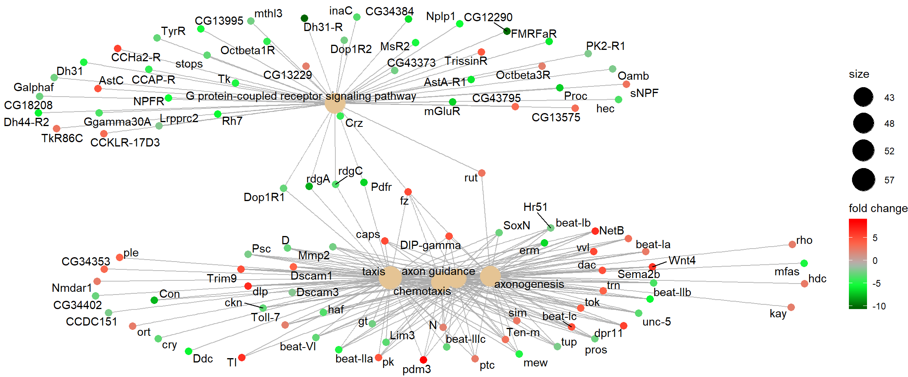

   Category netplot: gene nodes are connected to the enriched GO
   categories they belong to, with fold-change overlaid as colour.

KEGG pathway enrichment
-----------------------

For KEGG pathway enrichment we use the ``enrichKEGG`` function. KEGG
requires its own identifier types, so we first convert gene IDs with
``bitr`` (included in ``clusterProfiler``). It is normal for this call
to produce some messages or warnings.

In the ``bitr`` function, the param ``fromType`` should be the same as
the ``keyType`` we used for ``enrichGO`` above (the annotation
source). This param is used again in the next two steps: creating
``dedup_ids`` and ``df2``.

``toType`` in the ``bitr`` function has to be one of the available
options from ``keyTypes(org.Dm.eg.db)`` and must map to one of
``'kegg'``, ``'ncbi-geneid'``, ``'ncib-proteinid'`` or ``'uniprot'``,
because ``enrichKEGG`` only accepts one of those four options as its
``keytype`` parameter. In the case of *org.Dm.eg.db*, none of those
four types are available directly, but ``'ENTREZID'`` is the same as
``'ncbi-geneid'`` for *org.Dm.eg.db*, so we use ``'ENTREZID'`` for
``toType``.

As our initial input, we use ``original_gene_list`` created above.

Prepare data
~~~~~~~~~~~~

.. code:: r

    # Convert gene IDs for enrichKEGG function
    # We will lose some genes here because not all IDs will be converted
    ids <- bitr(names(original_gene_list), fromType = "ENSEMBL",
                toType = "ENTREZID", OrgDb = "org.Dm.eg.db")

    # remove duplicate IDS (here I use "ENSEMBL", but it should be
    # whatever was selected as keyType)
    dedup_ids = ids[!duplicated(ids[c("ENSEMBL")]),]

    # Create a new dataframe df2 which has only the genes which were
    # successfully mapped using the bitr function above
    df2 = df[df$X %in% dedup_ids$ENSEMBL,]

    # Create a new column in df2 with the corresponding ENTREZ IDs
    df2$Y = dedup_ids$ENTREZID

    # Create a vector of the gene universe
    kegg_gene_list <- df2$log2FoldChange

    # Name vector with ENTREZ ids
    names(kegg_gene_list) <- df2$Y

    # omit any NA values
    kegg_gene_list <- na.omit(kegg_gene_list)

    # sort the list in decreasing order (required for clusterProfiler)
    kegg_gene_list = sort(kegg_gene_list, decreasing = TRUE)

    # Extract significant results from df2
    kegg_sig_genes_df = subset(df2, padj < 0.05)

    # From significant results, we want to filter on log2 fold change
    kegg_genes <- kegg_sig_genes_df$log2FoldChange

    # Name the vector with the CONVERTED ID!
    names(kegg_genes) <- kegg_sig_genes_df$Y

    # omit NA values
    kegg_genes <- na.omit(kegg_genes)

    # filter on log2 fold change (PARAMETER)
    kegg_genes <- names(kegg_genes)[abs(kegg_genes) > 2]

Parameters
~~~~~~~~~~

**organism** KEGG organism code. The full list is here:
`KEGG organism list <https://www.genome.jp/kegg/catalog/org_list.html>`_
(need the 3-letter code). We define it as ``kegg_organism`` first,
because it is used again below when making the pathview plots.

**keyType** one of ``'kegg'``, ``'ncbi-geneid'``, ``'ncib-proteinid'``
or ``'uniprot'``.

Create the enrichKEGG object
~~~~~~~~~~~~~~~~~~~~~~~~~~~~

.. code:: r

    kegg_organism = "dme"
    kk <- enrichKEGG(gene = kegg_genes,
                     universe = names(kegg_gene_list),
                     organism = kegg_organism,
                     pvalueCutoff = 0.05,
                     keyType = "ncbi-geneid")

Visualizations
~~~~~~~~~~~~~~

Barplot
^^^^^^^

.. code:: r

    barplot(kk,
            showCategory = 10,
            title = "Enriched Pathways",
            font.size = 8)

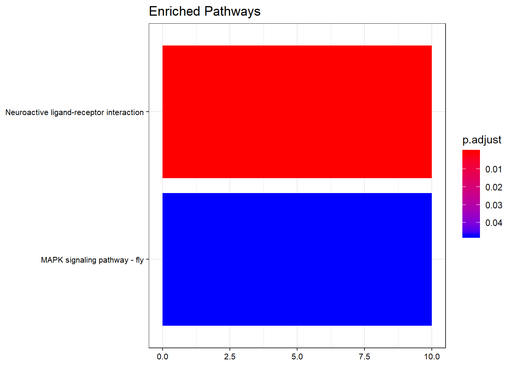

   Top 10 enriched KEGG pathways by adjusted p-value.

Dotplot
^^^^^^^

.. code:: r

    dotplot(kk,
            showCategory = 10,
            title = "Enriched Pathways",
            font.size = 8)

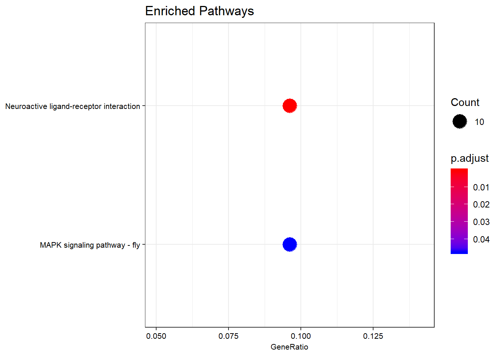

   Dotplot of enriched KEGG pathways. Dot size is the DE-gene count
   per pathway; colour is the adjusted p-value.

Category netplot
^^^^^^^^^^^^^^^^

The ``cnetplot`` depicts the linkages of genes and biological concepts
(here KEGG pathways) as a network.

.. code:: r

    # categorySize can be either 'pvalue' or 'geneNum'
    cnetplot(kk, categorySize = "pvalue", foldChange = gene_list)

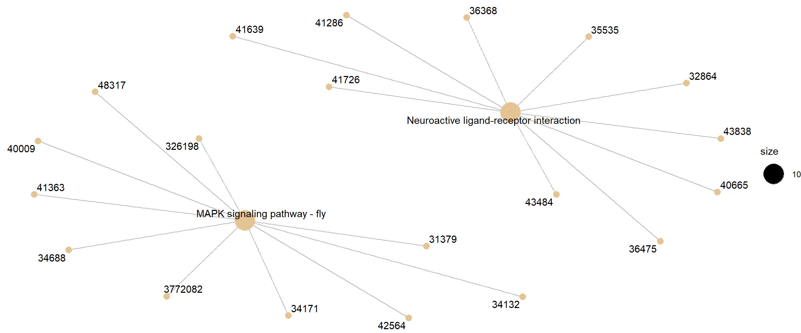

   Category netplot for KEGG pathway enrichment, with DE-gene
   fold-change overlaid as colour.

Pathview
--------

``pathview`` renders an enriched KEGG pathway with your DE genes
overlaid, producing a PNG and a (different) PDF of the pathway map.

Parameters
~~~~~~~~~~

**gene.data** The named vector ``kegg_gene_list`` created above.

**pathway.id** The user needs to enter this. Enriched pathways plus
the pathway ID are provided in the ``enrichKEGG`` output table above.

**species** Same as ``organism`` above in ``enrichKEGG``, which we
defined as ``kegg_organism``.

**gene.idtype** The index number (first index is 1) corresponding to
your keytype from this list: ``gene.idtype.list``.

.. code:: r

    library(pathview)

    # Produce the native KEGG plot (PNG)
    dme <- pathview(gene.data = gene_list, pathway.id = "dme04080",
                    species = kegg_organism,
                    gene.idtype = gene.idtype.list[3])

    # Produce a different plot (PDF) (not displayed here)
    dme <- pathview(gene.data = gene_list, pathway.id = "dme04080",
                    species = kegg_organism,
                    gene.idtype = gene.idtype.list[3],
                    kegg.native = F)

    knitr::include_graphics("dme04080.pathview.png")

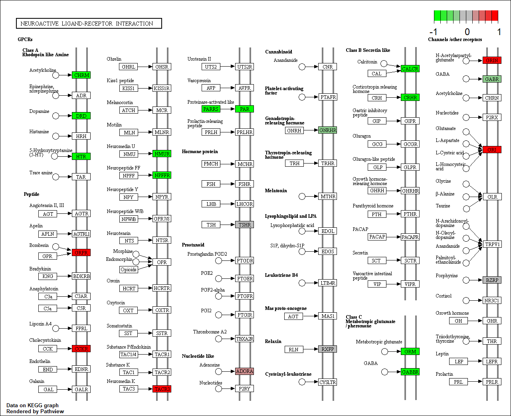

   KEGG native enriched pathway plot (``dme04080``) with DE-gene
   fold-change overlaid on pathway nodes.
