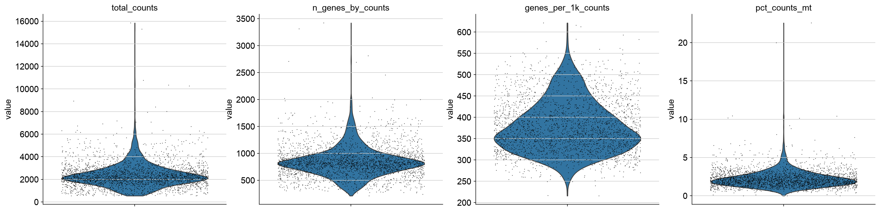
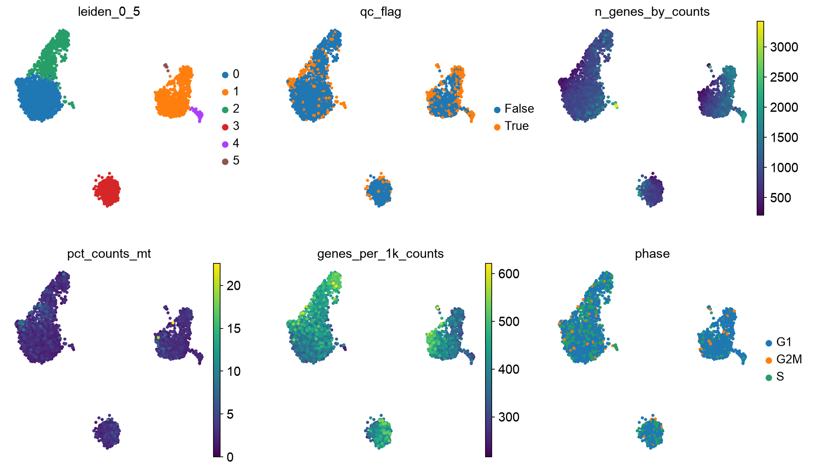
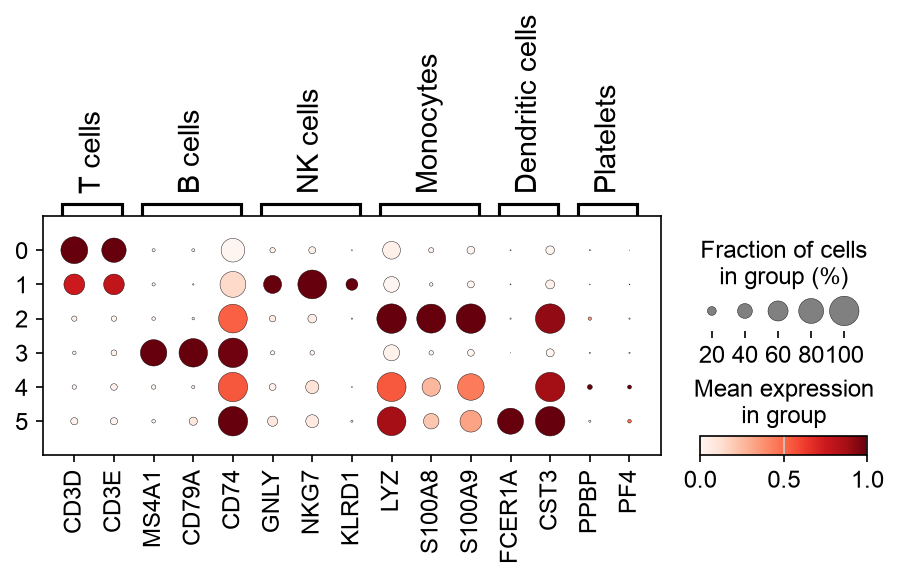

Single-cell RNA-seq analysis with Scanpy
========================================

This tutorial introduces a dataset-specific single-cell RNA-seq analysis
workflow using Scanpy. It starts from a 10x Genomics count matrix, computes QC
and doublet flags, scores cell cycle state, builds an initial embedding for QC
review, removes cells only after inspection, and then reruns PCA, clustering,
UMAP visualization, and marker-gene plots on the cleaned dataset.

The goal is not only to run the code, but to understand why each step is used.
Batch correction and data integration are important, but they should be handled
in a separate tutorial after sample-level QC has been completed.

Learning objectives
-------------------

By the end of this tutorial, you should be able to:

* Load 10x Genomics data from either a matrix directory or an HDF5 file.
* Compute and visualize quality-control metrics.
* Choose data-driven QC flags using percentiles and MAD-based summaries.
* Detect and review putative doublets.
* Score cell cycle state and inspect whether it explains clustering.
* Use a first-pass UMAP and cluster-level QC summaries to decide what to remove.
* Normalize and log-transform single-cell counts.
* Select highly variable genes.
* Run PCA, neighbor graph construction, Leiden clustering, and UMAP.
* Visualize marker genes across clusters using dot plots.
* Understand which steps are used for representation and which support biological interpretation.

Prerequisites
-------------

.. code-block:: bash

   pip install scanpy anndata matplotlib pandas numpy leidenalg igraph scrublet

Imports
-------

.. code-block:: python

   import numpy as np
   import pandas as pd
   import scanpy as sc
   import scrublet as scr
   import matplotlib.pyplot as plt

   sc.settings.verbosity = 3
   sc.settings.set_figure_params(dpi=100, facecolor="white", frameon=False)

1. Read 10x data
----------------

Conclusion
~~~~~~~~~~

The 10x count matrix is the starting point, not the biological result.

Motivation
~~~~~~~~~~

A 10x Genomics gene-expression run usually produces either a matrix directory
containing ``matrix.mtx.gz``, ``features.tsv.gz``, and ``barcodes.tsv.gz``, or a
single HDF5 file such as ``filtered_feature_bc_matrix.h5``. Scanpy stores this
in an AnnData object. The main matrix, ``adata.X``, has cells as rows and genes
as columns.

Read a 10x matrix directory
~~~~~~~~~~~~~~~~~~~~~~~~~~~

.. code-block:: python

   data_dir = "path/to/filtered_feature_bc_matrix"

   adata = sc.read_10x_mtx(
       data_dir,
       var_names="gene_symbols",
       cache=True,
   )

   adata.var_names_make_unique()
   adata

Read a 10x HDF5 file
~~~~~~~~~~~~~~~~~~~~

Use this instead if Cell Ranger output is stored as ``filtered_feature_bc_matrix.h5``.

.. code-block:: python

   h5_file = "path/to/filtered_feature_bc_matrix.h5"

   adata = sc.read_10x_h5(h5_file)
   adata.var_names_make_unique()
   adata

Inspect the object:

.. code-block:: python

   print(adata)
   print(adata.obs.head())
   print(adata.var.head())

Optional sample metadata
~~~~~~~~~~~~~~~~~~~~~~~~

If the object already contains a ``sample``, ``library``, ``donor``, or
``condition`` column, keep it. If it does not, add those columns before QC when
the information is available. Splitting multi-sample objects and integrating
them is beyond the scope of this tutorial.

.. code-block:: python

   # Example only. Replace with real metadata for your experiment.
   adata.obs["sample"] = "sample_1"

PBMC example
~~~~~~~~~~~~

If you do not have a dataset ready, you can run the tutorial with the public
PBMC 3k example distributed through Scanpy. Use this block instead of the
``read_10x_mtx`` block above.

.. code-block:: python

   adata = sc.datasets.pbmc3k()
   adata.var_names_make_unique()
   adata

The PBMC figures shown below were generated with
``source/transcriptomics/scripts/generate_pbmc_scrna_figures.py``.

2. Preserve raw counts
----------------------

Conclusion
~~~~~~~~~~

Raw counts should be preserved before normalization changes the representation.

Motivation
~~~~~~~~~~

Normalization and log transformation are useful for clustering and visualization,
but count-based downstream analyses often require raw counts. Store counts in a
layer before modifying ``adata.X``.

Code
~~~~

.. code-block:: python

   adata.layers["counts"] = adata.X.copy()

3. Compute QC metrics
---------------------

Conclusion
~~~~~~~~~~

QC metrics identify cells whose profiles may be technically unreliable.

Motivation
~~~~~~~~~~

Common QC metrics include:

* total counts per cell
* number of detected genes per cell
* mitochondrial fraction
* ribosomal fraction
* hemoglobin fraction, especially in blood-like datasets
* gene complexity ratio, such as detected genes per 1,000 counts
* doublet score and predicted doublet status

These metrics should be interpreted jointly rather than with one universal
cutoff. A high mitochondrial fraction or high gene content may indicate poor
quality, but it can also reflect the biology of the experiment. QC should be
run and interpreted for each experiment or capture before integration.

Code
~~~~

.. code-block:: python

   # Human gene naming convention.
   # For mouse, mitochondrial genes usually start with "mt-".
   adata.var["mt"] = adata.var_names.str.upper().str.startswith("MT-")
   adata.var["ribo"] = adata.var_names.str.upper().str.startswith(("RPS", "RPL"))
   adata.var["hb"] = adata.var_names.str.upper().str.match(r"^HB[^(P)]")

   sc.pp.calculate_qc_metrics(
       adata,
       qc_vars=["mt", "ribo", "hb"],
       percent_top=None,
       log1p=False,
       inplace=True,
   )

   adata.obs["genes_per_1k_counts"] = (
       1000
       * adata.obs["n_genes_by_counts"]
       / adata.obs["total_counts"].replace(0, np.nan)
   )

   adata.obs[
       [
           "total_counts",
           "n_genes_by_counts",
           "genes_per_1k_counts",
           "pct_counts_mt",
           "pct_counts_ribo",
           "pct_counts_hb",
       ]
   ].describe()

Detect putative doublets
~~~~~~~~~~~~~~~~~~~~~~~~

Doublets are barcodes that likely contain RNA from more than one cell. Their
rate depends on the loading concentration, cell type mixture, and capture. If
your object contains multiple independent samples or 10x lanes, run doublet
detection per sample before combining the decisions.

.. code-block:: python

   scrub = scr.Scrublet(adata.layers["counts"])
   doublet_scores, predicted_doublets = scrub.scrub_doublets()

   adata.obs["doublet_score"] = doublet_scores
   adata.obs["predicted_doublet"] = predicted_doublets

   adata.obs[["doublet_score", "predicted_doublet"]].describe()

4. Visualize QC distributions
-----------------------------

Conclusion
~~~~~~~~~~

QC thresholds should be chosen from the observed distribution, not copied from a recipe.

Motivation
~~~~~~~~~~

Different tissues and protocols produce different QC distributions. Before
filtering, inspect distributions and relationships among QC metrics.

Code
~~~~

.. code-block:: python

   qc_vars = [
       "total_counts",
       "n_genes_by_counts",
       "genes_per_1k_counts",
       "pct_counts_mt",
       "pct_counts_ribo",
       "pct_counts_hb",
       "doublet_score",
   ]

   sc.pl.violin(
       adata,
       qc_vars,
       jitter=0.4,
       multi_panel=True,
   )

   sc.pl.scatter(
       adata,
       x="total_counts",
       y="n_genes_by_counts",
       color="pct_counts_mt",
   )

   sc.pl.scatter(
       adata,
       x="total_counts",
       y="pct_counts_mt",
   )

   sc.pl.scatter(
       adata,
       x="total_counts",
       y="genes_per_1k_counts",
       color="n_genes_by_counts",
   )

PBMC example output
~~~~~~~~~~~~~~~~~~~

   Example QC distributions from the Scanpy PBMC 3k dataset. These plots show
   why thresholds should be derived from the observed dataset rather than copied
   from a fixed recipe.

5. Define data-driven QC flags
------------------------------

Conclusion
~~~~~~~~~~

Percentile and MAD-based thresholds provide dataset-specific QC flags.

Motivation
~~~~~~~~~~

Fixed cutoffs can be misleading. A mitochondrial threshold that is strict for one
tissue may be permissive for another. A better strategy is to inspect the
distribution and flag outliers using percentiles or median absolute deviation.
Do not reject cells at this stage. The flags are carried into the first PCA,
clustering, and UMAP so you can decide whether they mark technical artifacts or
real biology in the current experiment.

Helper functions
~~~~~~~~~~~~~~~~

.. code-block:: python

   def mad(x):
       """Median absolute deviation, ignoring NaNs."""
       x = np.asarray(x)
       med = np.nanmedian(x)
       return np.nanmedian(np.abs(x - med))

   def mad_bounds(x, nmads=3, lower=True, upper=True):
       """Return lower and upper MAD-based bounds."""
       med = np.nanmedian(x)
       m = mad(x)
       lo = med - nmads * m if lower else -np.inf
       hi = med + nmads * m if upper else np.inf
       return lo, hi

   def percentile_bounds(x, lower_q=1, upper_q=99):
       """Return lower and upper percentile bounds."""
       return np.nanpercentile(x, lower_q), np.nanpercentile(x, upper_q)

Dataset-level data-driven thresholds
~~~~~~~~~~~~~~~~~~~~~~~~~~~~~~~~~~~~

These thresholds are computed from the current dataset. If the object contains
multiple samples, captures, or chemistries, compare QC distributions by those
metadata columns before making final decisions. Splitting and integrating
multi-sample objects is covered in a separate tutorial.

.. code-block:: python

   gene_lo_mad, gene_hi_mad = mad_bounds(
       adata.obs["n_genes_by_counts"],
       nmads=3,
   )

   count_lo_mad, count_hi_mad = mad_bounds(
       adata.obs["total_counts"],
       nmads=3,
   )

   _, mt_hi_mad = mad_bounds(
       adata.obs["pct_counts_mt"],
       nmads=3,
       lower=False,
       upper=True,
   )

   complexity_lo_mad, _ = mad_bounds(
       adata.obs["genes_per_1k_counts"],
       nmads=3,
       lower=True,
       upper=False,
   )

   gene_p1, gene_p99 = percentile_bounds(adata.obs["n_genes_by_counts"], 1, 99)
   count_p1, count_p99 = percentile_bounds(adata.obs["total_counts"], 1, 99)
   mt_p1, mt_p99 = percentile_bounds(adata.obs["pct_counts_mt"], 1, 99)
   complexity_p1, complexity_p99 = percentile_bounds(
       adata.obs["genes_per_1k_counts"],
       1,
       99,
   )

   print("MAD-based thresholds")
   print(f"n_genes_by_counts: lower={gene_lo_mad:.1f}, upper={gene_hi_mad:.1f}")
   print(f"total_counts:      lower={count_lo_mad:.1f}, upper={count_hi_mad:.1f}")
   print(f"pct_counts_mt:     upper={mt_hi_mad:.1f}")
   print(f"genes_per_1k_counts: lower={complexity_lo_mad:.1f}")

   print("Percentile thresholds")
   print(f"n_genes_by_counts: p1={gene_p1:.1f}, p99={gene_p99:.1f}")
   print(f"total_counts:      p1={count_p1:.1f}, p99={count_p99:.1f}")
   print(f"pct_counts_mt:     p99={mt_p99:.1f}")
   print(
       "genes_per_1k_counts: "
       f"p1={complexity_p1:.1f}, p99={complexity_p99:.1f}"
   )

Flag QC outliers, but do not remove them yet
~~~~~~~~~~~~~~~~~~~~~~~~~~~~~~~~~~~~~~~~~~~~

.. code-block:: python

   adata.obs["qc_low_genes"] = adata.obs["n_genes_by_counts"] < gene_lo_mad
   adata.obs["qc_high_genes"] = adata.obs["n_genes_by_counts"] > gene_hi_mad
   adata.obs["qc_low_counts"] = adata.obs["total_counts"] < count_lo_mad
   adata.obs["qc_high_counts"] = adata.obs["total_counts"] > count_hi_mad
   adata.obs["qc_high_mt"] = adata.obs["pct_counts_mt"] > mt_hi_mad
   adata.obs["qc_high_counts_low_complexity"] = (
       adata.obs["qc_high_counts"]
       & (adata.obs["genes_per_1k_counts"] < complexity_lo_mad)
   )
   adata.obs["qc_predicted_doublet"] = adata.obs["predicted_doublet"].astype(bool)

   qc_flag_columns = [
       "qc_low_genes",
       "qc_high_genes",
       "qc_low_counts",
       "qc_high_counts",
       "qc_high_mt",
       "qc_high_counts_low_complexity",
       "qc_predicted_doublet",
   ]

   adata.obs["qc_flag"] = adata.obs[qc_flag_columns].any(axis=1)
   adata.obs["qc_flag_count"] = adata.obs[qc_flag_columns].sum(axis=1)

   adata.obs[qc_flag_columns + ["qc_flag"]].sum().sort_values(ascending=False)

Inspect flagged cells
~~~~~~~~~~~~~~~~~~~~~

.. code-block:: python

   sc.pl.violin(
       adata,
       [
           "total_counts",
           "n_genes_by_counts",
           "genes_per_1k_counts",
           "pct_counts_mt",
           "doublet_score",
       ],
       groupby="qc_flag",
       multi_panel=True,
       jitter=0.4,
   )

   sc.pl.scatter(
       adata,
       x="total_counts",
       y="n_genes_by_counts",
       color="qc_flag",
   )

   sc.pl.scatter(
       adata,
       x="total_counts",
       y="pct_counts_mt",
       color="qc_high_mt",
   )

   sc.pl.scatter(
       adata,
       x="total_counts",
       y="genes_per_1k_counts",
       color="qc_high_counts_low_complexity",
   )

Keep the original object for review
~~~~~~~~~~~~~~~~~~~~~~~~~~~~~~~~~~~

At this point, the cells are only flagged. A high mitochondrial fraction could
represent damaged cells, but it can also be plausible in some cell states. High
gene and count content can indicate doublets, but it can also reflect larger or
more transcriptionally active cells. High UMI/count depth with low gene
complexity can reflect signal concentrated in a small set of genes, ambient or
damaged-cell signal, or a real cell state with dominant transcripts. The first embedding
should show where these flags fall before cells are removed.

.. code-block:: python

   adata.obs["qc_review_status"] = "keep_for_first_pass"
   adata.obs.loc[adata.obs["qc_flag"], "qc_review_status"] = "flagged_for_review"

   adata.obs["qc_review_status"].value_counts()

Prepare first-pass analysis object
~~~~~~~~~~~~~~~~~~~~~~~~~~~~~~~~~~

Filter genes for the first-pass embedding, but keep all cells so QC flags can be
seen on PCA, clusters, and UMAP.

.. code-block:: python

   adata_work = adata.copy()

   # Data-driven gene filtering:
   # keep genes detected in at least 0.1% of cells, with a minimum of 3 cells.
   min_cells_fraction = 0.001
   min_cells = max(3, int(np.ceil(min_cells_fraction * adata_work.n_obs)))

   print(f"Filtering genes detected in fewer than {min_cells} cells")
   sc.pp.filter_genes(adata_work, min_cells=min_cells)

   adata_work

6. Normalize count depth
------------------------

Conclusion
~~~~~~~~~~

Normalization makes cells more comparable by reducing library-size effects.

Motivation
~~~~~~~~~~

Cells differ in the total number of captured molecules. Without normalization,
high-depth cells may appear to express more of many genes simply because more
molecules were sampled.

Code
~~~~

.. code-block:: python

   adata_work.layers["counts"] = adata_work.X.copy()

   sc.pp.normalize_total(
       adata_work,
       target_sum=1e4,
   )

   adata_work.layers["norm"] = adata_work.X.copy()

7. Log-transform normalized counts
----------------------------------

Conclusion
~~~~~~~~~~

Log transformation compresses dynamic range and improves the geometry used by PCA and clustering.

Motivation
~~~~~~~~~~

Highly expressed genes can dominate distances between cells. ``log1p`` compresses
large values while remaining defined at zero.

Code
~~~~

.. code-block:: python

   sc.pp.log1p(adata_work)
   adata_work.layers["lognorm"] = adata_work.X.copy()

8. Score cell cycle state
-------------------------

Conclusion
~~~~~~~~~~

Cell cycle scores are biological/context covariates, not automatic QC failures.

Motivation
~~~~~~~~~~

Cell cycle can be a biological signal or a confounder, depending on the
experiment. Score it before PCA so you can inspect whether clusters or UMAP
structure are dominated by S phase or G2/M phase. Do not regress out or remove
cell cycle effects by default; decide after inspecting the experiment.

The example below uses human gene symbols. For mouse or Ensembl identifiers,
convert the list to match ``adata.var_names`` first.

Code
~~~~

.. code-block:: python

   s_genes = [
       "MCM5", "PCNA", "TYMS", "FEN1", "MCM2", "MCM4", "RRM1", "UNG",
       "GINS2", "MCM6", "CDCA7", "DTL", "PRIM1", "UHRF1", "CENPU",
       "HELLS", "RFC2", "RPA2", "NASP", "RAD51AP1", "GMNN", "WDR76",
       "SLBP", "CCNE2", "UBR7", "POLD3", "MSH2", "ATAD2", "RAD51",
       "RRM2", "CDC45", "CDC6", "EXO1", "TIPIN", "DSCC1", "BLM",
       "CASP8AP2", "USP1", "CLSPN", "POLA1", "CHAF1B", "BRIP1", "E2F8",
   ]

   g2m_genes = [
       "HMGB2", "CDK1", "NUSAP1", "UBE2C", "BIRC5", "TPX2", "TOP2A",
       "NDC80", "CKS2", "NUF2", "CKS1B", "MKI67", "TMPO", "CENPF",
       "TACC3", "FAM64A", "SMC4", "CCNB2", "CKAP2L", "CKAP2", "AURKB",
       "BUB1", "KIF11", "ANP32E", "TUBB4B", "GTSE1", "KIF20B", "HJURP",
       "CDCA3", "HN1", "CDC20", "TTK", "CDC25C", "KIF2C", "RANGAP1",
       "NCAPD2", "DLGAP5", "CDCA2", "CDCA8", "ECT2", "KIF23", "HMMR",
       "AURKA", "PSRC1", "ANLN", "LBR", "CKAP5", "CENPE", "CTCF",
       "NEK2", "G2E3", "GAS2L3", "CBX5", "CENPA",
   ]

   s_genes_present = [gene for gene in s_genes if gene in adata_work.var_names]
   g2m_genes_present = [gene for gene in g2m_genes if gene in adata_work.var_names]

   if len(s_genes_present) == 0 or len(g2m_genes_present) == 0:
       raise ValueError("No cell cycle genes found. Check gene identifiers.")

   sc.tl.score_genes_cell_cycle(
       adata_work,
       s_genes=s_genes_present,
       g2m_genes=g2m_genes_present,
   )

   adata.obs[["S_score", "G2M_score", "phase"]] = adata_work.obs[
       ["S_score", "G2M_score", "phase"]
   ]

   sc.pl.violin(
       adata_work,
       ["S_score", "G2M_score"],
       groupby="phase",
       multi_panel=True,
       jitter=0.4,
   )

9. Select highly variable genes
-------------------------------

Conclusion
~~~~~~~~~~

Highly variable genes define which signals enter dimensionality reduction
without dropping other genes from the cleaned object.

Motivation
~~~~~~~~~~

Single-cell datasets contain thousands of genes, but many are uninformative for
cell-state structure. Highly variable gene selection focuses the analysis on genes
whose variation is higher than expected for their mean expression. Use HVGs as a
feature mask for PCA, neighbors, clustering, and UMAP. Keep all genes in the main
AnnData object for marker inspection, annotation, and saving.

Code
~~~~

.. code-block:: python

   sc.pp.highly_variable_genes(
       adata_work,
       n_top_genes=2000,
       flavor="seurat",
   )

   sc.pl.highly_variable_genes(adata_work)

   print(adata_work.var["highly_variable"].value_counts())

Optional: batch-aware HVG selection
~~~~~~~~~~~~~~~~~~~~~~~~~~~~~~~~~~~

If multiple samples are present, use ``batch_key`` so that genes are selected
based on reproducible variability across samples.

.. code-block:: python

   if "sample" in adata_work.obs:
       sc.pp.highly_variable_genes(
           adata_work,
           n_top_genes=2000,
           flavor="seurat_v3",
           layer="counts",
           batch_key="sample",
       )

       sc.pl.highly_variable_genes(adata_work)

10. Scale data
--------------

Conclusion
~~~~~~~~~~

Scaling prepares the expression matrix for PCA.

Motivation
~~~~~~~~~~

PCA is sensitive to feature scale. Scaling centers each gene and gives it unit
variance. Values are often clipped to reduce the influence of extreme outliers.
The full object is retained; HVGs are selected as a PCA feature mask in the next
step.

Code
~~~~

.. code-block:: python

   sc.pp.scale(adata_work, max_value=10)

11. Run PCA
-----------

Conclusion
~~~~~~~~~~

PCA compresses thousands of genes into a smaller set of variation axes.

Motivation
~~~~~~~~~~

PCA identifies linear combinations of genes that explain major axes of variation.
Here, PCA uses the highly variable genes without subsetting the AnnData object.
These axes can reflect biology, but also batch, count depth, mitochondrial
content, or other technical structure.

Code
~~~~

.. code-block:: python

   sc.tl.pca(
       adata_work,
       svd_solver="arpack",
       mask_var="highly_variable",
   )

   sc.pl.pca_variance_ratio(
       adata_work,
       log=True,
       n_pcs=50,
   )

   sc.pl.pca(
       adata_work,
       color=[
           "total_counts",
           "n_genes_by_counts",
           "pct_counts_mt",
           "S_score",
           "G2M_score",
           "phase",
       ],
   )

Choose number of PCs:

.. code-block:: python

   n_pcs = 30

12. Build the neighbor graph
----------------------------

Conclusion
~~~~~~~~~~

The neighbor graph defines which cells are considered locally similar.

Motivation
~~~~~~~~~~

Clustering and UMAP are based on a graph of nearest neighbors. This graph is
usually built from PCA coordinates, not directly from all genes.

Code
~~~~

.. code-block:: python

   sc.pp.neighbors(
       adata_work,
       n_neighbors=15,
       n_pcs=n_pcs,
   )

13. Cluster cells
-----------------

Conclusion
~~~~~~~~~~

Clustering partitions the neighbor graph into groups of transcriptionally similar cells.

Motivation
~~~~~~~~~~

Leiden clustering identifies communities in the neighbor graph. The resolution
parameter controls granularity. There is no universally correct resolution.

Code
~~~~

.. code-block:: python

   sc.tl.leiden(
       adata_work,
       resolution=0.5,
       key_added="leiden_0_5",
   )

   sc.tl.leiden(
       adata_work,
       resolution=1.0,
       key_added="leiden_1_0",
   )

   adata_work.obs[["leiden_0_5", "leiden_1_0"]].head()

14. Compute UMAP
----------------

Conclusion
~~~~~~~~~~

UMAP visualizes the neighbor graph and helps inspect QC flags; it does not prove
cluster identity.

Motivation
~~~~~~~~~~

UMAP projects the neighbor graph into two dimensions. It is useful for inspection
and communication, but distances and separations in UMAP should not be
overinterpreted. In the first pass, include QC flags, doublet scores, core QC
metrics, and cell cycle scores on the UMAP. A cluster enriched for QC flags or
cell cycle phase is a reason to inspect the cells, not automatic proof that the
cluster should be removed.

Code
~~~~

.. code-block:: python

   sc.tl.umap(adata_work)

   sc.pl.umap(
       adata_work,
       color=[
           "leiden_0_5",
           "qc_flag",
           "qc_flag_count",
           "qc_high_counts_low_complexity",
           "predicted_doublet",
           "doublet_score",
           "total_counts",
           "n_genes_by_counts",
           "genes_per_1k_counts",
           "pct_counts_mt",
           "S_score",
           "G2M_score",
           "phase",
       ],
   )

If sample metadata exist:

.. code-block:: python

   metadata_colors = [
       col
       for col in ["sample", "condition", "leiden_0_5", "qc_flag", "phase"]
       if col in adata_work.obs
   ]

   if len(metadata_colors) > 0:
       sc.pl.umap(
           adata_work,
           color=metadata_colors,
       )

PBMC example output
~~~~~~~~~~~~~~~~~~~

   First-pass PBMC 3k UMAP used for QC review. QC flags and cell cycle phase are
   inspected in the same embedding as the clustering result before cells are
   removed.

Summarize QC flags and cell cycle by cluster
~~~~~~~~~~~~~~~~~~~~~~~~~~~~~~~~~~~~~~~~~~~~

Cluster-level summaries help identify groups dominated by low-quality cells or
putative doublets. They also show whether clusters are dominated by cell cycle
phase. Interpret these summaries alongside marker genes and the biology of the
experiment.

.. code-block:: python

   qc_by_cluster = (
       adata_work.obs
       .assign(
           qc_flag_bool=adata_work.obs["qc_flag"].astype(bool),
           high_counts_low_complexity_bool=adata_work.obs[
               "qc_high_counts_low_complexity"
           ].astype(bool),
           predicted_doublet_bool=adata_work.obs["predicted_doublet"].astype(bool),
           s_phase_bool=adata_work.obs["phase"].astype(str).eq("S"),
           g2m_phase_bool=adata_work.obs["phase"].astype(str).eq("G2M"),
       )
       .groupby("leiden_0_5", observed=True)
       .agg(
           n_cells=("qc_flag_bool", "size"),
           qc_flag_fraction=("qc_flag_bool", "mean"),
           high_counts_low_complexity_fraction=(
               "high_counts_low_complexity_bool",
               "mean",
           ),
           doublet_fraction=("predicted_doublet_bool", "mean"),
           median_genes=("n_genes_by_counts", "median"),
           median_counts=("total_counts", "median"),
           median_genes_per_1k_counts=("genes_per_1k_counts", "median"),
           median_pct_counts_mt=("pct_counts_mt", "median"),
           median_s_score=("S_score", "median"),
           median_g2m_score=("G2M_score", "median"),
           s_phase_fraction=("s_phase_bool", "mean"),
           g2m_phase_fraction=("g2m_phase_bool", "mean"),
       )
       .sort_values("qc_flag_fraction", ascending=False)
   )

   qc_by_cluster

15. Review QC decisions and rerun representation
------------------------------------------------

Conclusion
~~~~~~~~~~

Cells should be removed after QC review, then PCA, clustering, and UMAP should
be rerun on the cleaned dataset.

Motivation
~~~~~~~~~~

The first-pass embedding is a diagnostic view. It answers questions such as:

* Do high-mitochondrial cells form a low-gene, low-count cluster consistent with
  damaged cells?
* Do high-gene and high-count cells also have high doublet scores?
* Do high-count cells with low gene complexity cluster together, and do their
  marker genes suggest a technical artifact or expected biology?
* Do clusters separate primarily by cell cycle phase, and is proliferation
  expected for the sample?
* Are flagged cells concentrated in one sample, one capture, or one cluster?
* Could high mitochondrial or gene content be expected for this experiment?

After this review, define a removal rule that matches the experiment. The
example below removes low-complexity cells, high-count low-complexity cells,
and predicted doublets. High mitochondrial cells are left as a commented
decision because they require experiment-specific interpretation.

Code
~~~~

.. code-block:: python

   adata.obs["remove_after_qc_review"] = (
       adata.obs["qc_low_genes"] |
       adata.obs["qc_low_counts"] |
       adata.obs["qc_high_counts_low_complexity"] |
       adata.obs["qc_predicted_doublet"]
   )

   # Add high-mitochondrial cells only if inspection supports removal.
   # adata.obs["remove_after_qc_review"] |= adata.obs["qc_high_mt"]

   adata.obs["remove_after_qc_review"].value_counts()

   adata_qc = adata[~adata.obs["remove_after_qc_review"]].copy()

   min_cells_fraction = 0.001
   min_cells = max(3, int(np.ceil(min_cells_fraction * adata_qc.n_obs)))

   print(f"Filtering genes detected in fewer than {min_cells} cells")
   sc.pp.filter_genes(adata_qc, min_cells=min_cells)

   adata_qc.layers["counts"] = adata_qc.X.copy()

   sc.pp.normalize_total(adata_qc, target_sum=1e4)
   adata_qc.layers["norm"] = adata_qc.X.copy()

   sc.pp.log1p(adata_qc)
   adata_qc.layers["lognorm"] = adata_qc.X.copy()
   adata_qc.raw = adata_qc

   s_genes_present = [gene for gene in s_genes if gene in adata_qc.var_names]
   g2m_genes_present = [gene for gene in g2m_genes if gene in adata_qc.var_names]

   if len(s_genes_present) == 0 or len(g2m_genes_present) == 0:
       raise ValueError("No cell cycle genes found. Check gene identifiers.")

   sc.tl.score_genes_cell_cycle(
       adata_qc,
       s_genes=s_genes_present,
       g2m_genes=g2m_genes_present,
   )

   sc.pp.highly_variable_genes(
       adata_qc,
       n_top_genes=2000,
       flavor="seurat",
   )

   sc.pp.scale(adata_qc, max_value=10)

   sc.tl.pca(
       adata_qc,
       svd_solver="arpack",
       mask_var="highly_variable",
   )

   sc.pp.neighbors(
       adata_qc,
       n_neighbors=15,
       n_pcs=n_pcs,
   )

   sc.tl.leiden(
       adata_qc,
       resolution=0.5,
       key_added="leiden_0_5",
   )

   sc.tl.umap(adata_qc)

   sc.pl.umap(
       adata_qc,
       color=[
           "leiden_0_5",
           "total_counts",
           "n_genes_by_counts",
           "genes_per_1k_counts",
           "pct_counts_mt",
           "S_score",
           "G2M_score",
           "phase",
       ],
   )

Optional covariate handling
~~~~~~~~~~~~~~~~~~~~~~~~~~~

Cell cycle score, sample identity, mitochondrial fraction, count depth, gene
complexity, and doublet score can all explain structure. Inspect them before
deciding whether to regress, stratify, correct, or leave them unchanged.
Regression is not shown here because it should follow from the biological
question and experimental design.

Ambient RNA or background correction can be important, especially for droplet
datasets with substantial empty-droplet signal. That topic is also outside the
scope of this introductory tutorial.

16. Inspect known marker genes
------------------------------

Conclusion
~~~~~~~~~~

Cluster labels should be assigned from marker evidence, not from the cluster number.

Motivation
~~~~~~~~~~

Clusters are algorithmic groups. Annotation requires biological interpretation.
Known marker genes help determine whether clusters correspond to expected cell
types or states.

Example marker list
~~~~~~~~~~~~~~~~~~~

Modify this list for your tissue.

.. code-block:: python

   marker_genes = {
       "T cells": ["CD3D", "CD3E", "TRAC"],
       "CD4 T cells": ["CD4", "IL7R", "CCR7"],
       "CD8 T cells": ["CD8A", "CD8B", "NKG7"],
       "B cells": ["MS4A1", "CD79A", "CD74"],
       "NK cells": ["GNLY", "NKG7", "KLRD1"],
       "Monocytes": ["LYZ", "S100A8", "S100A9"],
       "Dendritic cells": ["FCER1A", "CST3"],
       "Platelets": ["PPBP", "PF4"],
   }

   marker_genes_present = {
       cell_type: [gene for gene in genes if gene in adata_qc.var_names]
       for cell_type, genes in marker_genes.items()
   }

   marker_genes_present = {
       cell_type: genes
       for cell_type, genes in marker_genes_present.items()
       if len(genes) > 0
   }

Dot plot
~~~~~~~~

.. code-block:: python

   sc.pl.dotplot(
       adata_qc,
       marker_genes_present,
       groupby="leiden_0_5",
       standard_scale="var",
       dendrogram=False,
       use_raw=True,
   )

PBMC example output
~~~~~~~~~~~~~~~~~~~

   Example PBMC 3k marker dot plot after reviewed filtering and rerunning the
   representation. Marker inspection uses the full cleaned object, not only HVGs.

UMAP marker overlays
~~~~~~~~~~~~~~~~~~~~

.. code-block:: python

   genes_to_plot = ["CD3D", "MS4A1", "LYZ", "NKG7", "PPBP"]
   genes_to_plot = [g for g in genes_to_plot if g in adata_qc.var_names]

   sc.pl.umap(
       adata_qc,
       color=genes_to_plot,
       vmax="p99",
       use_raw=True,
   )

17. Find cluster marker genes
-----------------------------

Conclusion
~~~~~~~~~~

Marker-gene tests rank genes that distinguish clusters, but they are not automatically condition-level inference.

Motivation
~~~~~~~~~~

Cluster marker discovery asks which genes distinguish one cluster from others.
This is useful for annotation. It is not the same as testing disease versus
control across biological replicates.

Code
~~~~

.. code-block:: python

   sc.tl.rank_genes_groups(
       adata_qc,
       groupby="leiden_0_5",
       method="wilcoxon",
       use_raw=True,
   )

   sc.pl.rank_genes_groups(
       adata_qc,
       n_genes=20,
       sharey=False,
   )

   marker_table = sc.get.rank_genes_groups_df(adata_qc, group=None)
   marker_table.head()

   marker_table.to_csv("cluster_markers_wilcoxon.csv", index=False)

18. Annotate clusters
---------------------

Conclusion
~~~~~~~~~~

Annotation converts algorithmic clusters into biological hypotheses.

Motivation
~~~~~~~~~~

Annotation should combine known markers, cluster-specific marker results,
metadata, and biological context. Ambiguous clusters should remain annotated as
ambiguous until additional evidence is available.

Code
~~~~

.. code-block:: python

   cluster_to_celltype = {
       "0": "T cells",
       "1": "Monocytes",
       "2": "B cells",
       # Edit after inspecting marker expression.
   }

   adata_qc.obs["cell_type"] = (
       adata_qc.obs["leiden_0_5"]
       .map(cluster_to_celltype)
       .astype("category")
   )

   sc.pl.umap(
       adata_qc,
       color=["leiden_0_5", "cell_type"],
   )

19. Save the processed object
-----------------------------

Conclusion
~~~~~~~~~~

Save the full cleaned object, not only the HVG feature subset. The saved object
should retain all genes that passed gene filtering, raw counts, normalized/log
layers, QC columns, cell cycle scores, PCA, clusters, UMAP coordinates, and
annotations.

Code
~~~~

.. code-block:: python

   adata_qc.write("scanpy_tutorial_processed_full.h5ad")

20. Recommended QC reporting
----------------------------

Conclusion
~~~~~~~~~~

A reproducible tutorial should report both thresholds and their motivation.

Recommended report items
~~~~~~~~~~~~~~~~~~~~~~~~

* Number of cells before and after QC.
* Number of genes before and after filtering.
* QC metrics used.
* Whether thresholds were global or per sample.
* Percentile and MAD values used.
* Gene detection threshold used for gene filtering.
* Cell cycle gene set used and whether gene identifiers were converted.
* Whether any covariates were regressed, corrected, stratified, or left unchanged.
* Whether ambient RNA/background correction was considered.
* Number and fraction of cells flagged before removal.
* Number and fraction of cells removed after QC review.
* First-pass UMAP colored by QC flags, doublet score, QC metrics, and cell cycle phase.
* Proportion of QC-flagged cells per first-pass cluster.
* Proportion of high-count, low-complexity cells per first-pass cluster.
* Proportion of S-phase and G2/M-phase cells per first-pass cluster.
* Final UMAP after reviewed filtering and rerunning PCA, clustering, and UMAP.
* Marker-gene dot plot used for annotation.

Example summary table
~~~~~~~~~~~~~~~~~~~~~

.. code-block:: python

   qc_report = pd.DataFrame({
       "metric": [
           "cells_before_qc",
           "cells_flagged_for_review",
           "cells_high_counts_low_complexity",
           "cells_s_phase",
           "cells_g2m_phase",
           "cells_removed_after_review",
           "cells_after_qc",
           "genes_after_qc",
       ],
       "value": [
           adata.n_obs,
           int(adata.obs["qc_flag"].sum()),
           int(adata.obs["qc_high_counts_low_complexity"].sum()),
           int((adata.obs["phase"].astype(str) == "S").sum()),
           int((adata.obs["phase"].astype(str) == "G2M").sum()),
           int(adata.obs["remove_after_qc_review"].sum()),
           adata_qc.n_obs,
           adata_qc.n_vars,
       ],
   })

   qc_report.to_csv("qc_report_summary.csv", index=False)
   qc_report

21. Workflow summary
--------------------

Conclusion
~~~~~~~~~~

The workflow turns raw counts into an interpretable cell-state representation.

Workflow
~~~~~~~~

::

   10x matrix directory or HDF5 file
      ↓
   AnnData object
      ↓
   raw counts preserved
      ↓
   QC metrics computed
      ↓
   data-driven QC flags selected
      ↓
   first-pass gene filtering
      ↓
   first-pass normalization and log1p transformation
      ↓
   cell cycle scored
      ↓
   first-pass HVG feature mask, PCA, clustering, and UMAP
      ↓
   UMAP and cluster-level QC and cell cycle proportions reviewed
      ↓
   cells removed after experiment-specific QC decision
      ↓
   genes filtered on cleaned dataset
      ↓
   library-size normalization
      ↓
   log1p transformation
      ↓
   highly variable gene selection
      ↓
   scaling
      ↓
   PCA
      ↓
   neighbor graph
      ↓
   Leiden clustering
      ↓
   UMAP visualization
      ↓
   marker-gene dot plot and cluster annotation

Key cautions
------------

* QC thresholds are dataset-specific.
* QC should be run on individual experiments or captures before integration.
* Flag questionable cells before removing them.
* High mitochondrial content or high gene content can be biological in some experiments.
* High UMI/count depth with low gene complexity should be inspected before removal.
* Cell cycle can be expected biology, a confounder, or both; inspect before regression or removal.
* Ambient RNA correction can matter, but is outside the scope of this tutorial.
* Batch correction and integration require separate analysis decisions.
* UMAP is a visualization, not a statistical test.
* Cluster marker genes are useful for annotation but are not the same as condition-level DGE.
* Raw counts should be preserved for downstream count-based analyses.
* Biological replication is defined by samples or donors, not by cells.
