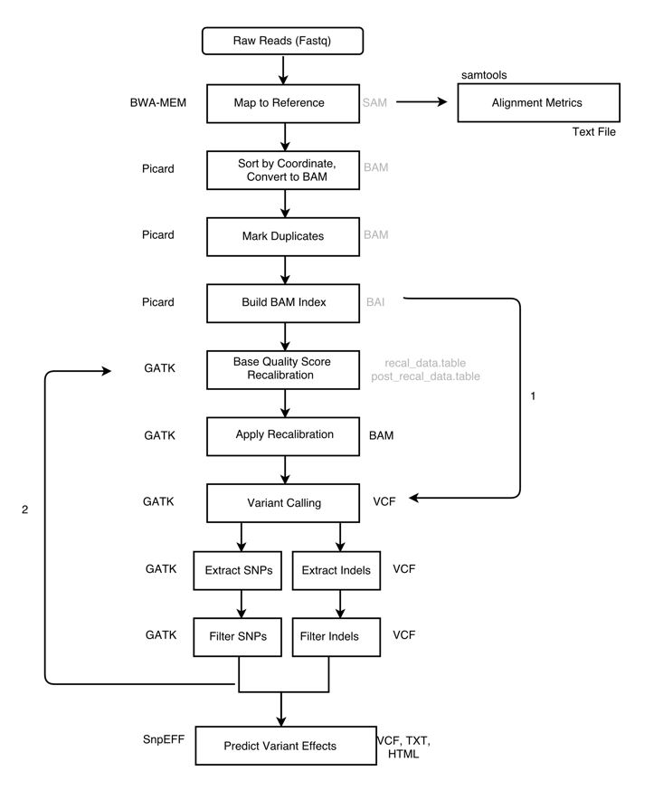
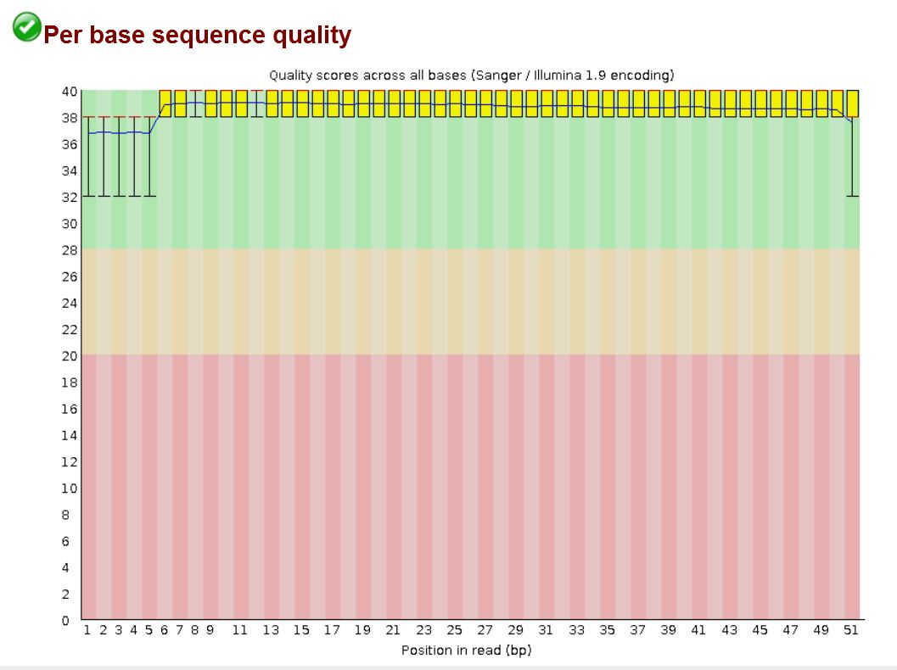
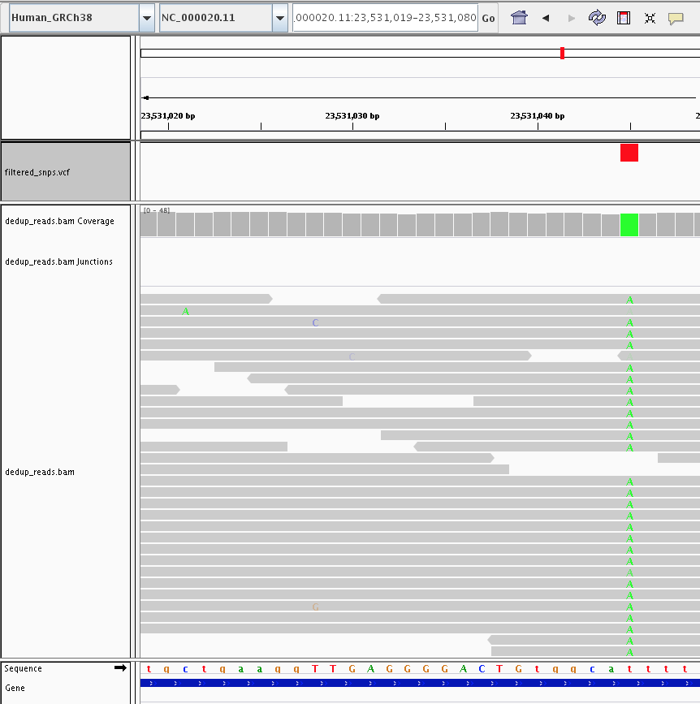
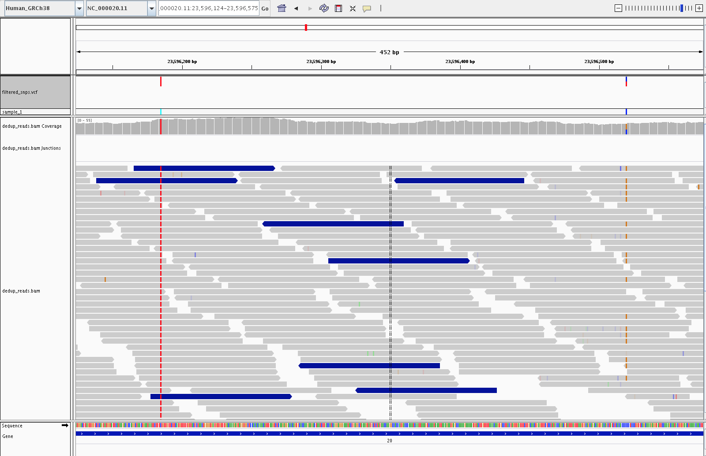
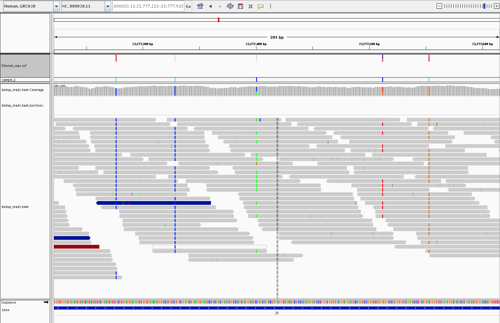
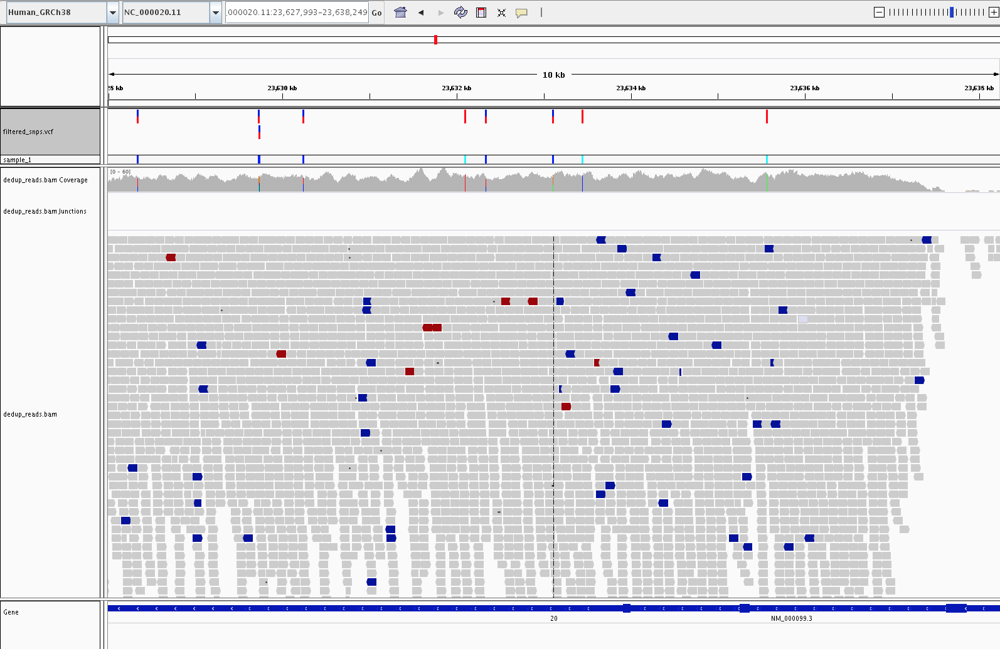

WGS
===

Germline short-variant calling (SNPs and small indels) from whole-genome
sequencing of **non-model organisms**, run on locally installed HPC modules.

Because non-model organisms rarely have a trusted known-variants VCF
(dbSNP, 1000 Genomes, etc.), this pipeline departs from the standard
Broad Best Practices in two specific ways:

* **Bootstrapped BQSR.** We generate our own "known-sites" VCF by first
  calling and hard-filtering variants on unrecalibrated reads, then
  feeding that filtered VCF into ``BaseRecalibrator``.
* **Hard filtering instead of VQSR.** VQSR requires a large, curated truth
  set that does not exist for most non-model species. We use GATK's
  recommended hard-filter expressions for SNPs and indels separately.

Scope is limited to **germline short variants in a single sample**. This
tutorial does not cover somatic calling, structural variants, or joint
genotyping across cohorts.

Pipeline overview
-----------------

   The pipeline, with two alternative paths marked. Arrow **1** shows
   an alternative path that skips BQSR entirely, going straight from
   the indexed BAM to variant calling. Arrow **2** is the bootstrap
   feedback loop: filtered variants from the first-pass call are fed
   back in as the known-sites input for BQSR. Best practice is to run
   BQSR, and for non-model organisms (where no curated known-sites VCF
   exists) that means bootstrapping your own via arrow **2**. This
   tutorial follows that path and runs the loop once (a single
   bootstrap pass).

Steps
-----

1. Align reads with BWA-MEM.
2. Sort, mark duplicates.
3. Bootstrap a known-sites VCF: a first-pass ``HaplotypeCaller`` call,
   split into SNPs and indels, hard-filtered, and kept only if PASS.
4. ``BaseRecalibrator`` + ``ApplyBQSR`` using the bootstrap VCF.
5. Final variant calling with ``HaplotypeCaller``.
6. Split, hard-filter, normalize, annotate, and QC the final call set.
7. Visualize the results in IGV to sanity-check the calls.

Environment
-----------

All commands assume the following modules are loaded. Exact names depend
on your HPC installation. Substitute the versions available to you.

.. code:: bash

    module purge
    module load bwa/<version>
    module load samtools/<version>
    module load bcftools/<version>
    module load gatk/4.x
    module load htslib/<version>    # for tabix
    module load snpeff/<version>

.. note::

   ``bwa-mem2`` is a drop-in faster replacement for ``bwa mem`` and
   produces identical alignments. If your HPC provides it, substitute
   ``bwa-mem2 mem`` for ``bwa mem`` in the alignment step below.

Inputs
------

Before running the pipeline you need:

* A **reference genome FASTA** (``reference.fa``). This is the assembly
  your reads will be aligned to.
* **Paired-end sequencing reads** (``sample_1_R1.fastq.gz`` and
  ``sample_1_R2.fastq.gz``): gzip-compressed FASTQ, read 1 and read 2 of
  each pair.
* A **sample name**, used in the BAM read-group ``SM`` tag and as a
  prefix for derived filenames. We use ``sample_1`` throughout.

All other files in the pipeline are produced by the commands below.

Preprocessing
-------------

Index the reference
~~~~~~~~~~~~~~~~~~~

BWA, samtools, and GATK each need their own index or dictionary of the
reference.

.. code:: bash

    bwa index reference.fa
    samtools faidx reference.fa
    gatk CreateSequenceDictionary -R reference.fa

For references larger than 2 GB, use ``bwa index -a bwtsw reference.fa``.

Align with BWA-MEM
~~~~~~~~~~~~~~~~~~

The ``-R`` read-group string is required. ``HaplotypeCaller`` will refuse
to run without it. ``-M`` marks shorter split hits as secondary, which
GATK expects.

.. code:: bash

    bwa mem -M \
        -R '@RG\tID:sample_1\tLB:sample_1\tPL:ILLUMINA\tSM:sample_1' \
        reference.fa \
        sample_1_R1.fastq.gz sample_1_R2.fastq.gz \
        > aligned_reads.sam

Sort and convert to BAM
~~~~~~~~~~~~~~~~~~~~~~~

.. code:: bash

    gatk SortSam \
        -I aligned_reads.sam \
        -O sorted_reads.bam \
        -SO coordinate

Sanity-check the alignment with ``samtools flagstat``:

.. code:: bash

    samtools flagstat sorted_reads.bam > alignment_metrics.txt

Things to look for in the report:

* **Total reads** should roughly match the expected count (reads-in-FASTQ
  multiplied by 2 for paired-end).
* **Mapped %**: typically above 95% for a matched reference and a healthy
  library. Substantially lower can indicate the wrong reference, heavy
  contamination, or severe quality issues.
* **Properly paired %**: aim for above 90%. Very low values point to
  library-prep problems or an assembly that is fragmented relative to
  the insert size.
* **Singletons %**: reads whose mate did not map. Should be low (low
  single-digit %).

Mark duplicates
~~~~~~~~~~~~~~~

The same DNA fragment can be sequenced multiple times: PCR duplicates
during library prep, or optical duplicates from the instrument mis-reading
one cluster as several. Duplicates are not independent evidence of a
variant, so they must be identified and excluded from downstream variant
calling.

``MarkDuplicates`` does not remove duplicates; it **flags** them, so
downstream GATK tools can skip them by default.

.. code:: bash

    gatk MarkDuplicates \
        -I sorted_reads.bam \
        -O dedup_reads.bam \
        -M dedup_metrics.txt

    samtools index dedup_reads.bam

.. warning::

   Do not mark duplicates for amplicon or other library types where reads
   are expected to start and end at the same positions by design.

Inspecting the duplicate flag
^^^^^^^^^^^^^^^^^^^^^^^^^^^^^

The second column of every SAM/BAM record is the **bitwise flag**, a
small integer that packs multiple boolean properties about the read
into a single number. To see the raw records, use ``samtools view``:

.. code:: bash

    samtools view dedup_reads.bam | head -1

A SAM record has 11 required tab-separated columns followed by optional
tags. Broken out, a typical record looks like this:

.. code:: text

    Column  Field   Example value
    ------  ------  ---------------------------------------------
    1       QNAME   HWI-ST123:42:ABCDE:1:1101:1234:5678
    2       FLAG    99
    3       RNAME   chr1
    4       POS     10145
    5       MAPQ    60
    6       CIGAR   100M
    7       RNEXT   =
    8       PNEXT   10245
    9       TLEN    200
    10      SEQ     ACGTACGT...
    11      QUAL    IIIIIIII...
    tags    ...     NM:i:0  RG:Z:sample_1  ...

The ``99`` in column 2 is the bitwise flag for that read.

``MarkDuplicates`` sets bit ``0x400`` (decimal ``1024``) on any record
it identifies as a duplicate. Every other bit is left as it was. A
properly-paired forward read that gets marked as a duplicate will go
from flag ``99`` to flag ``1123`` (that is, ``99 + 1024``).

Two ways to decode a flag value into its component bits:

* The Broad Institute hosts a `web-based flag decoder
  <https://broadinstitute.github.io/picard/explain-flags.html>`_: paste
  a flag number into the form and the page shows you which bits are set.
* Run ``samtools flags <value>`` on the command line:

.. code:: bash

    samtools flags 1123
    # 0x463  1123  PAIRED,PROPER_PAIR,MREVERSE,READ1,DUP

To see how many records carry each flag value in a BAM:

.. code:: bash

    samtools view dedup_reads.bam | awk '{print $2}' | sort | uniq -c | sort -rn | head

The ``dedup_metrics.txt`` file written by the command above summarizes
the duplication rate per library (``PERCENT_DUPLICATION``) and an
``ESTIMATED_LIBRARY_SIZE``, which is useful for spotting over-amplified
or under-diverse libraries.

Bootstrapped BQSR
-----------------

Why base-quality recalibration
~~~~~~~~~~~~~~~~~~~~~~~~~~~~~~

The sequencer emits a Phred-scaled **base quality score** (Q-score) for
every base it calls. Q20 means a 1-in-100 probability that the base is
wrong; Q30 means 1-in-1000. Variant callers use these scores to weigh
evidence for and against a variant: a pile-up of high-Q alternate bases
is a real signal, whereas the same pile-up at low quality is noise.

The problem is that **the raw Q-scores coming out of the instrument are
biased**. Systematic sources (sequencing chemistry, position in the
read, local sequence context such as the preceding dinucleotide, and
lane or flowcell effects) mean a report of "Q30" is not really
1-in-1000 across the board. Base Quality Score Recalibration (BQSR)
learns an empirical correction for these biases and overwrites the raw
scores with recalibrated ones, so downstream variant-calling evidence
is correctly weighted.

   Example FastQC per-position quality plot. The first few positions
   show wider spread and a lower mean quality, the middle of the read
   is stable at Q37 or above, and the final base drops back toward
   Q32. These position-dependent systematic patterns are exactly what
   BQSR learns to correct.

How BQSR works
~~~~~~~~~~~~~~

``BaseRecalibrator`` scans the BAM. At every aligned base it compares
the read base to the reference. At any position that appears in the
known-sites VCF, mismatches are treated as real variation and skipped.
At any other position, a mismatch is treated as a likely sequencing
error.

For each observed base, the tool records a set of properties, called
**covariates**, that might explain systematic errors. A covariate is
simply a property of the observation (something describing the base or
the read it came from) that the tool can group by when measuring error
rates. The standard covariates are:

* **Read group**: which lane and library the read came from.
* **Reported Q-score**: the quality the sequencer originally assigned.
* **Cycle position**: how far into the read the base is (base 1,
  base 2, ..., base N).
* **Sequence context**: the current base and the base immediately
  preceding it (the dinucleotide, e.g. ``AC`` vs. ``TG``).

For every combination of these covariate values, ``BaseRecalibrator``
counts how many bases were examined and how many mismatched the
reference. Those two numbers give an empirical error rate, which is
compared to the reported Q-score. The difference produces a correction.
For example: "in lane 3, at cycle 90, in an ``AC`` dinucleotide context,
bases reported as Q30 actually mismatch at a rate closer to Q24, so
subtract 6 from the score". The table of all such corrections is the
recalibration report.

``ApplyBQSR`` then walks the BAM and replaces the original per-base
Q-scores with the corrected values from the table.

Why we bootstrap for non-model organisms
~~~~~~~~~~~~~~~~~~~~~~~~~~~~~~~~~~~~~~~~

BQSR requires a known-sites VCF to mask real variants during error
estimation. For humans and a handful of other model organisms, curated
sets like dbSNP or the 1000 Genomes panel are the standard input. For
a non-model organism, no such resource exists.

The **bootstrap** solves this: call variants once on the *uncalibrated*
BAM, hard-filter aggressively to get a high-confidence set, and use
that as the known-sites input for BQSR. This tutorial runs a **single
bootstrap pass**. For some species or deeper studies you may want to
iterate (re-call on the recalibrated BAM, re-filter, re-recalibrate)
until the BQSR report stabilises.

Step 1 - first-pass variant calling
~~~~~~~~~~~~~~~~~~~~~~~~~~~~~~~~~~~

The bootstrap call is throw-away. We only need candidate sites to mask
during recalibration, so a plain VCF output is fine here (no need for
GVCF mode, introduced below in the final variant-calling step).

.. code:: bash

    gatk HaplotypeCaller \
        -R reference.fa \
        -I dedup_reads.bam \
        -O bootstrap_variants.vcf

Step 2 - split and hard-filter
~~~~~~~~~~~~~~~~~~~~~~~~~~~~~~

Split into SNPs and indels; each class has its own filter thresholds.

.. code:: bash

    gatk SelectVariants \
        -R reference.fa \
        -V bootstrap_variants.vcf \
        --select-type-to-include SNP \
        -O bootstrap_snps.vcf

    gatk SelectVariants \
        -R reference.fa \
        -V bootstrap_variants.vcf \
        --select-type-to-include INDEL \
        -O bootstrap_indels.vcf

Apply hard filters. ``VariantFiltration`` marks failing variants but
keeps them in the VCF; we drop them in the next command.

.. code:: bash

    gatk VariantFiltration \
        -R reference.fa \
        -V bootstrap_snps.vcf \
        --filter-expression "QD < 2.0"              --filter-name "QD2" \
        --filter-expression "FS > 60.0"             --filter-name "FS60" \
        --filter-expression "MQ < 40.0"             --filter-name "MQ40" \
        --filter-expression "MQRankSum < -12.5"     --filter-name "MQRankSum-12.5" \
        --filter-expression "ReadPosRankSum < -8.0" --filter-name "ReadPosRankSum-8" \
        --filter-expression "SOR > 3.0"             --filter-name "SOR3" \
        -O bootstrap_snps.filtered.vcf

    gatk VariantFiltration \
        -R reference.fa \
        -V bootstrap_indels.vcf \
        --filter-expression "QD < 2.0"               --filter-name "QD2" \
        --filter-expression "FS > 200.0"             --filter-name "FS200" \
        --filter-expression "ReadPosRankSum < -20.0" --filter-name "ReadPosRankSum-20" \
        --filter-expression "SOR > 10.0"             --filter-name "SOR10" \
        -O bootstrap_indels.filtered.vcf

Keep only PASS variants and merge into a single known-sites VCF:

.. code:: bash

    gatk SelectVariants -R reference.fa -V bootstrap_snps.filtered.vcf \
        --exclude-filtered -O bootstrap_snps.pass.vcf
    gatk SelectVariants -R reference.fa -V bootstrap_indels.filtered.vcf \
        --exclude-filtered -O bootstrap_indels.pass.vcf

    gatk MergeVcfs \
        -I bootstrap_snps.pass.vcf \
        -I bootstrap_indels.pass.vcf \
        -O bootstrap_known_sites.vcf

    tabix -p vcf bootstrap_known_sites.vcf

Step 3 - recalibrate
~~~~~~~~~~~~~~~~~~~~

.. code:: bash

    gatk BaseRecalibrator \
        -R reference.fa \
        -I dedup_reads.bam \
        --known-sites bootstrap_known_sites.vcf \
        -O recal_data.table

    gatk ApplyBQSR \
        -R reference.fa \
        -I dedup_reads.bam \
        --bqsr-recal-file recal_data.table \
        -O recal_reads.bam

.. note::

   ``BaseRecalibrator`` in GATK4 no longer computes Per-Base Alignment
   Quality (BAQ) by default. If you want it, add ``--enable-baq``.
   Leaving it off is the current recommendation and is faster.

Variant calling
---------------

``HaplotypeCaller`` identifies candidate variant sites, locally
reassembles the reads overlapping each active region, and emits
genotype calls (SNPs and indels together) with confidence scores.

Choosing an output mode
~~~~~~~~~~~~~~~~~~~~~~~

``HaplotypeCaller`` can write its output in two forms.

**Standard VCF mode** (the default) emits one record per variant site
directly into a VCF file. It is the simplest path and is a reasonable
choice when you have a single sample and no plans to ever combine this
callset with others.

**GVCF mode** (``-ERC GVCF``) emits a *genomic VCF*
(``sample_1.g.vcf.gz``). A GVCF records reference confidence at every
position in the genome, with long reference-matching stretches
compressed into *reference blocks*. A second tool, ``GenotypeGVCFs``,
reads that GVCF and produces the final VCF. For a single sample the
final content is equivalent to standard mode.

GVCF mode is the current Broad Best Practices recommendation and it
future-proofs the pipeline: if more samples arrive later, you can
feed all their GVCFs into ``GenotypeGVCFs`` (or first consolidate
them with ``GenomicsDBImport``) to joint-genotype the cohort, without
re-running ``HaplotypeCaller`` from the BAMs. For one-shot
single-sample analyses where none of that applies, standard mode is
simpler and equally correct.

Both paths below produce ``raw_variants.vcf``, the input to the
hard-filter step.

Standard mode:

.. code:: bash

    gatk HaplotypeCaller \
        -R reference.fa \
        -I recal_reads.bam \
        -O raw_variants.vcf

GVCF mode:

.. code:: bash

    gatk HaplotypeCaller \
        -R reference.fa \
        -I recal_reads.bam \
        -ERC GVCF \
        -O sample_1.g.vcf.gz

    gatk GenotypeGVCFs \
        -R reference.fa \
        -V sample_1.g.vcf.gz \
        -O raw_variants.vcf

``HaplotypeCaller`` is deliberately permissive at this stage: the aim
is to maximise sensitivity. False positives are removed by the
hard-filter step below.

Hard filtering
--------------

Same split-then-filter pattern as the bootstrap, applied to the final
call set.

.. code:: bash

    gatk SelectVariants -R reference.fa -V raw_variants.vcf \
        --select-type-to-include SNP   -O raw_snps.vcf
    gatk SelectVariants -R reference.fa -V raw_variants.vcf \
        --select-type-to-include INDEL -O raw_indels.vcf

SNP filters:

.. code:: bash

    gatk VariantFiltration \
        -R reference.fa \
        -V raw_snps.vcf \
        --filter-expression "QD < 2.0"              --filter-name "QD2" \
        --filter-expression "FS > 60.0"             --filter-name "FS60" \
        --filter-expression "MQ < 40.0"             --filter-name "MQ40" \
        --filter-expression "MQRankSum < -12.5"     --filter-name "MQRankSum-12.5" \
        --filter-expression "ReadPosRankSum < -8.0" --filter-name "ReadPosRankSum-8" \
        --filter-expression "SOR > 3.0"             --filter-name "SOR3" \
        -O filtered_snps.vcf

Indel filters:

.. code:: bash

    gatk VariantFiltration \
        -R reference.fa \
        -V raw_indels.vcf \
        --filter-expression "QD < 2.0"               --filter-name "QD2" \
        --filter-expression "FS > 200.0"             --filter-name "FS200" \
        --filter-expression "ReadPosRankSum < -20.0" --filter-name "ReadPosRankSum-20" \
        --filter-expression "SOR > 10.0"             --filter-name "SOR10" \
        -O filtered_indels.vcf

These thresholds are the current GATK-recommended defaults for germline
hard filtering. Upstream reference: `Hard-filtering germline short
variants <https://gatk.broadinstitute.org/hc/en-us/articles/360035890471-Hard-filtering-germline-short-variants>`_.

Annotation
----------

A filtered VCF tells you *where* the variants are; annotation tells you
*what they do*: which gene and transcript each variant falls in,
whether it changes an amino acid, whether it disrupts a splice site,
whether it is intergenic, and so on. We use `snpEff
<https://pcingola.github.io/SnpEff/>`_, a command-line effect predictor
that:

* Reads a pre-built genome annotation database (gene, transcript, and
  exon structure) matched to your reference assembly.
* For every variant in the input VCF, looks up overlapping features and
  predicts the functional consequence (e.g. ``missense_variant``,
  ``synonymous_variant``, ``frameshift_variant``, ``splice_donor_variant``,
  ``intergenic_region``).
* Writes an annotated VCF with the predictions in a structured ``ANN``
  INFO field, plus a summary HTML report and a per-gene table.

snpEff is particularly well-suited to non-model organism work: pre-built
databases exist for over 20,000 reference genomes, and when no pre-built
database is available you can build your own from a GFF/GTF and the
reference FASTA.

Normalize before annotating
~~~~~~~~~~~~~~~~~~~~~~~~~~~

Annotators can assign different consequences to what is effectively the
same variant if it is represented differently in the VCF. Two
differences matter in practice:

* **Multi-allelic records**: a single VCF line can carry more than one
  alternate allele. Most annotators score the record as a whole; some
  rank the alts inconsistently. Splitting into one record per alt is
  safer.
* **Left-alignment of indels**: an indel that can be written at several
  equivalent positions should be normalized to the leftmost
  representation so it matches the annotation database.

``bcftools norm`` handles both in one pass:

.. code:: bash

    bcftools norm -f reference.fa -m -both \
        -O z -o filtered_snps.norm.vcf.gz filtered_snps.vcf
    tabix -p vcf filtered_snps.norm.vcf.gz

    bcftools norm -f reference.fa -m -both \
        -O z -o filtered_indels.norm.vcf.gz filtered_indels.vcf
    tabix -p vcf filtered_indels.norm.vcf.gz

Find and download a database
~~~~~~~~~~~~~~~~~~~~~~~~~~~~

.. code:: bash

    snpEff databases | grep -i <your_organism>
    snpEff download <database_name>

Annotate
~~~~~~~~

.. code:: bash

    snpEff -v <database_name> filtered_snps.norm.vcf.gz > filtered_snps.ann.vcf

Output files
^^^^^^^^^^^^

snpEff writes three files into the working directory:

* ``filtered_snps.ann.vcf``: the annotated VCF. Each variant carries an
  ``ANN`` INFO field listing predicted effects, affected gene and
  transcript, impact category (HIGH, MODERATE, LOW, MODIFIER), and HGVS
  nomenclature.
* ``snpEff_genes.txt``: tab-delimited per-gene summary of how many
  variants of each consequence class fall in each gene.
* ``snpEff_summary.html``: HTML report with distributional plots
  (effects by class, by region, by impact) and dataset-level QC.

Chromosome naming mismatches
~~~~~~~~~~~~~~~~~~~~~~~~~~~~

snpEff will silently annotate zero variants if chromosome names in your
VCF do not match those in the snpEff database. A typical mismatch is
RefSeq-style ``NC_000020.11`` in your VCF vs. plain ``20`` in the
database. Rename chromosomes before annotation:

.. code:: bash

    # Build a two-column rename map: <source_name> <target_name>
    echo -e "NC_000020.11\t20" > chrom_rename.txt

    bcftools annotate --rename-chrs chrom_rename.txt \
        -O z -o filtered_snps.renamed.vcf.gz filtered_snps.norm.vcf.gz
    tabix -p vcf filtered_snps.renamed.vcf.gz

Use ``filtered_snps.renamed.vcf.gz`` as the snpEff input.

Alternatives
~~~~~~~~~~~~

`Ensembl VEP <https://www.ensembl.org/info/docs/tools/vep/index.html>`_
is the other widely used effect predictor. It excels for human clinical
annotation (ClinVar, gnomAD frequencies) but has fewer pre-built
non-model genomes and a heavier setup, so snpEff is usually the better
default for non-model organism work.

Post-filter QC
--------------

Quick summary statistics on the final, annotated call set (Ts/Tv ratio,
singleton count, per-chromosome counts, depth distribution) are useful
for sanity-checking.

.. code:: bash

    bcftools stats filtered_snps.ann.vcf > filtered_snps.stats.txt

For a plotted report:

.. code:: bash

    plot-vcfstats -p plots/ filtered_snps.stats.txt

Visualization in IGV
--------------------

Loading the BAM and final VCF in IGV is the fastest sanity check: you
can see whether each called variant is supported by the underlying reads.

.. note::

   The screenshots below are from a human GRCh38 chr20 example, but the
   interpretation is the same for any organism. Only the track headers
   change.

Called vs. uncalled SNPs
~~~~~~~~~~~~~~~~~~~~~~~~

A called SNP has a clear, consistent alternate allele across a majority
of overlapping reads at that position. Sporadic mismatches that do not
cluster into a coherent signal are (correctly) not called.

   A called SNP (green column in the coverage track, red tick in the
   VCF track) supported by consistent alternate-allele reads, next to
   positions with sporadic mismatches that the caller correctly ignored.

Homozygous vs. heterozygous SNPs
~~~~~~~~~~~~~~~~~~~~~~~~~~~~~~~~

A homozygous alternate allele shows nearly 100% alternate reads; a
heterozygous call shows roughly 50% reference and 50% alternate.

   Homozygous alternate on the left (nearly all reads carry the
   alternate base) and heterozygous on the right (about half reference,
   half alternate).

PASS vs. filtered variants
~~~~~~~~~~~~~~~~~~~~~~~~~~

Variants that failed hard filtering remain in the VCF but are marked
with the filter name(s) they tripped. IGV renders them as lighter,
translucent ticks in the VCF track, so at a glance you can see which
calls passed and which did not. The pile-up alone does not always
explain the failure: hard-filter decisions are based on annotation
values such as QD, FS, MQ, and SOR in the VCF ``INFO`` field rather
than on anything directly visible in the reads. For a specific
filtered variant, read the ``FILTER`` column of its VCF record to see
which threshold(s) it tripped.

   Five SNPs in the VCF track: three solid dark-red ticks are PASS
   calls, and two lighter translucent ticks are variants that failed
   hard filtering.

SNPs in the cystatin C gene (CST3)
~~~~~~~~~~~~~~~~~~~~~~~~~~~~~~~~~~

The example below shows the final, hard-filtered SNP calls across the
cystatin C gene (``CST3``). Variants in ``CST3`` have been associated
with Alzheimer's disease.

   Eight SNPs called along the ``CST3`` gene, viewed over a ~10 kb
   window. The ``filtered_snps.vcf`` track at the top shows the
   individual SNP calls, and the gene track at the bottom
   (``NM_000099.3``) marks the ``CST3`` transcript.

Notes for non-model organisms
-----------------------------

* **When to iterate BQSR.** A single bootstrap pass is sufficient for
  many use cases. If you want to check convergence, re-run
  ``HaplotypeCaller`` on ``recal_reads.bam``, re-filter, and compare the
  resulting known-sites VCF to the previous one. Re-recalibrate only if
  the difference is non-trivial.
* **No known-sites VCF at all?** Running ``BaseRecalibrator`` without
  ``--known-sites`` is not supported. The bootstrap step is mandatory if
  you want BQSR for a non-model organism.
* **No rsIDs.** The annotated VCF will not carry dbSNP identifiers;
  functional predictions from snpEff are the primary annotation.
* **Custom snpEff database.** If no pre-built database exists for your
  organism, you can build one from a GFF/GTF and a reference FASTA. See
  the `snpEff database-building guide
  <https://pcingola.github.io/SnpEff/snpeff/build_db/>`_.
