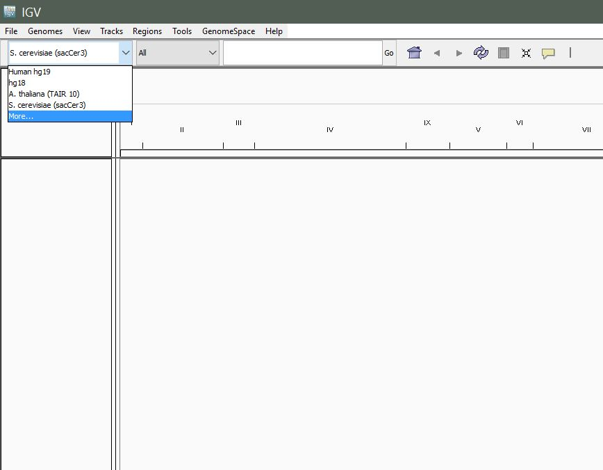
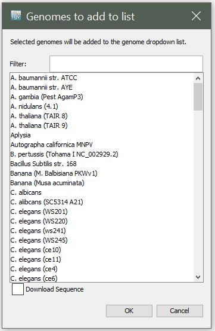
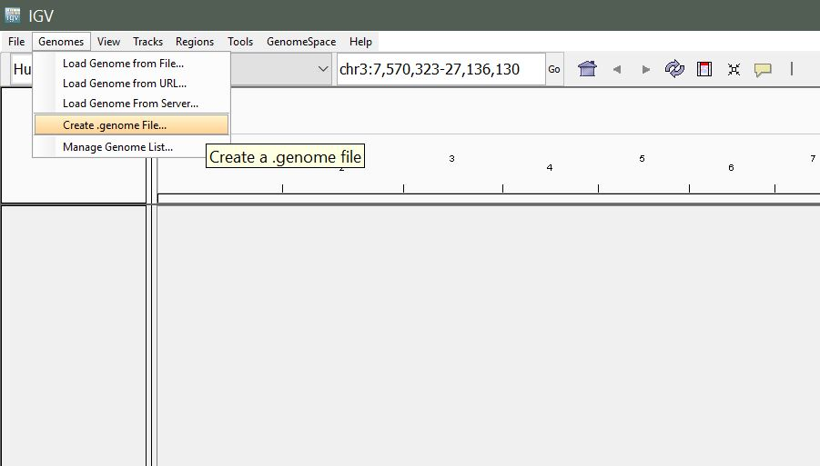
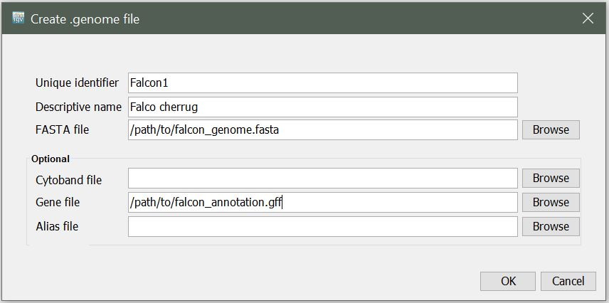
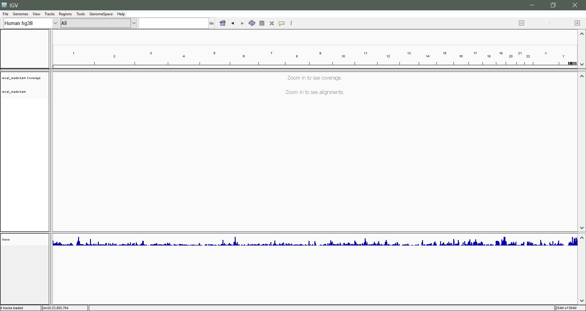
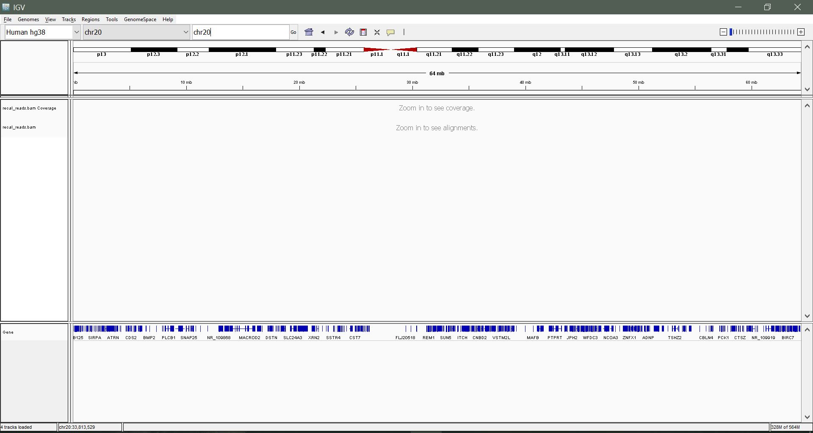
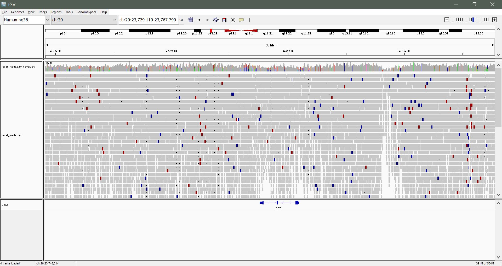

IGV
===

The `Integrative Genomics Viewer (IGV)
<http://software.broadinstitute.org/software/igv/home>`_ is a
high-performance visualization tool for interactive exploration of
large, integrated genomic datasets. It supports a wide variety of data
types involved in NGS analysis, including mapped reads, gene
annotations, and genetic variants.

This page is a hands-on walkthrough: launch IGV, load a reference
(pre-packaged or custom), load aligned reads, then navigate the data.

Overview
--------

* Launching IGV
* Load a pre-existing genome
* Create a custom genome
* Load alignment data (mapped reads)
* Navigate and interpret the data

Launching IGV
-------------

There are a few ways to launch IGV. We'll cover two basic ways here.

.. note::

   You may need to update your Java in order to run IGV.

Using Java Web Start
~~~~~~~~~~~~~~~~~~~~

* Go to the IGV downloads page:
  http://software.broadinstitute.org/software/igv/download
* Click the launch icon. The browser will display the web-start launch
  window.
* Select **Open with Java Web Start** and click **OK**. If the system
  displays messages about trusting the application, confirm that you
  trust the application. Web Start downloads and starts IGV.

Download and run locally
~~~~~~~~~~~~~~~~~~~~~~~~

Download IGV and launch it locally on your Windows or Mac computer.
Your computer must meet certain requirements (OS, Java version, etc.).
Follow instructions on
http://software.broadinstitute.org/software/igv/download. When
prompted, register or log in as requested. You must register to
download IGV (you'll need to provide your email address, that's it).

Load a pre-existing genome
--------------------------

Data for many commonly studied organisms comes pre-packaged with IGV.

Once IGV is up and running, navigate to the left-most dropdown in the
toolbar to select your genome.

   The left-most dropdown in the IGV toolbar lists pre-packaged
   genomes.

Select **More...** to see the full list of available genomes.

   The **More...** dialog shows the full set of genomes you can pull
   down on demand.

Create a custom genome
----------------------

In case you are working with an organism for which there is no
pre-existing genome in IGV, you can create a custom genome quite
easily.

Requirements:

* Reference sequence (in FASTA format)
* Gene annotations (in ``.gff`` format)

From the menu, select **Genomes > Create .genome File**.

   **Genomes > Create .genome File** in the IGV menu bar.

You will be presented with the following window. Enter a unique
identifier and descriptive name (these can be anything that makes
sense to you), then select the path to the reference FASTA file and
the path to your gene annotation (GFF) file for the **Gene File**.

.. note::

   A FASTA index (``.fai``) file needs to be in the same directory as
   the reference sequence (``.fasta``).

   The Create .genome File dialog: identifier, descriptive name,
   reference FASTA, and gene-annotation GFF.

Upon clicking **OK**, you will be prompted to select a name and
location to save your new ``.genome`` file.

Load alignment data
-------------------

Once you've loaded your reference genome, you can load your mapped
reads. Note that your reads must be sorted and indexed prior to
loading.

From the menu, select **File > Load from File**.

Locate the ``aligned_reads.sorted.bam`` file (prepared for you) and
click **Open**. You should see something like the following:

   IGV after loading a sorted, indexed BAM. The coverage track sits
   above the per-read pileup.

Navigate and interpret data
---------------------------

**Navigating by chromosome:** Use the drop-down menu beside the Genome
drop-down list to select a chromosome to view. In our sample
alignment, we have reads from chromosome 20 only. Alternatively, enter
the chromosome name in the search box (``chr20``) and hit enter.

   Chromosome dropdown and search box for jumping to a specific
   chromosome.

**Zooming in:** We still can't see much. Let's zoom in to a region
within 23,500,000 to 24,000,000 until you begin to see some mapped
reads. Use the slider on the top right to zoom incrementally, or click
and drag a region on the coordinates to zoom to it.

   Zoomed in to ``chr20:23,500,000-24,000,000``: individual mapped
   reads become visible.

**Navigating using the keyboard:** Once you are in a region of
interest, use the arrow, home, end, page-up and page-down keys to
explore the region.

**Navigate directly to a region of interest:** Enter a gene name or
coordinates in the search box to navigate directly to that
feature/region. Example: ``CST4`` or ``chr20:23,675,452-23,682,868``.

**Change the appearance of genes:** Right-click on the gene track and
select **expanded**. Navigate to gene ``GGTLC1`` to see the
difference. Try **squished** also.

**Change the appearance of reads:** Right-click on the BAM track and
experiment with some of the different options: **View as pairs**,
**Show all bases**, **Shade bases by quality**. We will discuss these
options.

Exercise
--------

Color-coded reads: you might see red and blue reads. What do these
represent? What might this suggest?

Further reading
---------------

For more details, see the `IGV User Guide
<http://software.broadinstitute.org/software/igv/UserGuide>`_.
