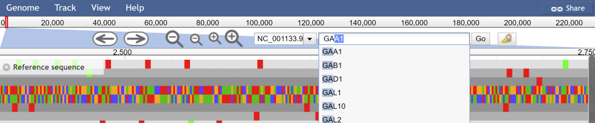

JBrowse
=======

Watch the September 24, 2020 BADAS `here
<https://nyu.zoom.us/rec/share/UIV6lkiETWwXHc-NOZK93MWnSGFfZ7XTK8rvasszTKz21EqlQAMnhjlG9UHppPU.ZhvKwBHFC7SlNLoB>`_.

Introduction
------------

During the 2020 Summer of COVID-19, the Ghedin and Gresham labs sequenced
SARS-CoV-2 isolates. To visualize and share this data with collaborators
the web-based genome visualization software JBrowse was used.

.. tip::

   Explore the live JBrowse instance for SARS-CoV-2 data:
   https://jbrowse.bio.nyu.edu/covid-19

To benefit all researchers at NYU engaged in genomics research, a centralized
JBrowse service has been published at http://jbrowse.bio.nyu.edu/ for PIs and
their lab members.

Demo
----

We'll go through a demo of

* Uploading a dataset
* How to manipulate the dataset visualization
* Some features
* Sharing URLs

`Login to the HPC Prince cluster
<https://sites.google.com/a/nyu.edu/nyu-hpc/documentation/hpc-access>`_
where there is small sample dataset to upload and manipulate.

This dataset is located in **/beegfs/eb167/yeast**. You can see the standard
files you are familiar with. There is one file specific to JBrowse and that is
the **samplelist** text file. It is used to tell JBrowse how to group the files
after upload, saving you the hassle of manually manipulating the configuration
file.

To upload, run the following but only change the part in bold and replace with
your netID.

.. code-block:: bash

   cgsb_upload2jbrowse -p demo -d **netID** -f /beegfs/eb167/yeast

You will be prompted for your password twice in this process, but once you
`request access <https://forms.bio.nyu.edu/>`_ to a PI lab passwordless
authentication will be configured for you.

Let me explain what this command does and the options available.

.. code-block:: text

   USAGE: cgsb_upload2jbrowse -p PI -d DATASET [-f FOLDER] [-s SAMPLELIST] [FILES]
   -------------------------------------------------------
   -p | --PI                specify PI
   -d | --dataset           specify data set
   -f | --folder            specify folder containing files
   -s | --samplelist        specify sample list for categorization
   -------------------------------------------------------
   File formats supported:
   - fa
   - fasta
   - fna
   - vcf.gz*
   - bam*
   - bam.bw
   - cram*
   - gff3.gz*
    *Requires index file (tbi, bai, crai) of the same base name

Execution of this script will rsync or upload the specified files or folders to
the appropriate JBrowse folder, create basic configurations for your dataset,
and publish the site.

The required fields are **-p/--PI** for the PI you are a member of and
**-d/--dataset** is for the dataset name that will be visible on the public
site. Optional arguments are **-f/--folder** to recursively upload a folder
and its contents as we just did and **-s/--samplelist** if the file is not
named 'samplelist'.

You'll notice after running the command and if successfully completing you'll
be given a URL link. Something like:
``https://jbrowse.bio.nyu.edu/demo/?data=data/netID``

Other Uploading Options
~~~~~~~~~~~~~~~~~~~~~~~

Uploading from HPC scratch with reference data
^^^^^^^^^^^^^^^^^^^^^^^^^^^^^^^^^^^^^^^^^^^^^^^

To transfer your data within your scratch (``/scratch/user/project1/data``)
along with the reference data in the prince shared genome repository folders
to Smith's project1 data set run the following.

.. code-block:: bash

   cgsb_upload2jbrowse -p Smith -d project1 \
    -f /scratch/user/project1/data  \
    /scratch/work/cgsb/genomes/Public/Fungi/Saccharomyces_cerevisiae/Ensembl/R64-1-1/Saccharomyces_cerevisiae.R64-1-1.dna.toplevel.fa \
    /scratch/work/cgsb/genomes/Public/Fungi/Saccharomyces_cerevisiae/Ensembl/R64-1-1/Saccharomyces_cerevisiae.R64-1-1.34.gff3

Uploading from outside the cluster
^^^^^^^^^^^^^^^^^^^^^^^^^^^^^^^^^^^

To transfer from outside the Prince cluster:

.. code-block:: bash

   # Transfer the files
   rsync --progress -ruv /path/to/dataset/ \
        <NYUnetID>@jbrowse.bio.nyu.edu:/jbrowse/<PI>/<DATASET>
   # Build and publish the tracks based on the files uploaded
   ssh <NYUnetID>@jbrowse.bio.nyu.edu addTracks --PI <PI> --dataset <DATASET>

The data will be accessible immediately on the JBrowse server. Choose your PI
on the JBrowse homepage's dropdown menu then the data set name that was
specified in the previous step. Once accessed you will be able to display
visualizations or tracks for each file. These tracks by default will be named
after the file itself.

Let's go to the URL of our uploaded yeast dataset.

On the left we see two blocks labeled **combined_ntr_21** and
**combined_ntr_22**. This again was possible because we had a samplelist file
listing the prefix used for grouping. If one is not provided it will look like
this https://jbrowse.bio.nyu.edu/demo/?data=data/badas-noList.

The available tracks will be selectable on the left allowing you to display
only items of interest and their order displayed.

If you go to the ``Track`` menu at the top of the page, you have two options
to create a combination track combining 2 tracks or a sequence search track,
which shows regions of the referenced sequence or its translations that match
a DNA or amino acid sequence.

We can search for features of interest with the search bar at the top.

To the right of the search box we have the highlight button. We can highlight
areas of note as well. This is beneficial as the URL will dynamically change
based on the current view which includes the highlights.

You can then use this unique URL to share with colleagues or post in
publications. Again this site is open to the public without need for VPN.

Customizing Tracks
------------------

We have configured the site to ingest your data in the JBrowse default
fashion. You can edit the tracks configuration file (tracks.conf) to meet
your needs. For more information on what is possible visit
https://jbrowse.org/docs/installation.html.

Next Steps
----------

Requesting Permissions
~~~~~~~~~~~~~~~~~~~~~~

For access, request access through the biology department forms portal at
https://forms.bio.nyu.edu. This is separate from HPC access and will require
approval from the PI.

The primary reason being you will have ability to alter or delete all datasets
associated with the PI. The data is not backed up. The only thing that is
backed up nightly are the configuration files.

GATK Pipeline
~~~~~~~~~~~~~

We have integrated automated JBrowse visualization into the `GATK pipeline
<https://gencore.bio.nyu.edu/variant-calling-pipeline-gatk4/>`_, which
performs alignment and variant calling. Within your nextflow.config file add
the following lines to specify the data set name and the PI.

.. code-block:: groovy

   // JBrowse params
   params.do_jbrowse = true
   params.gff = "/scratch/work/cgsb/genomes/Public/Fungi/Saccharomyces_cerevisiae/Ensembl/R64-1-1/Saccharomyces_cerevisiae.R64-1-1.34.gff3"
   params.jbrowse_pi = "Smith"
   params.dataset_name = "project1"
